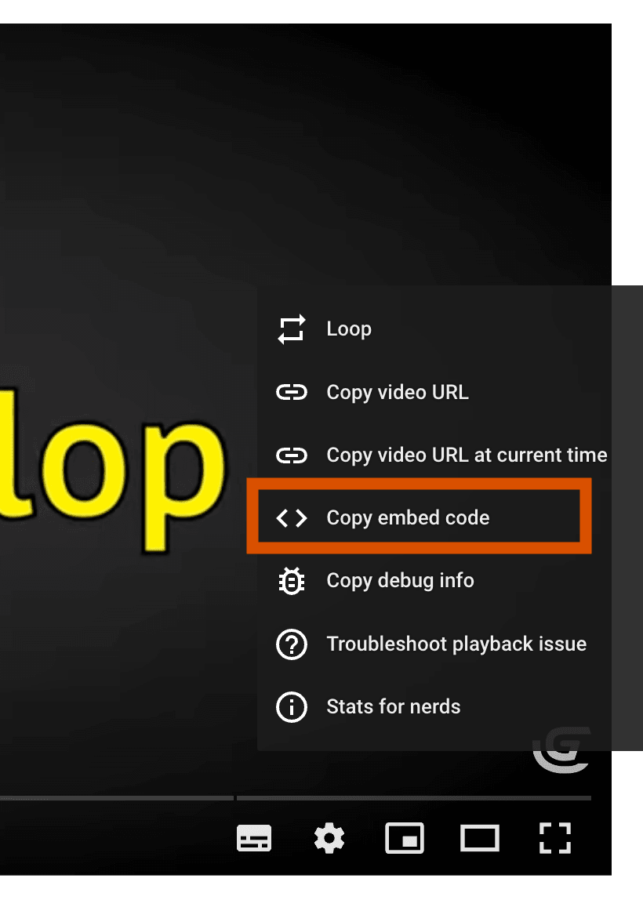

# Syntax

GDevelop's documentation is based on the framework [MkDocs](https://www.mkdocs.org/) that allows to write a whole documentation using only [markdown syntax](https://www.mkdocs.org/user-guide/writing-your-docs/#writing-with-markdown).

Note:

- MkDocs uses the [python markdown](https://python-markdown.github.io/) syntax that is slightly different from the markdown one. For instance it handles lists differently (see below).
- Displaying images comes with features brought by Material for MkDocs. Check [the reference here](https://squidfunk.github.io/mkdocs-material/reference/images/).

## Tips and tricks

### Nested lists

You should use 4 spaces to mark an indent in a list.

For example, to display:

- Getting started
    - First step
    - Second step

You shall write:

```md
- Getting started
    - First step
    - Second step
```

### Keep a white line before your lists

The list won't be formatted if there is no newline before the start of the list.

Bad format example:

```md
List of objects:
- Sprite
- Text
```

will be rendered as:

```md
List of objects: - Sprite - Text
```

You can fix it with:

```md
List of objects:

- Sprite
- Text
```

### Ordered lists

Ordered lists use numbers followed by periods. For consistency, always use the number `1.` and it will automatically be updated with the correct number.

For example, to display:

1. First item
    1. First nested item
    1. Second nested item
1. Second item

You shall write:

```md
1. First item
    1. First nested item
    1. Second nested item
1. Second item
```

### Display a video

By default, the video will take the same width as the article on mobile and, on desktop and tablet, it will be slightly less wide than the article and be centered.

#### If the video is hosted in the project

Use this syntax:

```md
<div class="video-container">
  <video controls>
    <source src="/gdevelop5/objects/ParticleEmitterWishforgeVideo.mp4">
  </video>
</div>
```

#### If you want to embed a video

Use this syntax:

```md

```

Find the link to use right-clicking a youtube video and clicking "Copy embed code". Then find the link in it.



### Display an image

An image is added with this syntax:

```md

```

#### Change image size

You can set the width of an image (the aspect ratio will be kept) with:

```md
{ width=300 }
```

#### Center an image with no text on the side

By default, the image will be aligned on the left and there will be no text displayed on the left or on the right of the image.

To center it, do the following:

```md

{ .align-center }
```

To have it aligned on the right, do the following:

```md

{ .align-right }
```

#### Display text on the side

**This features is available only for images aligned on the left or on the right.**

To display text alongside an image, use this syntax:

```md
{ align=left }
```
