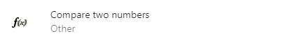

# Advanced conditions

## And logical operation

If the "**And**" condition is used in an event, the actions are performed if and only if all the sub-conditions are true. If one or more than one sub-conditions are false, the action is not performed.
!!! note

    The "**And**" condition is usually meant to be used within an "**Or**" condition. This is because having two conditions in the same event box is the same as using the "**And**" condition.

## OR logical operation

If the "**OR**" condition is used in an event, the actions are performed when one or several sub-conditions are true. If none of the sub-conditions are true, the action is not performed.

!!! warning

    The OR condition has a special behavior regarding the [object filtering logic of GDevelop](http://wiki.compilgames.net/doku.php/gdevelop5/tutorials/basic-game-making-concepts#events_and_how_objects_are_selected_by_these_events). The objects listed under it are _unselected_ by GDevelop if their condition is not met, so actions specific to these objects may not work. In some cases, using "Pick all instances" on the action side will fix things. In other cases, replacing the OR will be necessary.

## Not logical operation

If the "**Not**" condition is used in an event, it returns the contrary of the sub-conditions. If a sub-condition is true, it returns false and if a sub-condition is false, it returns true.

## Trigger once

Whenever the "**Trigger once while true**" condition is used, the actions for the event are triggered only once, for each time the conditions have been met.

!!! warning

    This condition applies to objects, not instances. If you need to trigger once for each instance, use an instance variable instead.

## Compare two numbers

When you use the "**Compare two numbers**" condition, it will compare the two numbers/expression based on the Sign of the test. If the numbers satisfy the test, the condition returns true and the corresponding actions are performed.

For example, suppose if the first value is entered as 5, the sign of the test is set to < (less than)" and the second value is equal to 7. In such a case, the test returns true because 5 is less than 7.

## Compare two strings

When you use the "**Compare two strings**" condition, it will compare the two strings/expression based on the Sign of the test. If the numbers satisfy the test, the condition returns true and the corresponding actions are performed.

## Always true/false

If you want a condition to always return true and the corresponding actions to be performed, you can use the "**Always**" condition. If the condition is inverted, it will always return false,_i.e. the corresponding actions will never be performed._

## Reference

All actions, conditions and expressions are listed in [the advanced conditions reference page](/gdevelop5/all-features/common-instructions/reference/).