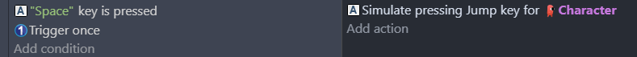
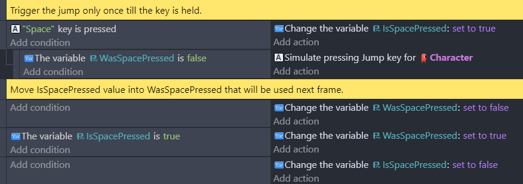
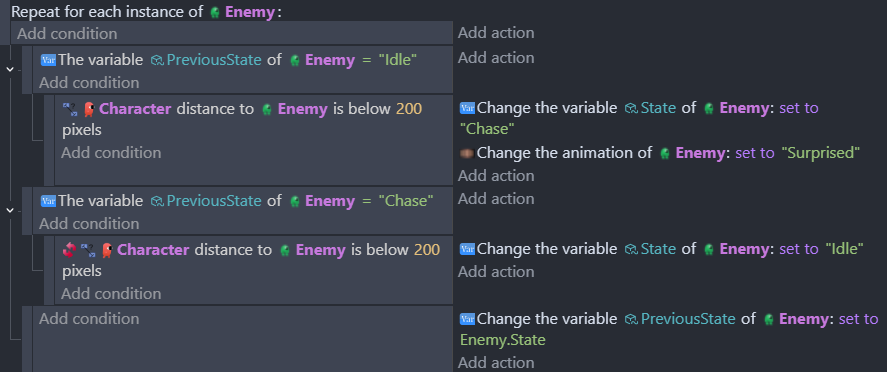

# Trigger once condition

Whenever the "**Trigger once while true**" condition is used, the event actions are triggered only once till the above conditions are met. 

## Replicate "trigger once" condition with variables

Every "trigger once" condition keep a state for wether the conditions above it were met or not during the previous frame. Given that the conditions above it are met:
- when the conditions were met, the actions are not triggered
- when the conditions weren't met, the actions are triggered

The following event...

...can be "translated" using variables:

In this case, the "trigger once" condition works well. This is only to help understand its limitations as described in the following section. 

## Trigger actions once per object instance

"Trigger once" conditions are not checked per instance. Until at least one instance met the conditions, the action won't be triggered for any instance. 
For instance, if you want to play a "surprised" animation when the player comes closed to an enemy, a trigger once may work as long as enemies are far from each other. But, when the player is still chased by an enemy, the encountered enemies won't play a "surprised" animation.

[Object variables](/gdevelop5/all-features/variables/object-variables/) must be used to follow the state of object instances one by one.
It could be done with boolean variables, but objects may have more than 2 states so it's often clearer to use string variables.

!!! info

    A more detailed example is explained on [the finite state machines](/gdevelop5/tutorials/finite_state_machine) page.
