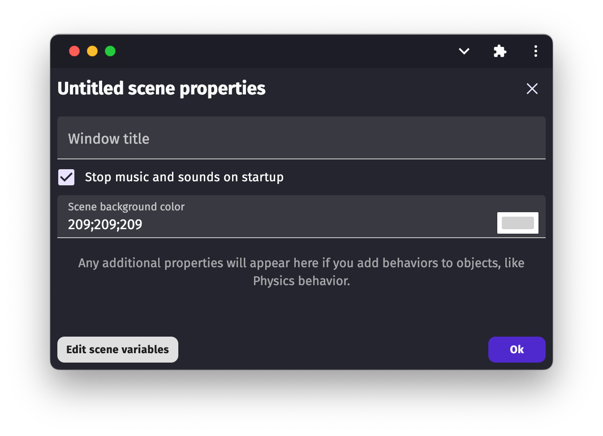
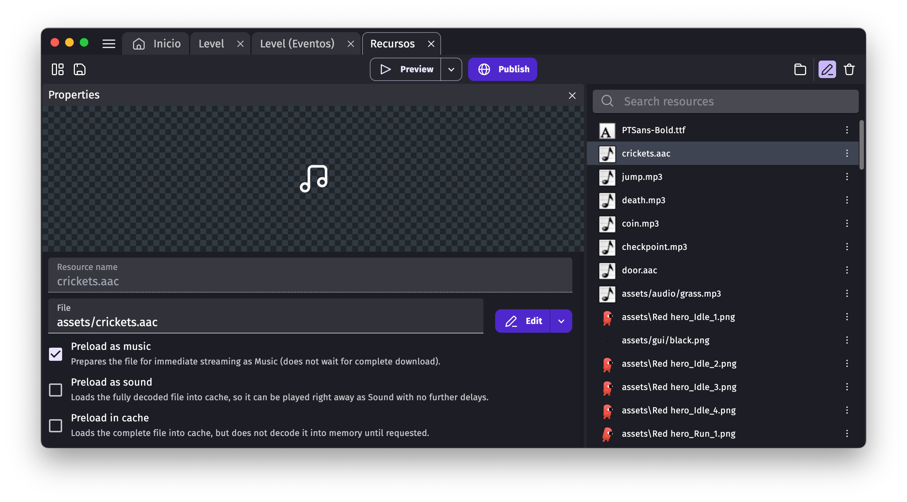

# Audio

Playing music or sounds is an essential part of any game. GDevelop provides you with several conditions and actions to play audio files.

All durations for audio (musics, sounds), and timers too, in GDevelop are in seconds.

## Playing a sound or a music file

!!! note

    Before a sound/music can be played, you have to first ensure that the player interacted with your game (a simple click/touch on the screen is ok to unlock audio). This is a limitation of browsers and cannot be worked around. In your final game, it's recommended to have on your first scene a "Press any key or touch the screen to continue" message.

The easiest way to play an audio file is to use the action "**Play a sound**" or "**Play a music file**". Choose the file to be played for the first parameter of both actions.

The supported audio file formats depends on the platform, but are generally:  
- Waveform Audio Format (wav), for short sound effects
- Advanced Audio Coding (AAC), for background musics or large audio files.

Some platforms also support:
- MP3 — but quality is below AAC, and this might not be always supported on some devices or operating systems), 
- Ogg Vorbis (OGG), but it won't work on iOS and on the Safari browser.

!!! tip

    AAC files are broadly supported by different browsers and OSes, iOS included. We highly recommended you use this format if you can.

These formats can all be used for music or sound effects, but it is strongly recommended to use AAC (or MP3 or OGG) for background musics and large audio files. Large audio files should always be played as a **music**, and not as a sound effect (which decodes the whole audio file in memory). Read the next section to learn about the difference in terms of **loading and memory usage**.

When you choose an audio file, it is added to the game resources. You can open the [Resources Editor](/gdevelop5/interface/project-manager) to choose if the audio should be preloaded during game startup — see the next sections for more information.

## Choosing between "Sound" or "Music" actions

!!! important

    It's important you properly understand the difference between a sound and a music. Otherwise, your game performance and memory usage might be impacted.

GDevelop has two different methods of playing audio files. These are listed in the engine as different actions: 

* **Play a Sound** or 
* **Play a Music** 

Along with actions and conditions related to these two different concepts. The rule of thumb for choosing between the two is as follows:

* In the majority of use cases, short audio files, like sounds effects, can be played using the **Play a Sound** actions. It's adapted to short sound effects because they will be **fully loaded in memory** before being played. 
* The **Play a Music** actions are useful to play **large audio files** and **background musics**. They work better with large audio files as they **stream** the audio in memory - resulting in less memory usage. The drawback is that musics needs to be decoded and streamed on the fly, resulting in a few milliseconds latency when you play the music for the first time.

Preloading an audio file as a sound effect or as a music can help to reduce the latency the first time a music (or a sound effect) is played. See the next sections.

!!! warning

    Be careful not to use a large audio file with the actions to play a *sound*. The whole audio file will be loaded and then decoded in memory, resulting in a very large memory usage (which can be easily hundreds of megabytes and even freeze some phones or low-memory devices).

## Keep music and sounds playing between scenes

When a new scene starts, by default, sounds and music are stopped. If you want to keep them playing, open the properties of the scene (right-click on the scene, in the scene editor) and uncheck the checkbox:

## Using channels

When using the "Play a sound" or "Play a music file" action, audio files are played immediately. On completion, they are removed from memory. Looping is an exception. When you set the action to loop the audio file, it will be played forever (its' an "endless loop"). You must use the action to stop all sounds or music to stop them.

If you want more control over sounds, use the action "**Play a sound on a channel**" or "**Play a music file on a channel.**" The action is used in the same way, except that you have to enter a channel number. This channel number can then be reused in other actions or conditions. A "channel number" can be used to check to see if a sound is being played on a channel, or it can be used to modify some properties of the music being played. For example, you could use a "channel number" to update the music volume dynamically according to the presence of enemies around the player.

## Volume

Sounds and music are by default played with a volume of 100%, which is the maximum. When starting a new sound/music, you can enter a different value (between 0 and 100).

You can also use the action "Game global volume" to change the entire game's audio volume. A value of 0 means that no sounds and or music can be heard. This action is convenient when allowing the player to mute or change the game's volume. For instance, you might have a settings screen in your game that accesses the game's volume control. Mobile games usually have a button to mute the sounds of the game too.

## Performance considerations

The first time music or sound is played, there can be a lag while the audio file is being prepared if you do not preload the audio. This is because the device must:

* Download the file on the disk/in cache (which takes time if the game is a web game),
* Decode and start playing the audio file (either fully, for sound effects, or progressively by streaming it, for music).

If it's essential to avoid any lag, you can preload the audio files in the resources panel. Within the resource list, click on the audio file and choose the appropriate option:

* **Preload as sound**: the audio file will be fully decoded in memory and ready to play,
* **Preload as music**: the audio file will be ready to be streamed as a music,
* **Preload in cache**: the audio file will be downloaded in cache by the browser (but not decoded) - this is only useful for web games.

!!! note

    Another option is to play the audio or music file at the beginning of the scene where it's used. Set the initial volume 0; this will force the game to load the sound or music. The audio will be cached in memory. It will quickly load when called using your action.

## More about the state of a sound/music

When you use the action to **play a sound or music on a channel**, it's put in the state **"playing,"** even if still **loading** in memory.

The condition "A sound is being played" (on this channel) is then true, while "A sound is stopped" (on this channel) will be false, as well as "A sound is paused" (on this channel again). When the sound is fully loaded, it will start to be really played on your device (so you will hear the audio).

The sound will be stopped when:

* It reaches its **end** and is not configured to loop. 
* There is **an error during the loading** (in which case it will be considered as playing for a few milliseconds, then will be deemed to be stopped as it was unable to load). 
* Or you used **the action** to stop a sound or music on the channel.

## Finding audio or making your own sounds

You can use the in-built sound effect creator tool called Jfxr for making sound effects: [learn how to use Jfxr here](/gdevelop5/all-features/audio/using-jfxr).

You can also find [high quality background musics and sound effects in the GDevelop Asset Store](https://gdevelop.io/asset-store).

## Reference

All actions, conditions and expressions are listed in [the audio reference page](/gdevelop5/all-features/audio/reference/).