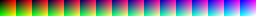
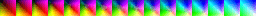
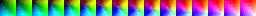
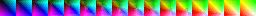

#  Color map effect

Applies a color-map effect on an object or layer.

This works by modifying a reference "color image map" containing all possible colors.

Create your own color map

  - Download the reference color map image:
    
  - Use an image editor (like [GIMP](https://www.gimp.org) or Photoshop) to tweak the color the reference color image map with some filters. For instance, you can use GIMP [Rotate Colors](https://docs.gimp.org/3.0/en/gimp-filter-color-rotate.html) filter.
      - Try some filters on your assets first to get an dea of the end result
      - Once you found the right settings, apply the same filters to the reference color map image.
      - Save it as a new file
  - Use this new image as the color image map for the effect in GDevelop.

Try some ready-to-use color maps

- color-map-model-1.png : 
- color-map-model-2.png : 
- color-map-model-3.png : 

## Reference

All effects are listed in [the effects reference page](/gdevelop5/all-features/effects/reference/).
