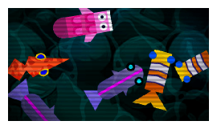

#  CRT effect

Applies a CRT effect, simulating an old cathode-ray tube television.

You can fine-tune the look with the effect properties: the **line width** and **line contrast** control the scanlines, **curvature** bends the image like a rounded screen, **noise** adds static, and **vignetting** darkens the edges. The scanlines can be animated (moving interlaced lines) by setting an **Interlaced Lines Speed** greater than 0.

!!! note

    This is a 2D effect. It has no effect on 3D objects or 3D layers.

## Reference

All effects are listed in [the effects reference page](/gdevelop5/all-features/effects/reference/).
