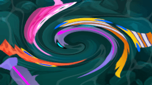
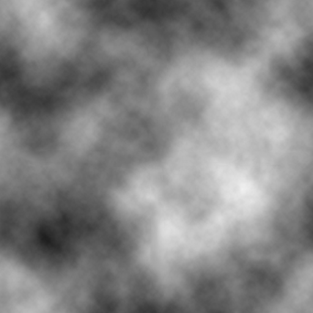

#  Displacement effect

This effect uses the pixel values from the specified texture (called the displacement map) to perform a displacement of an object or layer.

You can download **this example of a displacement map file** and use it in GDevelop when setting up the effect:

You can use this effect to apply all manner of warping effects. Currently, the `r` (red) property of the texture is used to offset the x-axis and the `g` (green) property of the texture is used to offset the y axis.

> It uses the values of the displacement map to look up the correct pixels to output. This means it's not moving the original. Instead, it's starting from the original output and displays the screen differently based on the displacement map. For example, if a displacement map pixel has red = 1 and the filter scale is 20, this filter will output the pixel approximately 20 pixels to the right of the original.

## Reference

All effects are listed in [the effects reference page](/gdevelop5/all-features/effects/reference/).