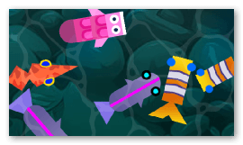

#  Drop shadow effect

Add a drop shadow under your object's visible on the layer.

## Key settings

- **Distance** and **Rotation** position the shadow relative to the image: increase the distance to make objects appear higher above the ground, and change the rotation to match the direction of your light source.
- **Blur** softens the edges of the shadow, while **Alpha** controls how transparent it is.
- **Color** lets you tint the shadow (a dark blue often looks more natural than pure black).
- Enable **Shadow only** to display just the shadow, hiding the object itself. This is handy to render a separate silhouette.
- If a large or far-away shadow gets clipped at the edges of the object, increase the **Padding** to reserve more space for the effect.

## Reference

All effects are listed in [the effects reference page](/gdevelop5/all-features/effects/reference/).
