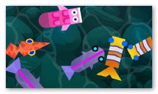

#  Drop shadow effect

Add a drop shadow under your object's visible on the layer.

## Properties

- **Distance** and **Rotation** set how far the shadow is offset and in which direction, so you can suggest a light source coming from a specific angle.
- **Blur** and **Quality** control how soft the shadow's edges are (a higher quality gives a smoother blur at the cost of performance).
- **Color of the shadow** and **Alpha** set the shadow's tint and opacity.
- **Shadow only** hides the object and renders only its shadow. This is handy to place a shadow as a separate object under a character.

!!! note

    If the shadow looks cut off at the edges of the object, increase the **Padding** property to enlarge the area in which the effect is drawn.

## Reference

All effects are listed in [the effects reference page](/gdevelop5/all-features/effects/reference/).
