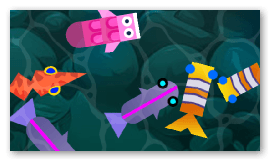

#  Drop shadow effect

Add a drop shadow around what is visible on the object or layer.

## Parameters

- **Distance** and **Rotation** set how far the shadow is offset and in which direction (the rotation is an angle in degrees).
- **Blur** softens the edges of the shadow, and **Quality** controls how smooth that blur looks (higher values look better but cost more performance).
- **Color** and **Alpha** set the tint and opacity of the shadow.
- Enable **Shadow only** to hide the original image and keep only the shadow, which is useful to build a separate object acting as a cast shadow.

## Reference

All effects are listed in [the effects reference page](/gdevelop5/all-features/effects/reference/).
