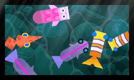

#  God rays effect

Cast rays of light from the top of the screen. **This won't work well if shown on top of the background color of the scene**. Be sure to use an object acting as a background or a floor.

## Adjusting the effect

- **Center X** and **Center Y** set the point the rays originate from, and **Angle** tilts their direction.
- Enable **Parallel** to cast parallel rays (like distant sunlight) using the angle; disable it to make the rays spread out from the center point instead.
- **Light** and **Gain** control how bright and intense the rays are, while **Lacunarity** changes how detailed and broken-up they look.
- **Animation Speed** makes the rays shimmer and move over time.

## Reference

All effects are listed in [the effects reference page](/gdevelop5/all-features/effects/reference/).