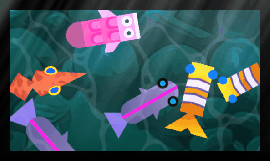

#  God rays effect

Cast rays of light from the top of the screen. **This won't work well if shown on top of the background color of the scene**. Be sure to use an object acting as a background or a floor.

## Parameters

- **Center X** and **Center Y** set where the rays come from.
- **Angle** and **Light** control the direction and spread of the rays.
- **Parallel** makes all rays point in the same direction (like distant sunlight) instead of radiating from the center point.
- **Gain** and **Lacunarity** change the intensity and the detail/roughness of the rays.
- **Animation Speed** animates the rays over time; set it to 0 to keep them static.

## Reference

All effects are listed in [the effects reference page](/gdevelop5/all-features/effects/reference/).