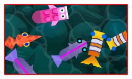

#  Outline

Add an outline on all objects of the layer having the effect.  **This won't work well if shown on top of the background color of the scene**. Be sure to use an object acting as a background or a floor.

## Key settings

- **Thickness** sets how wide the outline is, and **Color** sets its color.
- A thick outline can be cut off at the edges of the object. If this happens, increase the **Padding** to reserve extra space around the object for the effect.

## Reference

All effects are listed in [the effects reference page](/gdevelop5/all-features/effects/reference/).