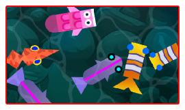

#  Outline

Add an outline on all objects of the layer having the effect.  **This won't work well if shown on top of the background color of the scene**. Be sure to use an object acting as a background or a floor.

## Properties

Use **Thickness** to set the width of the outline and **Color of the outline** to set its color.

!!! note

    If a thick outline looks cut off at the edges of the object, increase the **Padding** property to enlarge the area in which the effect is drawn.

## Reference

All effects are listed in [the effects reference page](/gdevelop5/all-features/effects/reference/).