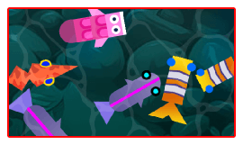

#  Outline

Add an outline on all objects of the layer having the effect.  **This won't work well if shown on top of the background color of the scene**. Be sure to use an object acting as a background or a floor.

## Parameters

- **Thickness** sets the width of the outline.
- **Color** sets the outline color.

!!! note

    A thick outline can be clipped at the edges of the object. If that happens, increase the **Padding** parameter to enlarge the area the effect is allowed to draw in.

## Reference

All effects are listed in [the effects reference page](/gdevelop5/all-features/effects/reference/).