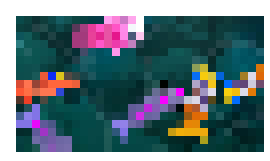

#  Pixelate effect

Applies a pixelated effect, making display objects appear 'blocky'.

The **Size** property sets how large each block of pixels is: the higher the value, the blockier the result.

!!! note

    For pixel-perfect or 8-bit games, you can change the **Scale mode** options in your [game properties](/gdevelop5/interface/project-manager/properties) instead of using this effect.

## Reference

All effects are listed in [the effects reference page](/gdevelop5/all-features/effects/reference/).