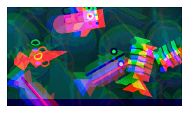

#  RGB split effect

Separate each component's RGB (red, green, blue) colors and display them on the screen with an offset:

This reproduces the "chromatic aberration" look where colors bleed apart. It's commonly used for glitch effects, retro/VHS aesthetics, or as short feedback when the player is hit or an ability is triggered. Since each color channel has its own offset, you can change these offsets with events to make the effect pulse or intensify at key moments.

## Reference

All effects are listed in [the effects reference page](/gdevelop5/all-features/effects/reference/).
