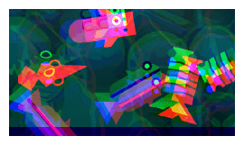

#  RGB split effect

Separate each component's RGB(red, green, blue) colors and display them on the screen with an offset:

Each color channel has its own X and Y offset, so you can move the red, green and blue components in different directions. The larger the offsets, the stronger the color fringing. This is often used for a glitch look, a screen-damage effect, or a subtle retro aberration.

## Reference

All effects are listed in [the effects reference page](/gdevelop5/all-features/effects/reference/).
