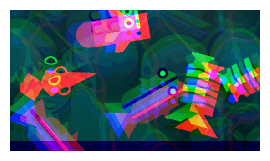

#  RGB split effect

Separate each component's RGB(red, green, blue) colors and display them on the screen with an offset:

## Parameters

Each color channel (red, green, blue) has its own **X offset** and **Y offset**, in pixels, that shifts that channel away from the others. The larger the offsets, the stronger the chromatic aberration. This effect is often used subtly to add a sense of glitch, speed or damage.

## Reference

All effects are listed in [the effects reference page](/gdevelop5/all-features/effects/reference/).
