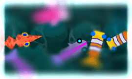

#  Tilt shift effect

Add blur to the top and bottom of the entire layer or object. Perfect to simulate a tiny world or a camera focus effect.

**Blur** sets how strong the blur is at the top and bottom, leaving a sharp band across the middle. **Gradient blur** controls how gradually the image goes from sharp to blurred: a small value gives an abrupt transition, while a large value spreads it out smoothly.

## Reference

All effects are listed in [the effects reference page](/gdevelop5/all-features/effects/reference/).
