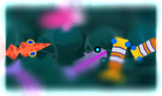

#  Tilt shift effect

Add blur to the top and bottom of the entire layer or object. Perfect to simulate a tiny world or a camera focus effect.

**Blur** sets how strong the blur is at the top and bottom of the screen. **Gradient blur** controls how gradually the image transitions from the sharp horizontal band in the middle to the blurred edges: a larger value keeps a wider area in focus with a softer transition, while a small value makes the blur begin right away.

## Reference

All effects are listed in [the effects reference page](/gdevelop5/all-features/effects/reference/).
