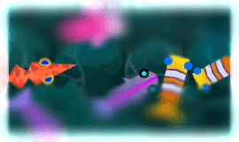

#  Tilt shift effect

Add blur to the top and bottom of the entire layer or object. Perfect to simulate a tiny world or a camera focus effect.

## Parameters

- **Blur** sets how strong the blur is at the top and bottom.
- **Gradient blur** controls the size of the sharp (in-focus) band in the middle: a larger value keeps more of the image sharp, while a smaller value narrows the focused strip.

## Reference

All effects are listed in [the effects reference page](/gdevelop5/all-features/effects/reference/).
