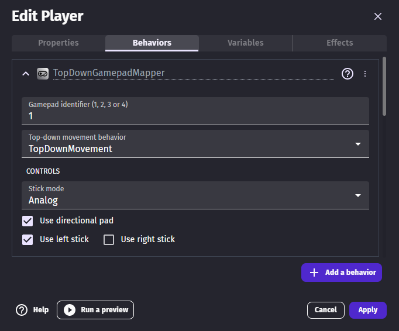
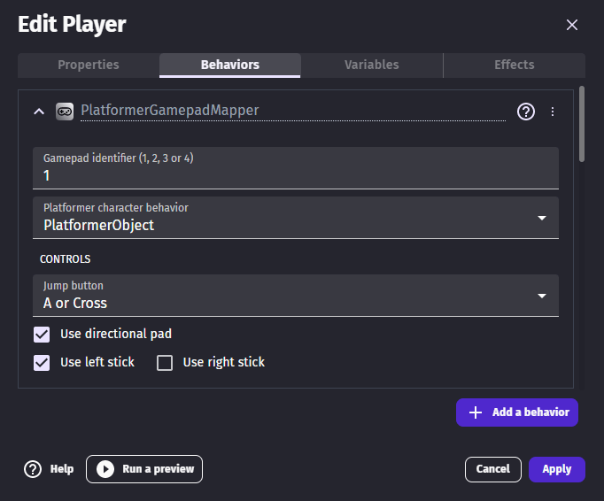
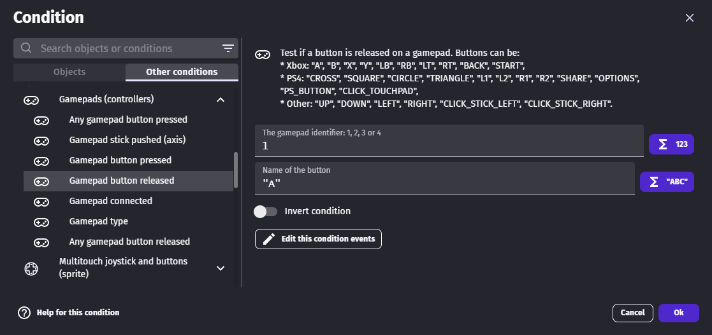
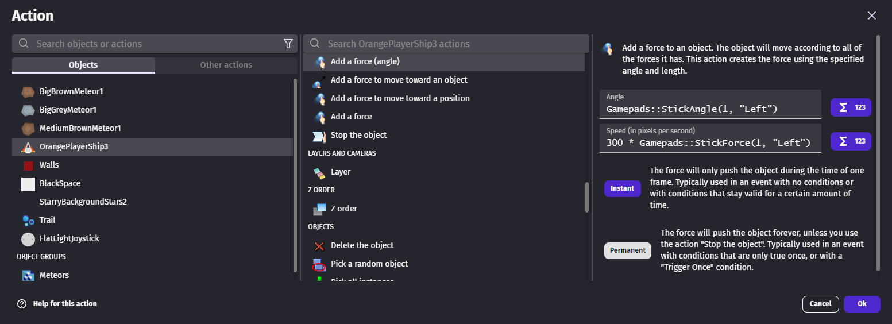
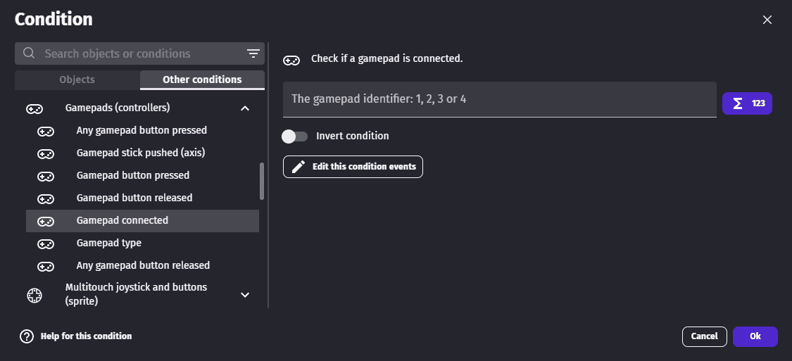

# Gamepad

Gamepad, joystick and game controllers can be used in your game.
**Xbox**, **Playstation** and **generic** controllers are supported.

This feature can be activated by adding the **Gamepad extension** to your project. You will then be able to use conditions and expressions to check if a gamepad is connected, if a button is pressed, released or if a stick is pushed.

!!! tip

    Learn [how to install new extensions](/gdevelop5/extensions/search) by following a step-by-step guide.

## Move a character

### Move a top-down character

The "Top-down gamepad mapper" behavior can be added to the character to make the character move according to player inputs automatically. The default configuration will work without any change for single player games.

!!! tip

    Learn more about the [Top-Down Movement behavior](/gdevelop5/behaviors/topdown).

### Move a platformer character

The "Platformer gamepad mapper" behavior can be added to the character to make the character move according to player inputs automatically.

!!! tip

    Learn more about the [Platform Character behavior](/gdevelop5/behaviors/platformer).

[Open example in GDevelop](https://editor.gdevelop.io/?project=example://platformer){ .md-button .md-button--primary }

[{ width="320" }](https://editor.gdevelop.io/?project=example://platformer)

### Move a 3D platformer character

The "3D platformer gamepad mapper" behavior can be added to a [3d physics character](/gdevelop5/behaviors/physics3d) to make the character move according to player inputs automatically.

[Open example in GDevelop](https://editor.gdevelop.io/?project=example://3d-platformer){ .md-button .md-button--primary }

[{ width="320" }](https://editor.gdevelop.io/?project=example://3d-platformer)

### Move a 3D shooter character

The "3D shooter gamepad mapper" behavior can be added to a [3d physics character](/gdevelop5/behaviors/physics3d) to make the character move according to player inputs automatically.

[Open example in GDevelop](https://editor.gdevelop.io/?project=example://3d-first-person){ .md-button .md-button--primary }

[{ width="320" }](https://editor.gdevelop.io/?project=example://3d-first-person)

### Move a character with custom movement

#### Handle pressed buttons

Detecting pressed buttons can be done with the **Gamepad button pressed** (or **released**) condition. Playstation and Xbox controllers have different button names,  but checking for `A` or `Cross` is the same.

#### Handle sticks

The following [expressions](/gdevelop5/all-features/expressions) let you read analog stick values:

- `Gamepads::StickAngle(gamepadNumber, stick)` — angle the stick is pushed toward (in degrees).
- `Gamepads::StickForce(gamepadNumber, stick)` — overall force/magnitude of the stick push (0 to 1).
- `Gamepads::StickForceX(gamepadNumber, stick)` — horizontal axis of the stick (−1 = fully left, 1 = fully right).
- `Gamepads::StickForceY(gamepadNumber, stick)` — vertical axis of the stick (−1 = fully up, 1 = fully down).

For triggers (LT / RT / L2 / R2), use `Gamepads::TriggerPressure(gamepadNumber, trigger)` which returns a value from 0 (not pressed) to 1 (fully pressed). This allows smooth acceleration or braking in racing games, for example.

#### Deadzone

Small stick movements near the center are often caused by imprecision in the hardware. GDevelop applies a **deadzone** (default 0.2) that ignores stick values below that threshold. You can change the deadzone with the action **"Set the deadzone of a gamepad stick"** or read it with the expression `Gamepads::Deadzone(gamepadNumber)`.

## Handle several players on the same device

### Detect connected gamepads

Each gamepad connected to the computer or phone is numbered from 1 to 4:

* If your game is single player, you'll usually always use condition for the Gamepad 1.
* If your game is multi player, it's a good idea to use the **Gamepad connected** condition to check which gamepads are connected. You could store in a variable the gamepad number associated to a player. You can also force the first player to use the Gamepad 1, and the other player to use Gamepad 2.

### Detect controller type

Use the condition **"Type of gamepad"** or the expression `Gamepads::GamepadType(gamepadNumber)` to identify the kind of controller connected (Xbox, PS4, Steam Deck, etc.). This lets you display the correct button icons in your UI — for example, showing a cross button for PlayStation players and an A button for Xbox players.

## Vibrate a gamepad

Use the action **Gamepad vibration** to make a gamepad vibrate.

**Advanced Gamepad vibration** allows to setup vibration magnitudes for low and high frequency rumble motors.
Each player can have different rumble values.

!!! warning

    Advanced vibration is not supported on Firefox.
