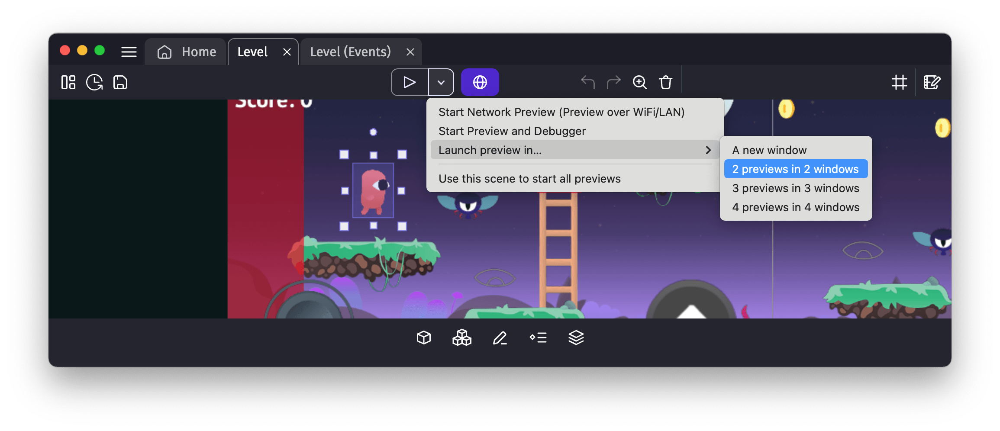
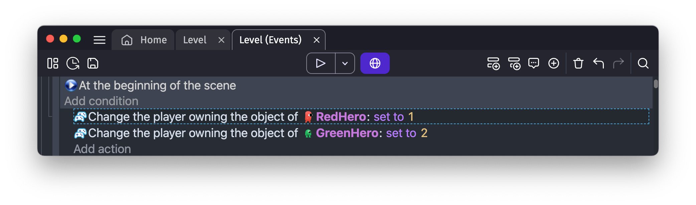
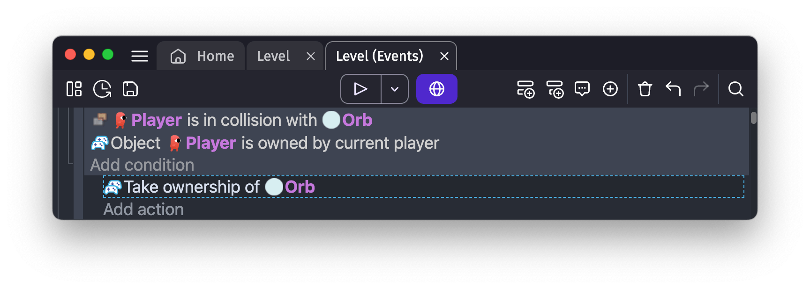
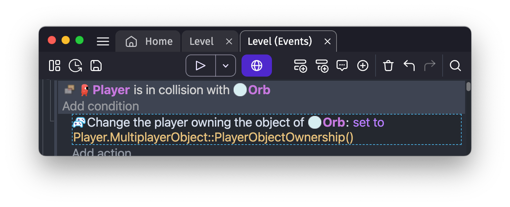

# Making multiplayer games with GDevelop

GDevelop provides a built-in solution for **real-time multiplayer games**. Whether you're making a simple multiplayer game or a more complex one, from a cooperative game to a competitive one, GDevelop Multiplayer features can be used for building your game. Multiplayer works well with [Player Authentication](/gdevelop5/all-features/player-authentication) and [Leaderboards](/gdevelop5/all-features/leaderboards).

It is built to be easy to use, accessible to everyone, and provides a good experience for all your players.

<figure class="video_container">
  <video controls="true" allowfullscreen="true" muted="true" autoplay="true" loop="true">
    <source src="multiplayer-example.mp4" type="video/mp4">
  </video>
</figure>

Some features available out of the box are:

- **Lobbies** for your game and a user interface allowing players to start a new game,
- Built-in **authentication** for players to create an account and log in to your game,
- Automatic choice of the _host_ of the game,
- Automatic **synchronization of players**, depending on who is in charge of each object,
- Automatic synchronization of the rest of the **game state**: game objects, variables...

!!! tip

    Usually, adding multiplayer features or creating a multiplayer game from scratch is something difficult and error-prone. Most solutions, including some you could adapt or use with GDevelop, require some programming and networking knowledge. With GDevelop Multiplayer features, there is **no need to handle servers**, sending custom messages, handling connections, lobbies, packets being lost, prediction of movements, interpolation, etc.

To use the multiplayer features, use the **Multiplayer** behavior on your objects, and the actions/conditions in the **"Multiplayer"** category in GDevelop. It is automatically available in your game, and you can start using it right away. This page will explaining how to use the behavior to make a multiplayer game and the actions/conditions to start and end a game.

!!! note

    GDevelop Multiplayer infrastructure is built to scale from very small game to games with thousands of concurrent players. If you're a game studio or an agency with specific needs (for example, launching a game for a promotional campaign to an audience of dozens of thousands of people), feel free to reach out at hello@gdevelop.io to discuss your specific use-case.

## 1-minute example: from a static game to a 2 player platformer game

Here is a quick example showing how to add lobbies and two players in a platformer game.

<figure class="video_container">
  <video controls="true" allowfullscreen="true" muted="true" autoplay="true" loop="true">
    <source src="Multiplayer_in_1_minute.mp4" type="video/mp4">
  </video>
</figure>

Read the rest of this page to learn more about lobbies and how to set up your game objects.

## Lobby system: start and end a game

The multiplayer extension provides lobbies, so players can join a game together and start playing. It is a key feature to allow players to play together, define which player number they are, and start the game when all players are ready.
Lobbies are automatically created for your game.

!!! note

    In the future, GDevelop will provide a way to setup more lobbies for your game, let players open their own lobbies, or customize the interface.

### Letting the players join a new game

Use the action **Open game lobbies**. This action will show the lobbies to the player, so they can join a game.

??? note "More about the lobbies infrastructure"

    Lobbies are entirely handled by GDevelop Multiplayer infrastructure:

    - When players join a lobby, they are automatically assigned a player number, and the host of the game is automatically defined (player 1).
    - When all players are ready, the player 1 can start the game.
    - When the game is started, the lobby window is automatically closed and players are automatically connected to each other.

??? note "More about player authentication"

    To join a lobby, a player needs to log in to their GDevelop or gd.games account. This is automatically handled for you, so that calling this action will automatically open the authentication window if needed.
    If you want to handle this yourself, or allow players to change their account, you can use the actions and conditions provided by the **Player Authentication** extension.

If needed, you can use the condition **Lobbies window is open** to check if the lobbies are open and prevent some actions to happen on your scene.
Typically, you can use this action when the user presses a button in your menu.

Once the game has started, the condition **Lobby game has just started** will turn true, so you can start your game.
Typically, you can use this condition to either start moving things in your game, or to switch to another scene, where the game will happen.

Note that there is also a condition called **Player is in a lobby** if you need to know if a player has joined a lobby.

??? tip "Access more information about the lobby during the game"

    Expressions are available to let you know access information about the lobby:

    - Expression **Number of players in the lobby**:
      use this expression to know how many players are in the lobby. This can be useful to know how many players are in the game, and adapt your game to the number of players (for instance, deleting scores, enemies, players...)

    - Condition and expression **Player number**. Use this expression or condition to retrieve and compare the player number of a player in the lobby. Numbers are 1, 2, 3, etc.
      This will be particularly useful during the game so you can assign who has permissions to do what, and who is in charge of what, depending on the player number.

    - Conditions **Player has left**:
      use this condition to know if a player has left the lobby. This can be useful to adapt your game if a player leaves the game, either by ending the game or adapt the difficulty of the game.

When developing the game, you can open multiple preview windows and join the same lobby with the same account. This way, you can test the multiplayer features without needing multiple devices.

### Ending a game

When you want to end the game, use action **End the game**. The lobby will be reopened and players will still be in this lobby. This is useful if you want to restart a new game with the same players.

When the action `End the game` is called, the condition **Lobby game has just ended** will turn true, so you can end your game. Typically, you can use this condition to either stop moving things in your game, or to switch to another scene, where the lobby will be reopened.

You can also automatically re-open the lobby by using the action **Open the game lobbies**, so players can start a new game.

## During the game: set up synchronized objects and their owners

One of the most important task in a multiplayer game is to have all the game objects (players, projectiles, doors, triggers, obstacles...) to be synchronized across the players, so all players see the same thing like if they were in the same room.

The Multiplayer extension provides a **behavior to synchronize objects** between players.
By default, if this behavior is not used anywhere, no objects are synchronized between players when the game is played.

To make a multiplayer game, you need to identify:

- Which objects must be synchronized between players (typically, most of the moving objects)
- Which objects are "owned" by the host or by a specific player - see below.

For each synchronized object, there is a notion of **owner** of the object. The owner is the player who is in charge of the object instance: they can move it, change their properties, etc. Other players will simply reproduce this on their own game.

By default, when you use the Multiplayer behavior, the owner of the object is the host (Which is defined as Player 1 in the lobby).

- If your object is not meant to be owned by a specific player, but it's critical for everyone to see it at the right position, you can leave it like this, and the host will be the owner of the object.
- If your object is meant to be owned by a specific player only (a character for instance), you can change the owner of the object to this player number.
- If your object is meant to change owner during the game (for instance, a bonus that can be picked up by any player, or an arrow that can be shot by a player or the other), then leave the owner as "Host", and change who owns this object during the game by using the action **Change Player object ownership**. The owner is designated by the player number (1, 2, 3, 4...) or by 0 when the object is owned by the host.

!!! note

    Even if player 1 is the host, there is a difference between an object owned by the host and an object owned by player 1.
    You can for instance allow another player to grab an object if the host owns it (as in "no-one owns it"), but not if player 1 owns it.
    For the moment, player 1 is the default host, but we may allow other players to become host in the future.

You can also remove the ownership of an object by using the action **Remove object ownership**. When this action is used, the object will be owned back by the host.

### On which objects to use the Multiplayer behavior?

Typically, you will want to avoid using the behavior **Multiplayer object** on too many objects, to avoid overloading the network and the game. You can use it on objects that are important for the game, and you want to be sure that everyone sees them the same way. For instance:

- The **player character**. Each player will own their own character, and send their position to the server, which will synchronize it to other players.
- **Projectiles/Bombs/Items** that are thrown by players. Each player will own the objects they create, and send their position to the server, which will synchronize it to other players.
- Objects that can be **interacted with** by players (doors, buttons, flags, bonuses, etc...). Typically, the server will own these objects at the beginning. When a player interacts with them, an action is used so that the player owns the object.

??? note "What is synchronized across the network?"

    When an object has the behavior and is owned by a player or the server, it is "synchronized" (we also say "replicated") with other players. This includes the whole state of the object instance:

    - The position of the object, its angle, its scale, its opacity,
    - The current forces and movements applied to the object, allowing to synchronize moving platforms, rotating objects, etc,
    - The variables of the object, allowing to synchronize the health of an enemy, the score of a player, the state of a door, etc,
    - The animations of the object (for sprites or 3D models), allowing to synchronize the animation of a character, the state of a button, etc,
    - The effects applied to the object,
    - The timers of the object, allowing to synchronize the cooldown of a spell, the time left before a bomb explodes, etc,
    - The behaviors of the object. For instance, if the object has the behavior "Platformer character", the movement of the character will be synchronized, as well as the state of the character (jumping, falling, etc.). Same if you use physics behaviors or other behaviors impacting the object.

    All this information is sent automatically by GDevelop, so you don't need to worry about it.
    It's still useful to understand this because this shows that the more complex an object is, the most it will consume bandwidth and network resources.

When an object is destroyed, the behavior will also ensure it's deleted on other player games.

In most cases, you just need to add the behavior **Multiplayer object** to the objects you want to synchronize, define who is in charge of this object, and GDevelop will take care of the rest.

### Setting ownership of objects

The main action you will use during your game will be **Change player object ownership**. This action allows you to change the owner of an object, so that the proper player can be in charge of the object.

It's often used:

- At the start of the game, to define who is in charge of the objects that are already present in the game, if you haven't defined their owner in the behavior already.
  Typically, you will use this action on the player characters, depending on their player number at the beginning of the scene. You don't need to use this action on objects that are created by the host, as the host will be the owner by default (for example, a door, a button, a bonus, etc...)

  

- When a player creates an object, to define who is in charge of the object. For instance, when a player throws a bomb, the bomb will be owned by the player, so you can use this action with the **Player number** expression.
- When a player interacts with an object, to change the owner of the object. For instance, when a player grabs a bonus or a weapon, it will be owned by the player. If you use the same object for different players, also use the condition to check if the instance is owned by the current player (otherwise, all players will try to take ownership). For example:

  

  Alternatively, you can use the expression `MultiplayerObject::PlayerObjectOwnership()` to get the number of the player owning an object:

  

### Synchronization of variables and the rest of the game

During a game, the host will automatically synchronize:

- Which scene is currently played,
- The values of the global variables,
- The values of the scene variables,
  This is particularly useful to have a single source of truth for the game state, and to avoid having to synchronize everything manually.

Whereas each player will automatically synchronize:

- The objects they own, as explained above, and the state of these objects (position, object variables, behaviors, etc...),

If you want to make sure that everyone has the same information about a game state, then you can use the global and scene variables: a score multiplier, the difficulty level, etc...

!!! note

    It means that if a player tries to cheat by modifying the global variables or wrongly change a variable because of a network issue, the server will automatically send again the correct value to the player.

## Common patterns and things to look out for

### Handling collisions and interactions between synchronized objects

A particularly tricky situation is when you have objects that are owned by different players, and you need to handle collisions or interactions between these objects.
If not handled correctly, you risk seeing different behaviors on different players' games, which can lead to a bad experience for your players.

The most common case is _when you delete an object as soon as they collide with another_. There is a risk that one player sees the collision happen, but the other player doesn't (as they have not received the information about the latest position of the object).

The rule of thumb is as follows: if the collision, or the interaction in general, is important for the game, then you should handle it only on one player's game (or the server), and then synchronize the result to other players.

For instance, when an arrow shot by a player hits another character or an enemy, you should handle the collision either by the player who owns the arrow or by the player who owns the character or enemy:

- If you handle the collision on the player who owns the arrow, ensure you use the condition **Player object ownership** to check if the current player owns the arrow. Once it happens, you can delete your arrow, and save the information about the collision in a variable of an object owned by the player. For instance a variable `LastHit` can be set to `Player 2` if the arrow hits player 2, and player 2 can react accordingly when they see this variable being set (change their animation, decrease their health, etc.)
- If you handle the collision on the player who owns the character or enemy, ensure you use the condition **Player object ownership** to check if the current player owns the character. Once it happens, you can save the information about the collision in a variable of an object owned by the player. For instance a variable `LastHitBy` can be set to `Player 1` if the arrow belonged to player 1, and player 1 can react accordingly when they see this variable being set (and delete the arrow on their side, for instance).

!!! note

    You can also use the action **Send a custom message to other players** in this case. This action sends a message to other players. For instance a message `Arrow hit player 2` can be sent to all players, so that they can handle the collision on their side, using the condition to read the custom message.
