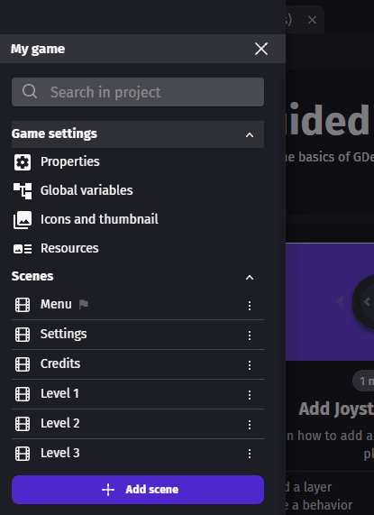
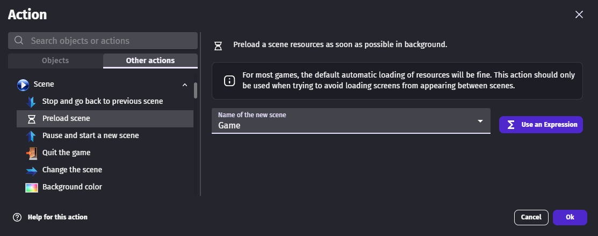
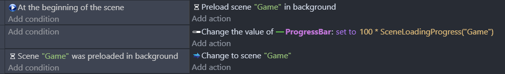

# Resources loading

  <iframe src="https://www.youtube.com/embed/GDVzz21NjCs" frameborder="0" allowfullscreen></iframe>

## Understand how resources are loaded

When a game starts a loading screen is shown while resources for the first scene (the one with a flag) are downloaded. It also includes resources used by global objects.

The resources used by other scenes are downloaded in background while users interact with the first scene, a game menu for instance.

It may happen that all the resources needed for a scene are not ready when the scene must be displayed. In this case, the loading is shown a second time while its resources are downloaded as soon as possible.

## Control preloading and unloading

By default, the resources of every scene are preloaded in the background and kept in memory even after leaving a scene. This makes switching scenes faster but increases memory usage.

You can change this behavior:

* In **Project properties**, modify **Scenes resources preloading** to disable preloading for all scenes.
* In **Scene properties**, override the preloading for a particular scene and use **Resources unloading** to remove its resources from memory when leaving it.

When a scene with unloading enabled is displayed again, its resources are loaded once more. These options are helpful for large or modular games or to reduce memory usage in web games.

## Optimize resource loading

Intermediary loading screens can be avoided by choosing in which order scenes are pre-loaded.

The scenes are pre-loaded in the same order as the scene list in the editor. The scenes with the highest chances of being displayed at the beginning should be moved to the top of the list. Scenes with very few resources are good candidates too because they will delay other scenes pre-loading only by a little.

An action allows to change the default loading order by choosing which scene to pre-load in the background next. For instance, this action can be used at the beginning of the scene to make sure that the next level will be pre-loaded as soon as possible.

!!! tip

    Projects built as an application have all resources stored locally and the loading will be fast enough for loading optimizations not to matter much.

## Make a custom loading screen

Default intermediary loading screens can be replaced by custom scenes using the following events. A [resource bar](/gdevelop5/objects/resource-bar) can be used to display the loading progress.

## Reference

All actions, conditions and expressions are listed in [the scene reference page](/gdevelop5/all-features/scene/reference/).
