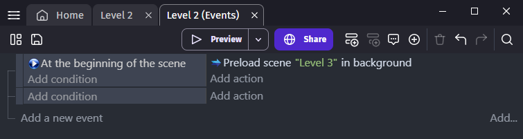

# Resources loading

## Understand how resources are loaded

When a game starts a loading screen is shown while resources for the first scene (the one with a flag) are downloaded. It also includes resources used by global objects.

The resources used by other scenes are downloaded in background while users interact with the first scene, a game menu for instance.

It may happen that all the resources needed for a scene are not ready when the scene must be displayed. In this case, the loading is shown a second time while its resources are downloaded as soon as possible.

## Optimize resource loading

Intermediary loading screens can be avoided by choosing in which order scenes are pre-loaded.

The scenes are pre-loaded in the same order as the scene list in the editor. The scenes with the highest chances of being displayed at the beginning should be moved on the top of the list. Scenes with very few resources are good candidates too because they will delay other scenes pre-loading only by a little.

An action allows to change the default loading order by choosing which scene to pre-load in background next. For instance, this action can be used at the beginning of the scene to make sure that the next level will be pre-loaded as soon as possible.

!!! tip

    Projects built as an application have all resources stored locally and the loading time will be fast enough for loading optimizations not to matter much.

## Reference

All actions, conditions and expressions are listed in [the resource loading reference page](/gdevelop5/all-features/resources-loading/reference/).
