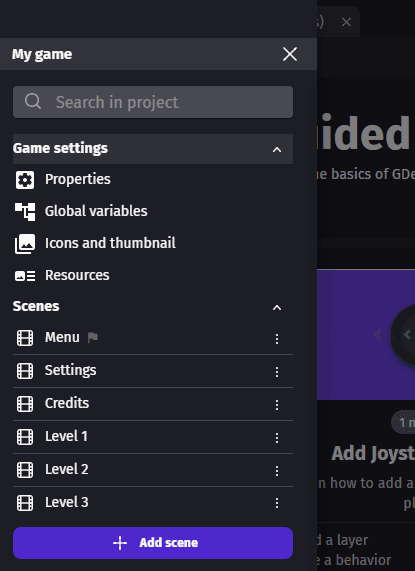
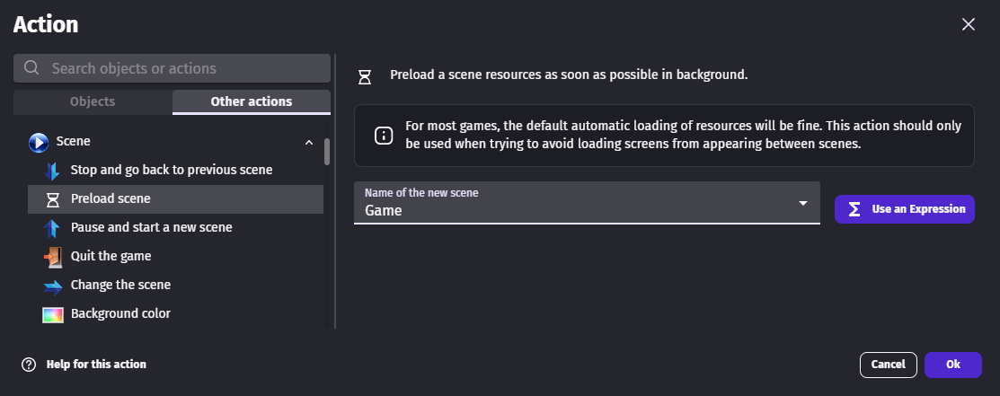
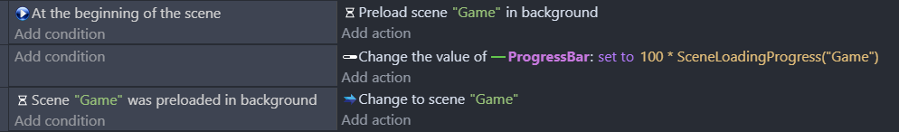
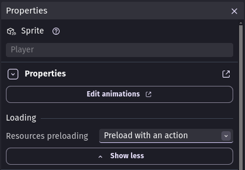
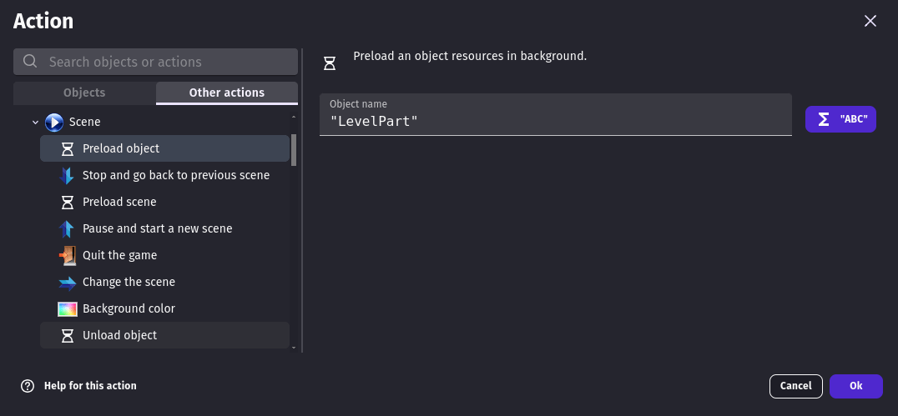
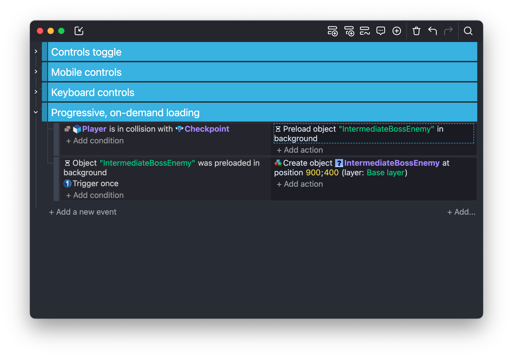

# Resources loading

  <iframe src="https://www.youtube.com/embed/GDVzz21NjCs" frameborder="0" allowfullscreen></iframe>

## Understand how resources are loaded

When a game starts a loading screen is shown while resources for the first scene (the one with a flag) are downloaded. It also includes resources used by global objects.

The resources used by other scenes are downloaded in background while users interact with the first scene, a game menu for instance.

It may happen that all the resources needed for a scene are not ready when the scene must be displayed. In this case, the loading is shown a second time while its resources are downloaded as soon as possible.

## Control preloading and unloading

By default, the resources of every scene are preloaded in the background and kept in memory even after leaving a scene. This makes switching scenes faster but increases memory usage.

You can change this behavior:

* In **Project properties**, modify **Scenes resources preloading** to disable preloading for all scenes.
* In **Scene properties**, override the preloading for a particular scene and use **Resources unloading** to remove its resources from memory when leaving it.

When a scene with unloading enabled is displayed again, its resources are loaded once more. These options are helpful for large or modular games or to reduce memory usage in web games.

## Optimize resource loading

Intermediary loading screens can be avoided by choosing in which order scenes are pre-loaded.

The scenes are pre-loaded in the same order as the scene list in the editor. The scenes with the highest chances of being displayed at the beginning should be moved to the top of the list. Scenes with very few resources are good candidates too because they will delay other scenes pre-loading only by a little.

The **Preload scene** action lets you override the default loading order by requesting that a specific scene's resources are loaded in the background as soon as possible. Use it at the beginning of a scene (for example, at the start of a menu scene) to ensure the next level is ready by the time the player reaches it.

You can check whether the background loading for a scene has completed using the **Scene preloaded** condition. The **Scene loading progress** expression (`SceneLoadingProgress("SceneName")`) returns a value between 0 and 1 representing how far along the background loading is.

!!! tip

    Projects built as an application have all resources stored locally and the loading will be fast enough for loading optimizations not to matter much.

## Make a custom loading screen

Default intermediary loading screens can be replaced by custom scenes using events. The approach is to start a dedicated loading scene early, trigger background loading of the next scene from it, then switch automatically once loading is complete.

Inside the loading scene, use:

- `SceneLoadingProgress("TargetScene")` — an expression returning a number from 0 (nothing loaded) to 1 (fully loaded). Connect it to a [resource bar](/gdevelop5/objects/resource-bar) to give visual feedback.
- **Scene preloaded** condition — becomes true when all resources for the target scene are ready. Use it to switch to the target scene automatically.

## Load an object independently

Usually, all objects are loaded with their scene. When a scene have a lot of resources, you might want to choose when to load and unload objects with heaviest resources. For this, you should select **Preload with action** for the **Resources preloading** property of your objects.

You can then use the **Preload object** and **Unload object** actions.

The **Preload object** won't stop the game while the object resources are being preloaded. If you try to create the object right away you will likely see pink images because some resources haven't been loaded yet. You can check when it's safe to create the object with the **Object preloaded** condition. 

!!! note

    Global objects and global object groups are not supported yet.

## Reference

All actions, conditions and expressions are listed in [the scene reference page](/gdevelop5/all-features/scene/reference/).
