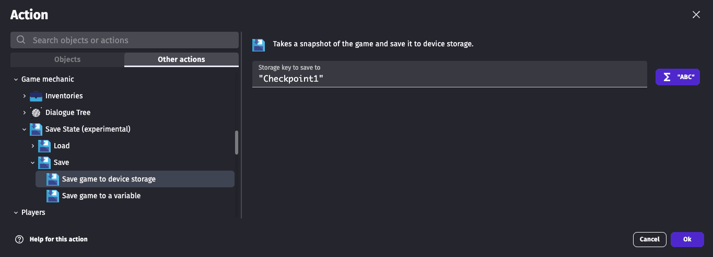

# Saving & Loading the game state

## Overview

GDevelop provides a built-in solution for **saving and loading**. It is built to be very easy to use, with a simple action to save the game state and another one to load it.

Save & Load can be done in 2 different ways:

- **Using the device storage** This is the easiest way to save/load the game state, and is recommended for most games, as it works on all platforms (web, desktop, mobile) and ensure the date is persisted between game sessions (closing and reopening the game).
  - You can define a key to identify the save slot (for example "Save1" or "CheckpointA"), so that you can have multiple save slots.
- **Using a scene or global variable** This is a more advanced way to save/load the game state, and can be used for example to implement checkpoints in your game. The game state is saved in a variable, that you can then store it in a file or send to a server. The downside is that the data is not persisted between game sessions, as variables are reset when the game is closed.

A few expressions and conditions are also provided to check the last save/load time, as well as the success/failure of the last operation.

### Known missing features or limitations

!!! note

    While it can save the game at any point, it is recommended to save/load from a checkpoint in your game, where the game state is consistent (for example, not in the middle of a fight, or complex movements).
    The risk is to lose some information while loading the game back, resulting in a new state that is not exactly the same as the one when saving.

Missing features or limitations:

- Custom objects are not properly saved/loaded for the moment. They will be correctly recreated and positioned, but in a default state.
