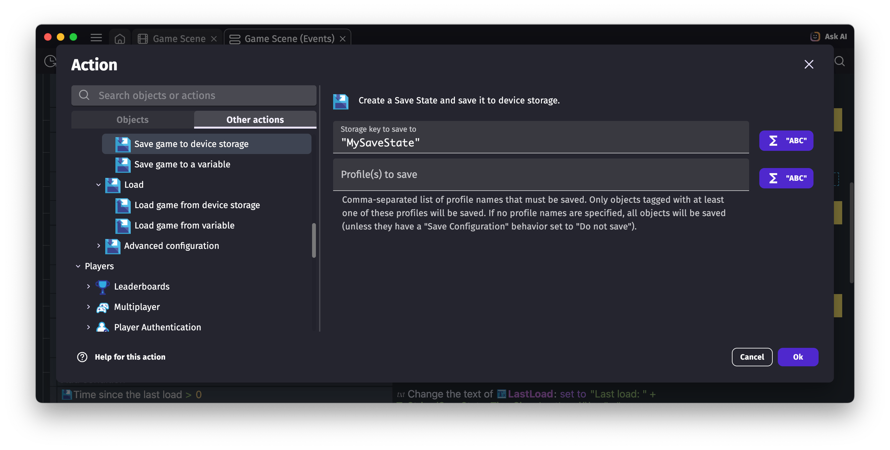

# Save & Load (Save State)

The **Save State** extension allows you to **save and restore the full state of your game** at any time — including objects (position, variables, behaviors), global and scene variables, scene timers, "Trigger Once" states, sounds and music being played, tweens, layers, async actions (Wait X seconds), and linked objects.

It is designed to be **easy to use by default**, while also providing **advanced configuration options** for developers who need finer control over what gets saved or loaded.

These two short videos are illustrating save states being used/restored in a 3D game (using the 3D physics engine) and a 2D game:

  <video muted="true" autoplay="true" loop="true">
    <source src="save-load-3d-demo.mp4" type="video/mp4">
  </video>

  <video muted="true" autoplay="true" loop="true">
    <source src="save-load-demo.mp4" type="video/mp4">
  </video>

## Basic Usage

You can save and load the game state in **two main ways**: to a device storage handled by GDevelop or to a variable.

### 1. Save to Device Storage

This is the **recommended** approach for most games. It automatically stores the save data in the player’s **device storage** (web, desktop, or mobile), ensuring that the save persists between sessions — even if the game is closed or restarted.

For this, use actions **Save game to device storage** and **Load game from device storage**.

Both load actions have an optional **"Stop and restart all the scenes currently played?"** parameter (default: No). When set to Yes, all currently running scenes are unloaded and re-created before applying the save state — useful when you need a clean slate (e.g. returning from a menu to the game). When set to No, the save state is applied on top of the currently running scenes.

Each save uses a **storage key**, such as `"Save1"`, `"CheckpointA"`, or `"Autosave"`, to identify the save slot. This enables you to offer multiple save slots (in some games, it's usual to have 3 to 5 save slots that the player can use).

!!! tip

    While there is no hard limitation on the number of saves, some devices or browsers might have a limitation on the total size occupied by the saves. It's usually safer to limit the number of saves the player can do.

### 2. Save to a Variable (Advanced)

You can also save the entire game state into a **scene or global variable**.
This is useful for:

- Implementing checkpoints or quicksaves that don’t persist after closing the game. In this case, be sure to exclude the variable from the save state (see "Exclude Variables or other scene/game data from Save States" section below).
- Sending save data to a remote server or cloud.
- Debugging.

!!! important
    Variable-based saves are stored only in memory — they are **not persisted** between game sessions. You must persist the variable somewhere if you want to keep the save state.

## Monitoring Save/Load Operations

The extension provides **conditions and expressions** to react to save/load events:

**Conditions:**
- **Save just succeeded** — triggers the frame after a save completed successfully. Use this to show a "Game saved!" notification.
- **Save just failed** — triggers if a save attempt failed. Use this to warn the player.
- **Load just succeeded** — triggers the frame after a load completed successfully. This is useful to run initialization logic after restoring a save (analogous to "At the beginning of the scene", but the scene is already running since it was "frozen in time" in the save state).
- **Load just failed** — triggers if a load attempt failed (e.g. no save found for that key).

**Expressions:**
- **TimeSinceLastSave** — number of seconds since the last successful save. Returns `-1` if no save has happened yet in this session.
- **TimeSinceLastLoad** — number of seconds since the last successful load. Returns `-1` if no load has happened yet in this session.

## Advanced: Excluding Objects from Save States with the “Save Configuration” Behavior.

By default, everything in the game is saved — all objects, scene data, and variables. In practice, there are objects you might want not to save, like interface elements, virtual joystick, backgrounds, etc...

You can customize this behavior using the **Save Configuration** behavior or dedicated actions.

Add the **Save Configuration** behavior to any object you don’t want to include in save states or only in some save states. Then, set up the properties:

- **Persistence mode**:
    - "Include in save states" (default): the object is included in save states and loaded back.
    - "Do not save": the object is excluded. It won’t be saved, and even if it was previously saved, it won’t be loaded back.
- **Save profile names** (advanced): optional comma-separated list of profiles (see below) in which this object should be included.

!!! note
    Objects that do **not** have a Save Configuration behavior are treated as "Include in save states" for the default profile — they are saved and loaded normally.

!!! tip

    The best practice is to tag all objects from your game interface, virtual controls as well as objects that are not part of the gameplay with this behavior and the "Do not save" mode.

### Exclude Variables or other Scene/Game Data from Save States

You can also configure **scene or global variables** to be included or excluded from save states dynamically. Use the action **"Change the save configuration of a variable"**. It lets you:

- Exclude a variable from all saves. This is helpful for variables that must stay the same or that are already loaded from another storage, like game settings (audio volume, custom control schemes or keys, etc...).
- Include it only in certain save profiles (see next section).

Similarly, you can use these actions for fine-grained control on what is saved/loaded in the rest of the game:

- **Change the save configuration of the global game data**: this does the same for global variables and audio (sounds/musics being played).
- **Change the save configuration of a scene data**: this does the same for the scene variables, timers, layers, asynchronous actions (Wait X seconds).

## Even More Advanced: Using Save Profiles

The Save State system supports **profiles**, allowing you to save only some part of the game. For example, you could:

- Make a full save of the game after a level is completed (this is what happens when you don't specify a profile: the "default" profile is used).
- During a level, use the save state with a specific profile `"enemies"` to save enemies positions when a checkpoint is reached. If they player dies, you put it back to the checkpoint position and the save state with the profile `"enemies"` so that enemies are restored - but the rest of the game continues to run.

Each object, variable, or piece of scene/game data can be assigned one or more **profile names** (like `"default"`, `"checkpoint"`, `"player"`, etc.). For example, a coin can be `items, coins`.

When you perform a save or load, you can specify one or more profiles (comma-separated) — and only the data tagged with **at least one** of those profiles will be affected. Data not tagged with any of the specified profiles is left untouched during loading.

## Known Limitations

!!! note

    While it’s technically possible to save the game at any moment, it’s **recommended** to save or load at stable points in gameplay — such as checkpoints or after the end of an action — to avoid inconsistencies (e.g., during physics updates or combat animations).

- **Custom objects** are not yet fully serialized. They will be recreated and placed correctly, but their internal state may reset to default.
- **Third-party extensions** that manage data outside of GDevelop’s variable/object system might not be captured.
- **Performance impact:** Saving large games (many objects or variables) can briefly freeze the game; use with care on mobile or web platforms.
