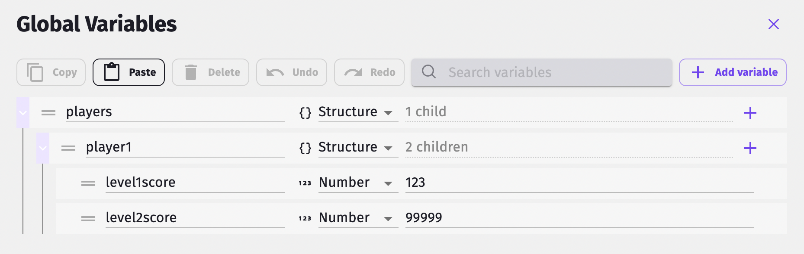

# Variables

In GDevelop, you can use _variables_ to store temporary data, such as numbers and text. For example, you might use variables to store the player's name, current health, and score.

!!! note

    To learn how to store data that isn't temporary, such as a player's saved progress, refer to [storage](/gdevelop5/all-features/storage).

<div class="video-container">
  <iframe src="https://www.youtube.com/embed/MFvAd-96LWo" frameborder="0" allowfullscreen></iframe>
</div>

## Data types

All variables have a _data type_. The data type of a variable determines what type of data the variable can contain.

In GDevelop, variables can contain the following types of data:

- Number
- Text
- Structure
- Boolean
- Array

Number, Text and Boolean are *primitive types*: they store a value.
Structure and Array are *collection types*: they store multiple variables.

### Number

A variable with the *Number* data type can contain numeric values, such as `0`, `100`, and `-10`. You can perform mathematical calculations on variables that have this data type, such as multiplication or division.

### Text

A variable with the *Text* data type can contain text, such as the words `Hello world`. In programming languages, this data type is often referred to as a _string_. In this documentation,
the terms *text* and *string* are used interchangeably.

### Boolean

A variable with the *Boolean* data type contains the simplest form of information: either yes or no, 1 or 0, true or false. They are useful as they can be easily toggled.

### Structure

A Structure variable maps names to other variables (called "child variables").

For example, a simple structure can map the name "Hello" to one sub-variable and the name "World" to another sub-variable.
You can use this data type to organize related variables within a single variable.

!!! tip

    In programming languages, this data type is often referred to as an _object_, _map_, _hash_, or *dictionary*.

Structures can be created in the Variables Editor, using events or by using an extension like [JSON resource loader](../../extensions/jsonresource-loader/).

### Array

An Array variable, also sometimes called _list_ in programming languages, is like a list of variables.

Each variable in an Array has an index, which defines their position in the array.
The indices begin at 0 and go up to however long the array is.

Arrays can be created in the Variables Editor, using events or by using an extension like [JSON resource loader](../../extensions/jsonresource-loader/).

## Using a variable in expressions

Once a variable is added in the variables editor of a project or a scene, you can simply write its name in an expression to use it. For example, if you have a variable named "Score":

`"Your total points are:" + Score`

For a variable of an object, you write the object name first followed by a dot and the variable name. For example:

`"The player points are" + Player.Points`


!!! info

    If multiple variables or objects have the same name, or if they are conflicting with a parameter (in a function) or a property (in a custom behavior or custom object) the order is as follows:

    - In a scene: Object > Scene Variable > Global Variable,
    - In an extension: Object > Parameter > Property > Shared Property.

    This means if there are conflicting names, the object will always be used in priority. Otherwise, in the events of a scene, it will be a scene variable if it exists, otherwise a global variable if it exists.
    In an extension, the parameter with the given name will be used first, other a property if it exists.

## Accessing child variables in structures or arrays

Variables that exist within a collection variable (i.e: an array or a structure) are known as _child variables_.
To access the value of a child variable, use the following syntax in an [expressions](/gdevelop5/all-features/expressions), replacing the values in angled brackets with variable names:

```
<parent_variable>.<child_variable>
```
Assume we have this structure:



To get the value `123` we can write the following expression

```
players.player1.level1score
```

Or, using brackets:

```
players["player1"]["level1score"]
```

!!! tip

    On structures, `<child_variable>` is the name of the child variable. On arrays it is the index of the child variable. Only **numbers work as indices** for arrays.

Parent variables need to be declared, but it's not the case for children variables. The benefit of declaring children is to get autocompletion in the events.

!!! note

    Collection variables (structures and arrays) can contain other collection variables. This makes it possible to store complex data in a single variable. This is helpful when dealing with structured data coming from various sources, including data served from web services or third parties.

    Just be careful the data doesn't become too difficult to manage if you create structures with a lot of variables.

### Accessing child variables dynamically

You can use expressions to dynamically access child variables.

For example, imagine storing the player's score for each level, called `Level1`, `Level2`, `Level3`. If you want to show the player's score for a specific level, you may store the current level number in a variable called `CurrentLevel`. You could then use the following syntax to access the score:

```
PlayerScore["Level" + CurrentLevel]
```

Whatever is inside the square brackets will be interpreted as the name of the child.

If you need to use a variable to define part of the child path, all the subsequent children in the path will need to be in square brackets as well.   In the above example if you wanted to address a child called `PlayerScore.Level1.enemies.killbonus` but still define the level dynamically, it would look like this:

```
PlayerScore["Level" + CurrentLevel].enemies.killbonus
```

Note that this is equivalent to writing:

```
PlayerScore["Level" + CurrentLevel]["enemies"]["killbonus"]
```

## Scopes

The _scope_ of a variable determines:

- where the variable can be accessed from,
- how long the variable is stored in memory,
- the steps required to create the variable.

In GDevelop, there are three variable scopes:

- [Global](/gdevelop5/all-features/variables/global-variables)
- [Scene](/gdevelop5/all-features/variables/scene-variables)
- [Local to an event](/gdevelop5/all-features/variables/local-variables)
- [Object](/gdevelop5/all-features/variables/object-variables)

Refer to the linked pages for more information about each variable scope.

!!! tip

    Sometimes, in particular in extensions, variables are not recommended because there are better alternatives. For example, in a custom behavior, you can use the properties of the behavior to store data inside the behavior.

## Naming variables

Variable names should not contain dots (periods), commas or spaces. Other characters are also reserved by GDevelop. If you use something forbidden, GDevelop will automatically correct the name you've entered.

## Debugging variables

When developing a game, bugs can occur because the value of a variable isn't what you expect it to be. If something in your game isn't working and you think the problem might relate to a variable, use GDevelop's debugger to figure out what's wrong.

For more information, refer to [debugger](/gdevelop5/interface/debugger).

## Reference

All actions, conditions and expressions are listed in [the variables reference page](/gdevelop5/all-features/variables/reference/).
