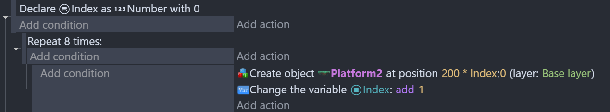
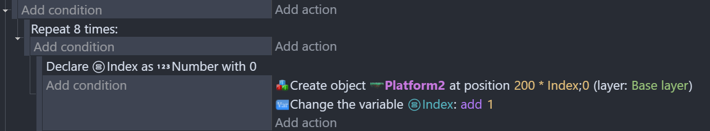

# Local variables

Local variables are [variables](/gdevelop5/all-features/variables) which are:

- stored in memory for the duration of an event execution,
- can only be accessed from its event and sub-events.

They're useful for temporarily use the result of a calculus, such as a random number to tiger different actions according to its value. They're deleted from memory as soon as the event is fully executed.

## Creating local variables

1. Open the [Event editor](/gdevelop5/interface/events-editor).
2. Right click on an event.
3. Select **Add > Add local variable**.

In the editor, choose "Add a variable", then enter a name, choose a data type and, optionally, enter a default value for the variable (this will be the value used when the even execution starts).

!!! tip

    Variable names should not contain dots (periods), commas or spaces. Other characters are also reserved by GDevelop. If you use something forbidden, GDevelop will automatically correct the name you've entered.

## Using local variables in expressions

You can use local variables in [expressions](/gdevelop5/all-features/expressions). Just write the name of the variable to use it in a formula. Note that if an object is using the same name, it will take the priority over the scene variable.

## Use local variable as a loop index

A local variable can be used to keep track of the current repetition number in a [repeat loop](/gdevelop5/events/repeat). For instance, the following events create a row of 8 platforms.

Local variables can also be used within a loop, but in this case its value is reset at every repetition. For instance, the following events create 8 platforms overlapping each other.

