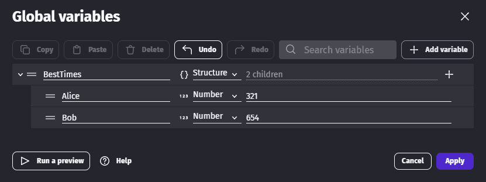
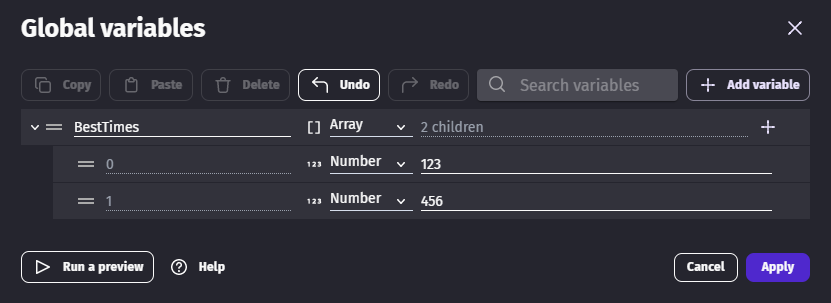
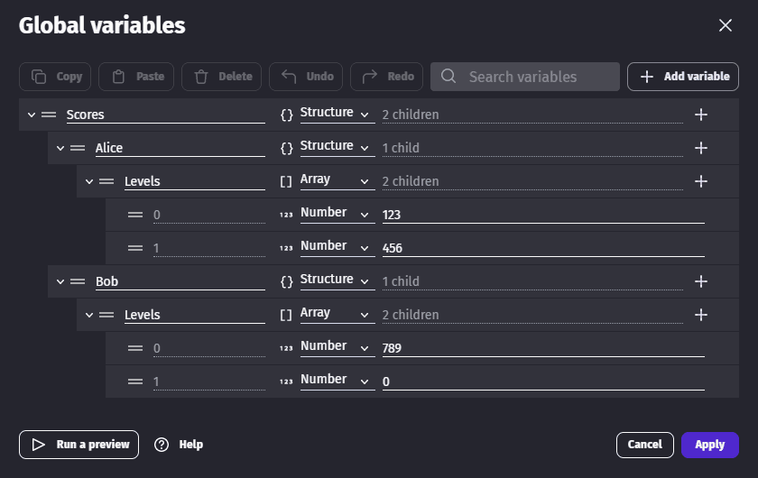
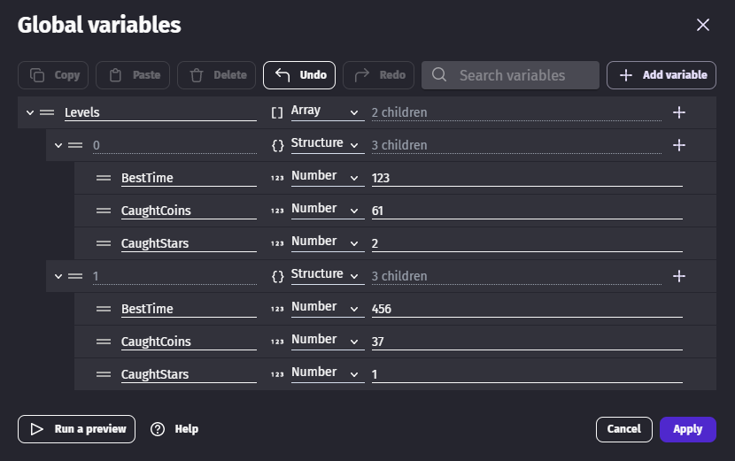

# Structure and array variables

<div class="video-container">
  <iframe src="https://www.youtube.com/embed/irG4e2HoaEw" frameborder="0" allowfullscreen></iframe>
</div>

!!! warning

    Reading the [variable](..) page first will help understanding this page.

### Structure

A Structure variable maps names to other variables (called "child variables").

For example, a simple structure can map the name "Hello" to one sub-variable and the name "World" to another sub-variable.
You can use this data type to organize related variables within a single variable.

!!! tip

    In programming languages, this data type is often referred to as an _object_, _map_, _hash_, or *dictionary*.

Structures can be created in the Variables Editor, using events or by using an extension like [JSON resource loader](../../extensions/jsonresource-loader/).



### Array

An Array variable, also sometimes called _list_ in programming languages, is like a list of variables.

Each variable in an Array has an index, which defines their position in the array.
The indices begin at 0 and go up to however long the array is.

Arrays can be created in the Variables Editor, using events or by using an extension like [JSON resource loader](../../extensions/jsonresource-loader/).



!!! note

    Array variables should only contain children of the same type, here numbers. When you need a mix of numbers and strings (or even only several numbers), you can make each child a structure as explained in the [Array of structures](#array-of-structures) section.

## Accessing child variables in structures or arrays

Variables that exist within a collection variable (i.e: an array or a structure) are known as _child variables_.
To access the value of a child variable, use the following syntax in an [expressions](/gdevelop5/all-features/expressions), replacing the values in angled brackets with variable names:

```
<parent_variable>.<child_variable>
```
Assume we have this structure:



To get the value `123` we can write the following expression

```
Scores.Alice.Levels[0]
```

Or, using brackets:

```
Scores["Alice"]["Levels"][0]
```

!!! tip

    On structures, `<child_variable>` is the name of the child variable. On arrays it is the index of the child variable. Only **numbers work as indices** for arrays.

Parent variables need to be declared, but it's not the case for children variables. The benefit of declaring children is to get autocompletion in the events.

!!! note

    Collection variables (structures and arrays) can contain other collection variables. This makes it possible to store complex data in a single variable. This is helpful when dealing with structured data coming from various sources, including data served from web services or third parties.

    Just be careful the data doesn't become too difficult to manage if you create structures with a lot of variables.

### Accessing child variables dynamically

You can use expressions to dynamically access child variables.

For example, imagine storing the player's score for each level. If you want to show the player's score for a specific level, you may store the current level number in a variable called `CurrentLevel`. You can then use the following syntax to access the score:

```
Scores.Alice.Levels[CurrentLevel]
```

### Array of structures

Array variables can contain structure variables. It allows to have several values for one index.


