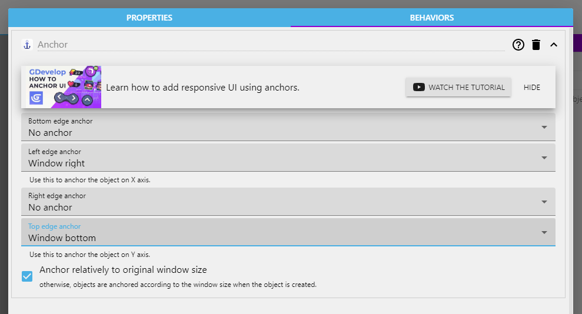

# Anchor Behavior

You can anchor an [object](/gdevelop5/objects) to the screen by using anchor [behavior](/gdevelop5/behaviors) to pin its edges (bottom, left, right, or top) to the window edges. Once anchored, if the screen size changes, the distance between the edge of the object and the edge of the window will stay the same. This is useful for static UI/HUD objects.

## Anchoring an object to the screen

To add an anchor to an object:

  * Right-click on the object in the Objects Panel (or create a new object) and select **Edit object**.
  * Click on the **Behaviors** tab.
  * Click **+** to add a behavior to the object.
  * Select **Anchor**.
  * Set your anchor points and click **Apply**.

## Behavior parameters

### Edge anchor

You can choose to what the object will be anchored from 3 main options:

  * **None**: No anchor will be applied to the selected edge.
  * **Window side**: The distance between the object's edge and the selected window side is set so that it is the same for any window size.
  * **Proportional**: The object's edge will always be set so that it is at the same proportion of the screen.

Note that setting anchors to opposite edges will stretch the object.

## Reference

All actions, conditions and expressions are listed in [the anchor behavior reference page](/gdevelop5/all-features/anchor-behavior/reference/).