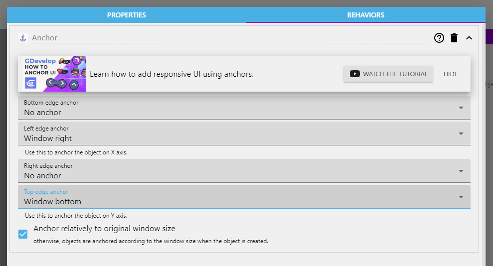

# Anchor Behavior

You can anchor an [object](/gdevelop5/objects) to the screen by using anchor [behavior](/gdevelop5/behaviors) to pin its edges (bottom, left, right, or top) to the window edges. Once anchored, if the screen size changes, the distance between the edge of the object and the edge of the window will stay the same. This is useful for static UI/HUD objects.

## Anchoring an object to the screen

To add an anchor to an object:

  * Right-click on the object in the Objects Panel (or create a new object) and select **Edit object**.
  * Click on the **Behaviors** tab.
  * Click **+** to add a behavior to the object.
  * Select **Anchor**.
  * Set your anchor points and click **Apply**.

## Behavior parameters

The anchor behavior editor provides a simplified set of buttons for horizontal and vertical anchoring:

  * **None**: No anchor applied — the object stays at its original position regardless of window size.
  * **Left / Top**: The object's position relative to the left (or top) edge of the window stays constant.
  * **Center**: The object stays at the same distance from the center of the window.
  * **Right / Bottom**: The object's position relative to the right (or bottom) edge stays constant.
  * **Fill**: The object stretches to fill the window (anchors both edges to opposite sides).
  * **Fill proportionally**: The object scales proportionally with the window size.

For advanced use cases — such as anchoring one edge to the left and the other to the center — an **Advanced** section is available with individual per-edge settings.

## Reference

All actions, conditions and expressions are listed in [the anchor behavior reference page](/gdevelop5/all-features/anchor-behavior/reference/).