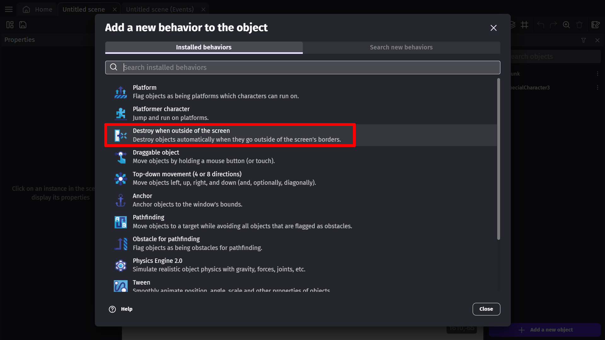
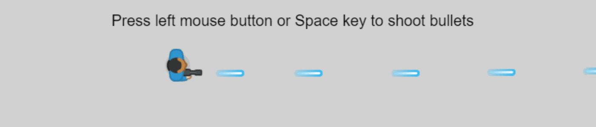

# Destroy outside screen behavior

This [behavior](/gdevelop5/behaviors) deletes objects, like bullets, that go off screen in order to improve performance. Apply the behavior to an [object](/gdevelop5/objects) and whenever an instance of this object goes out of the bounds of the game scene/screen it will be destroyed.

This is one way of ensuring that your game's performance doesn't suffer because it's keeping track of bullets or other objects that have left the game scene, and will likely never return.

#### Add behavior to object

To add a behavior to an object, first open the object properties by right-clicking/double clicking on the object that is located in the Objects list. Select "Edit object" from the popup list. Then select the Behaviors tab. Click the "add behavior" button.

#### Destroy when outside of screen

Once you have selected this behavior from the list, it is going to eliminate the object whenever it is outside the screen. You do not need to change this behaviors options, and it will automatically apply to all instances of the object. Press apply in the bottom right corner of the object properties window to confirm this change.

# Examples

!!! tip

        **See it in action!** 🎮
    Open this example online.

**Destroy Bullets Outside Screen/Scene**

[Open example in GDevelop](https://editor.gdevelop.io/?project=example://shoot-bullets){ .md-button .md-button--primary }

## Reference

All actions, conditions and expressions are listed in [the destroy outside behavior reference page](/gdevelop5/all-features/destroy-outside-behavior/reference/).