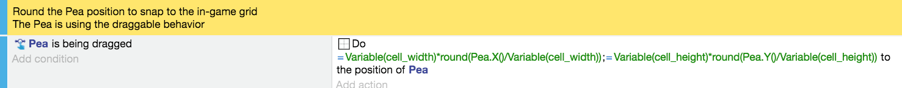
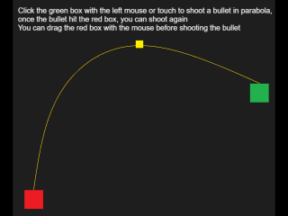
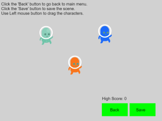

# Draggable Object Behavior

!!! tip

        **See it in action!** 🎮
    [I would rather see the Draggable object behavior examples! Please take me there now.](/#Examples)

The draggable object [behavior](/gdevelop5/behaviors) will make the [object](/gdevelop5/objects) draggable with the mouse or by touching it on a touchscreen.

## Add the Draggable behavior to an object

To add the Draggable behavior to an object, start with creating an object or open the object's properties by accessing the object in the Scene Objects list. Select "Edit object" from the popup list. Then select "Behaviors" and click the add behavior button.

Choose the behavior in the list:

## Properties and events

### Behavior configuration

The draggable behavior has an optional parameter:

  * **Check collision mask**: When enabled, the object can only be dragged when clicking on a non-transparent pixel (for sprites with transparency). This provides more precise click detection but may have a slight performance cost.

### Using events

Using the events, you can disable or reactivate this behavior for some objects - if you want to enable the player to move only some objects or restrict this to be done during a particular moment.

You can also check if an object is being dragged or was just dropped:

### Z-order behavior

When multiple draggable objects overlap, the object with the highest Z-order will be dragged. This ensures that the topmost visible object is always the one being interacted with.

# Examples

!!! tip

        **See it in action!** 🎮
    Open these examples online.

**Snap to Grid**

[Open example in GDevelop](https://editor.gdevelop.io/?project=example://snap-object-to-grid){ .md-button .md-button--primary }

[{ width="320" }](https://editor.gdevelop.io/?project=example://snap-object-to-grid)

**Shoot Bullet in Parabola Pattern** (A parabola is a plane curve which is mirror-symmetrical and is approximately U-shaped. Basically, an object that shoots toward an object in a curved trajectory.)

[Open example in GDevelop](https://editor.gdevelop.io/?project=example://shoot-bullet-in-parabola){ .md-button .md-button--primary }

[{ width="320" }](https://editor.gdevelop.io/?project=example://shoot-bullet-in-parabola)

**Save and Load**

[Open example in GDevelop](https://editor.gdevelop.io/?project=example://save-load){ .md-button .md-button--primary }

[{ width="320" }](https://editor.gdevelop.io/?project=example://save-load)

**Path Finding Basics**

[Open example in GDevelop](https://editor.gdevelop.io/?project=example://pathfinding-basics){ .md-button .md-button--primary }

[{ width="320" }](https://editor.gdevelop.io/?project=example://pathfinding-basics)

## Reference

All actions, conditions and expressions are listed in [the draggable behavior reference page](/gdevelop5/all-features/draggable-behavior/reference/).