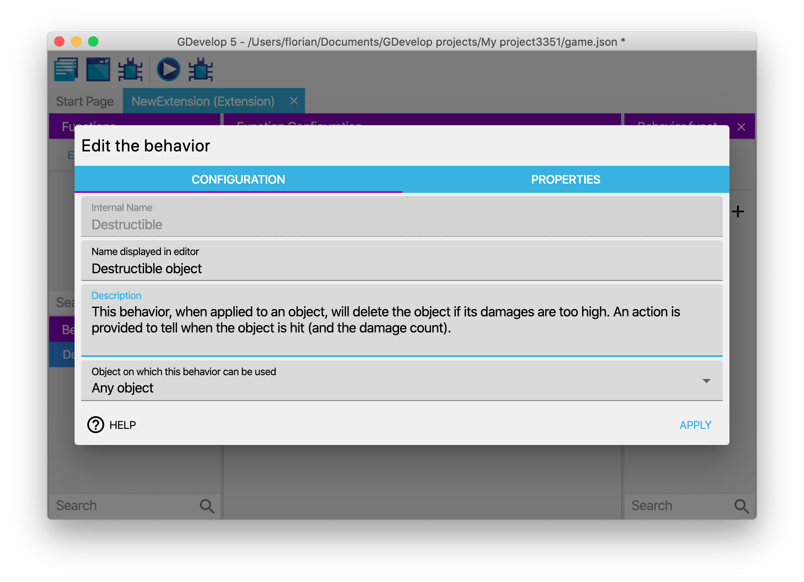
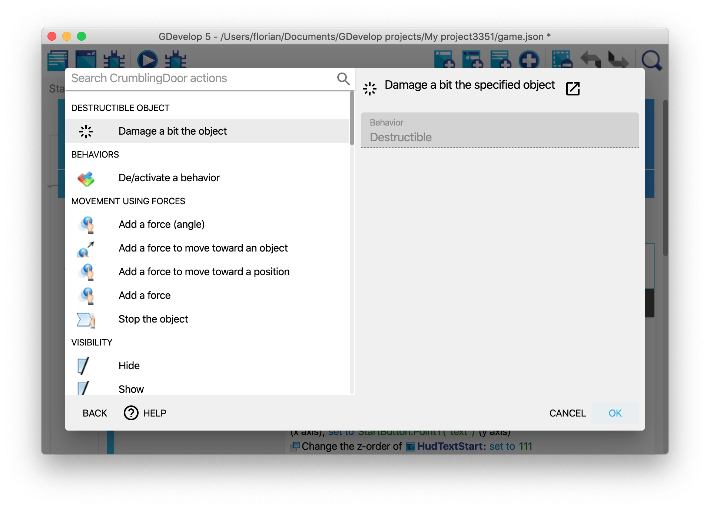
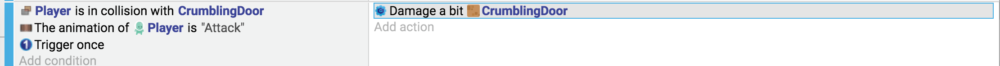
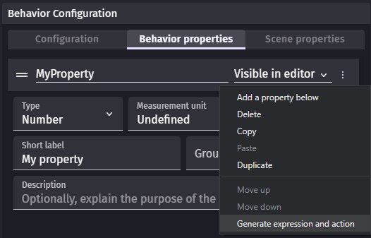

# Custom behaviors: create your own behaviors with events

Similarly to scenes, custom behaviors are created with events. Every [behavior](/gdevelop5/behaviors) from [community extensions](/gdevelop5/extensions/) is a custom behavior and contains events that can be edited by anyone.

!!! tip

    If you've never made an extension before, please start by reading how [functions](/gdevelop5/events/functions) works as it's a key concept to understand custom behaviors.

Behaviors events run at every frame like scene events do. The main difference is that behaviors are focused on the object they are attached too. Only the attached object can be used in the events that constitute the behavior's logic.

While this might seem restrictive, it actually enables behaviors to be used across various projects, as they are not bound to any specific scene object.

Behaviors from community extensions are chosen for their ability to be useful in many games. It's not necessarily what you should be aiming for, when creating a behavior for your game. Behaviors can be used as a way to organize events by:

- Adding actions and conditions only to some objects (whereas a function alone would be shown for any objects),
- Gathering all logic related to a particular object in a single location.
- Clearly defining configuration details (through visible properties) and the object state (via hidden properties), in contrast to variables (which are listed without such clear distinction).

!!! tip

    If you want to see an example of how behaviors can be used in your game, read [How to make a behavior for an object](/gdevelop5/tutorials/how-to-make-behavior). It's a step by step explanation and a good guide about architecturing your game with behaviors.

## Create a new behavior

Behaviors are grouped into [extensions](/gdevelop5/extensions). They are the same as [the extensions that can be installed](/gdevelop5/extensions/search). Extensions of a project are listed in the [Project Manager](/gdevelop5/interface/project-manager).

Click on **Create or search for new extensions** at the bottom. Then, select **Create a new extension** to [create a new extension](/gdevelop5/extensions/create).

By default, extensions don't have any behavior. Add one by clicking on the "+" button on the left next to **Behaviors**.

You can choose the description and the name to display to users when they will add your behavior to an object. If you need to use a specific object (sprites, texts...), you can choose it with the drop-down list at the bottom.

Behaviors can also embed properties, which are number, strings or booleans that are stored inside the behavior. Check out the section below about how to add and use properties.

## Add functions to your behavior

Click on the behavior in the list to see the list of functions composing the behavior. It will appear on the right side panel.

By default, a behavior is empty and does nothing. To add interactivity, you can add a new function. You'll be given the choice between some predefined functions, called *lifecycle methods*, or a custom function. Lifecycle methods will be called by the game engine automatically at some key moment during the game. Custom functions will be available to extension users as conditions, actions or expressions (like [usual functions outside behaviors](/gdevelop5/events/functions)).

### Run events at object creations

Events from the **onCreated** function are run when a new instance of an object with the behavior is created. It's the right place to setup the internal state of the behavior according to values set by the extension user.

### Run events every frame

Events from the **onStepPreEvents** function are run every time a frame is rendering on the screen before the "traditional" events of the scene. Typically this is done 60 times per second. It's called for every single object having the behavior unless it's deactivated.

The following `onStepPreEvents` function events automatically deletes objects that are too damaged:

### Add custom action, condition or expression

Behaviors and the scene events communicate through functions:

- Actions allow to change the state of the behavior and maybe initiate an effect over time in the `onStepPreEvents` function. For instance, a jump action changes the character state from standing to jumping and `onStepPreEvents` modify the character position on Y axis every frame.
- Conditions let scene events know about behavior state changes. For instance, a condition can allow to check if a character is jumping.

!!! tip

    The [functions](/gdevelop5/events/functions) page explains the concepts around custom functions in more details.

For example, this function defines an action that can be used to add damage to the object:

### Run events at other lifecycle key times

Even though, the lifecycle functions **onCreated** and **onStepPreEvents** are the most common, the following function can also be used:

* **onDestroy**: events that will be run when an instance of the object having the behavior is deleted (if multiple objects are removed at the same time, events will be run for each object). This is done even if the behavior is deactivated.
* **onDeActivate**: events that will be run once, after the behavior is deactivated on an object.
* **onActivate**: events that will be run once, after the behavior is activated again on an object.
* **onStepPostEvents**: events that will be run for every single object having the behavior, after the "traditional" events of the scene, if the behavior is not deactivated. Typically, this is done 60 times per second. It's recommend to prefer `onStepPreEvents`, to run your logic before events and give the events in the scene a chance to react to changes that happen on the objects.

## Use the behavior on an object

### 1. Add the behavior to an object

Once your behavior is created, you can start attaching it to objects. The best part about this is that your event based behavior will be listed like any other "[built-in behavior](/gdevelop5/behaviors)" that is bundled with GDevelop.

Here, you can see the "Destructible Object" behavior for example (that was created in the previous screenshots):

The custom behavior that you created is then displayed in the list of the behaviors attached to the object:

You can run the game and see that the events in "doStepPreEvents" function (or "doStepPostEvents") will be executed. In the example of the Destructible behavior that was created, if the "Damage" variable is set to a number greater or equal to 100, the object will be destroyed automatically.

To test this, we've added the "Destructible" behavior to object "Platform". Then, when using the debugger, we can inspect "Platform" instances and see that they have a "Damage" variable (set to 0). If we use the debugger (or an event) to set it to 100, the object is removed from the scene:

### 2. Use actions, conditions and expressions

Like any other "built-in behavior", you can also use actions/conditions (or expressions) if you have declared functions as such in the behavior. For example, in the "Destructible" behavior, we created an action to cause some damage to the object. We can find it and use it in the events sheet:

It is displayed in the events sheet:

As you can see, this allows creating very expressive and easy-to-read events. You can then make the behavior more complex or reuse it on other objects.

## Add and use properties in a behavior

Properties are similar to objects variables but they can only be used from the behavior events. If you've ever added a behavior to an object, you may have noticed a list of fields to setup the behavior. These are properties initial values.

You can use these properties to make your behavior customizable (for example, you can have the speed, an amount of damage, the life points, the power points, the mana, etc... as properties of your behavior - depending on what your behavior is doing).

!!! note

    Properties can be hidden if you don't wish to let extension users choose the initial value.

To show and add properties to your behavior, edit it and click on the "Properties" tab. In this example, you can see a behavior called "Health" that has properties to store the health of the object and the minimum time between two hits on the object:

Properties can be:

* Numbers
* Strings (including colors or string with choices)
* Booleans (displayed as a checkbox)

Properties can also be used to required behaviors as described in a following section.

### Use actions and conditions to manipulate the properties

Number, string and boolean parameters can be used with the same actions and conditions as global and scene [variables](/gdevelop5/all-features/variables). Properties can also be used directly in expressions by writing their name. For instance, a property called "ScoreToMultiply" can be used the following: `2 * ScoreToMultiply`.

Properties won't be usable from outside of the behavior. Properties are said to be "private", they can only be manipulated by the behavior. If you want to let extension users modifying them from the scene events, you can generate an action and a condition from the drop-down menu of the property.

## Behaviors using other behaviors as properties

It is possible for behaviors to use other "required behaviors" as properties. When this is the case, GDevelop will ensure that any object using your behavior will also use the other one.
You can then use the behavior entered as a property inside the actions, conditions, expressions and the lifecycle functions of your own behavior.

!!! tip

    This is an advanced feature that is helpful to create behaviors that are based on other. For example, you could make a behavior called "Platformer enemy" that is using the "Platformer object" behavior and adding specific actions, conditions and logic to make an enemy chase the player.

If you create a behavior and want to use this, just go to the properties of this behavior and add a new property. Choose the type "Required Behavior" for this property. You can then use this new behavior in the events of the behavior you just edited.

To use a behavior based on another, you don't need to do anything special! Just add it to your object as usual: any missing behavior will be added to your object, so you can start using it immediately.

## Write behaviors dedicated to your project

You probably used extensions from the community. These extensions aim to be usable in many projects, but extensions can also be created with only one project in mind.

The [platformer template](https://gdevelop.io/game-example/free/platformer) has a `Enemy` extension with a `MonsterEnemy` behavior. This behavior toggle between
- a **Fire** state where it hurts the player
- a **NoFire** state where the player can jump on it

The [Bomberman-like template](https://gdevelop.io/game-example/free/3d-bomber-bunny) shows how a game can be organized into extensions. The players, bombs and bonuses have their own custom behavior. It allows to gather the logic of each object in one place: their extension. The main events can then focus on how these objects interact with each other.

## A word about the advantages of behaviors

Creating your own behaviors has multiple advantages:

* *Encapsulation*: by adding logic inside a custom behavior, you can keep a clear events sheet, with fewer events so it's easier to read and maintain. Behaviors can have actions/conditions and expressions that run logic, so you don't have to repeat long instructions in the events sheet. You can just use the action/condition the behavior providing as you would normally do with any other behavior.
* *Reusability*: let's say that you created a behavior to have an enemy move and lose a life if hit by the player. If you want to create a slightly different enemy, but based on the same principles, you can create a new object, then add the same behavior with different properties. In a few clicks, you can have a new enemy in your game.
* *Collaboration*: let's say you are working in a team or would like to make your project open-source and invite people to contribute with new features and gameplay. Custom behavior makes it possible for anyone to design and create self-contained features and game logic that we can easily import into a project and used by anyone without prior knowledge required including level and game designers who don't normally work on game logic or at least prefer not to.

!!! note

    Encapsulation and reusability are core concepts in programming. In other game engines, like Unity, objects and behaviors might be named entities and components.

## Examples/ideas for custom behaviors

Installing and opening existing extensions can be a good way to see how behaviors work. The following extensions are simple enough not to feel lost when looking at their events: 

- [Animated back and forth movement](https://wiki.gdevelop.io/gdevelop5/extensions/animated-back-and-forth-movement/)
- [Flash object](https://wiki.gdevelop.io/gdevelop5/extensions/flash/)

You can imagine tons of different behaviors. Here are a few examples:

* A behavior to **manage the health of an enemy or a boss**.

  * There can be an action "Hit the object", a condition "Is the object dead?". The behavior will take care of updating the object variables to track the life of the enemy (for example, when the enemy is hit, you remove some life.
  * Then, life is regenerated progressively at each frame of the game) and the condition "Is the object dead?" will be able to check if the life reached 0 or not.

* Another idea can be to put the events to make **an enemy move following a complex pattern** on the screen inside a behavior.

  * You can add actions/conditions to change the movement, change the speed, etc... All of this will be in a behavior that can be added to any other object in a few clicks.

* A behavior can **automatically update the Score** in your game when enemies are destroyed, or items collected.

  * You can create a behavior that increases the "Score" variable when the object is destroyed. You can then create items, collectibles or enemies that have this behavior, and when they are collected or killed, the score will automatically increase.

!!! tip

     [New extensions](/gdevelop5/extensions) are being created by the community all the time!  If you are interested in helping with this, start by looking at the [GDevelop Extension Team](https://trello.com/b/AftjL2v1/gdevelop-extensions) (on Trello).  You can also start discussing your ideas for extensions on the [GDevelop Discord](https://discordapp.com/invite/JWcfHEB) channel named #extension.
