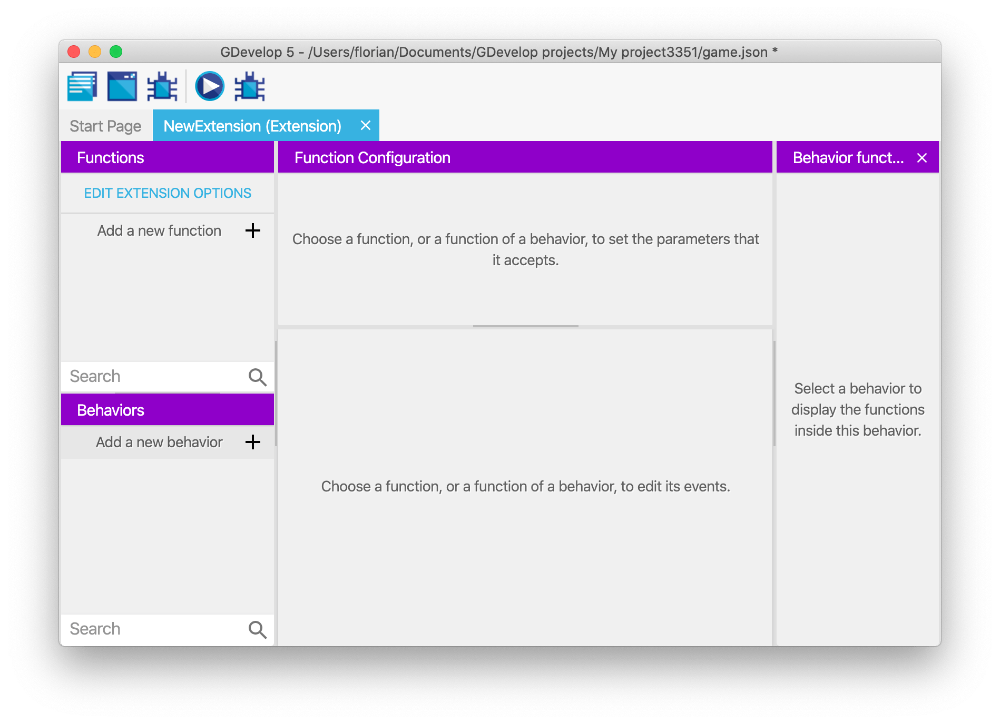
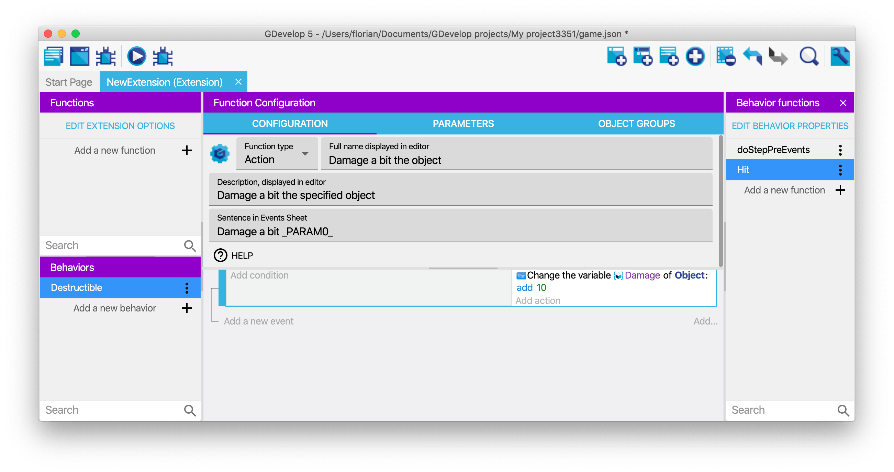
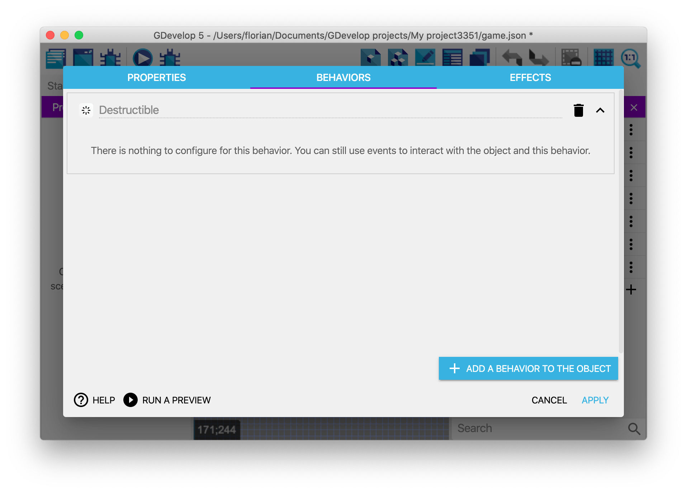
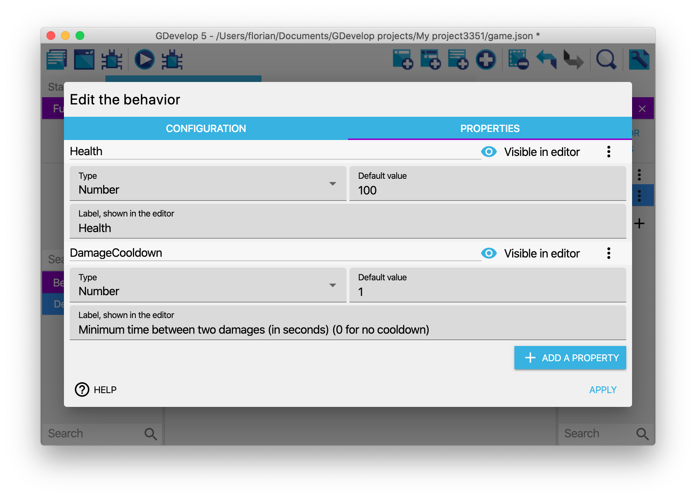

# Custom behaviors: create your own behaviors with events

Behaviors are very useful to quickly add some pre-determined features to objects. They are easy to use and allow to add complex features to your objects without having to re-create everything with events, which can be cumbersome and would make the events sheet cluttered (even if [groups](/gdevelop5/events/group), [functions](/gdevelop5/events/functions) and [external events](/gdevelop5/interface/project-manager) can help).

In GDevelop, you can create your own **custom behaviors**. Like the usual, built-in behaviors, they can be attached to objects. They will then *interact with the object automatically*. They can **move the object**, change its **variables**, change the animations (for Sprite objects), change the text (for text objects) and more generally, do anything that you can usually do with events.

!!! tip

    If you want to see an example of how behaviors can be used in your game, read [How to make a behavior for an object](/gdevelop5/tutorials/how-to-make-behavior). It's a step by step explanation and a good guide about architecturing your game with behaviors.

## Create a new behavior

Behaviors are grouped into [extensions](/gdevelop5/extensions/). Extensions are composed of custom functions (actions, conditions or expressions), custom behaviors or custom objects ("prefabs") powered by events. You can see the list of all the extensions the game has in the [Project Manager](/gdevelop5/interface/project-manager), as well as add a new extension:

Click on the **+** button at the bottom to create a new extension. You can right click on it to rename it. It's a good idea to have functions and behaviors related to the same thing in a single extension.

Click on the extension in the list to open its editor. By default, there are no functions in the extensions. Add one by clicking on **Add a new behavior**, on the left:

The new behavior is added. You should rename it to give it a name according to what you want it to do. For example, if your behavior will be used to have an enemy move left and right on a platform, you can call it `HorizontalMovement` (only alphanumeric characters and underscores are allowed in names). If your behavior is automatically tracking damage and deletes objects that are too damaged, you could call it `Destructible`.

You should also edit the configuration of the behavior by doing a right click on it and choosing "Properties". You can enter the description, the name displayed in the editor and specify if it should be restricted to some kind of objects:

Behaviors can also embed properties, which are number, strings or booleans that are stored inside the behavior. Check out the section below about how to add and use properties.

### Add functions to your behavior

Click on the behavior in the list to see the list of functions composing the behavior. It will appear on the right side panel.

By default, a behavior is empty and **does nothing**. To add interactivity, you can add a new function (also called "method"). You'll be given the choice between some predefined functions, called *lifecycle methods*, or a custom function. Lifecycle methods will be called by the game engine automatically at some key moment during the game. Custom functions will be available as conditions, actions or expressions (like [usual functions outside behaviors](/gdevelop5/events/functions)).

### Lifecycle methods

Predefined lifecycle methods are as such:

* **onCreated**: events inside the function will be run when **a new instance of an object** with the behavior is created.
* **onStepPreEvents**: will be run every time a frame is rendering on the screen **before the "traditional" events** of the scene. Typically in most games, this is done 60 times per second. This is called for **every single object** having the behavior if the behavior is not deactivated.
* **onDestroy**: events that will be run when an instance of the object having the behavior is **deleted** (if multiple objects are removed at the same time, events will be run for each object). This is done even if the behavior is deactivated.
* **onDeActivate**: events that will be run once, after the behavior is deactivated on an object.
* **onActivate**: events that will be run once, after the behavior is activated again on an object.
* **onStepPostEvents**: events that will be run for every single object having the behavior, **after** the "traditional" events of the scene,  if the behavior is not deactivated. Typically in most games, this is done 60 times per second. As possible, we recommend to prefer onStepPreEvents, to run your logic before events and give the events in the scene a chance to react to changes that happen on the objects.

This is an example of some events inside onStepPreEvents in the case of behavior that automatically deletes objects that are too damaged:

### Custom action, condition or expression

If you choose to create a custom function for your behavior, you can then configure your function like a traditional function, by choosing if it's an action, condition or expression, entering a name, description and a sentence to be displayed in the events sheet.

For example, this creates a new action that can be used to add damage to the object:

## Use the behavior on an object

### 1) Add the behavior to an object

Once your behavior is created, you can start attaching it to objects. The best part about this is that your event based behavior will be listed like any other "[built-in behavior](/gdevelop5/behaviors)" that is bundled with GDevelop.

Here, you can see the "Destructible Object" behavior for example (that was created in the previous screenshots):

The custom behavior that you created is then displayed in the list of the behaviors attached to the object:

You can run the game and see that the events in "doStepPreEvents" function (or "doStepPostEvents") will be executed. In the example of the Destructible behavior that was created, if the "Damage" variable is set to a number greater or equal to 100, the object will be destroyed automatically.

To test this, we've added the "Destructible" behavior to object "Platform". Then, when using the debugger, we can inspect "Platform" instances and see that they have a "Damage" variable (set to 0). If we use the debugger (or an event) to set it to 100, the object is removed from the scene:

### 2) Use actions/conditions/expressions

Like any other "built-in behavior", you can also use actions/conditions (or expressions) if you have declared functions as such in the behavior. For example, in the "Destructible" behavior, we created an action to cause some damage to the object. We can find it and use it in the events sheet:

It is displayed in the events sheet:

As you can see, this allows creating very expressive and easy-to-read events. You can then make the behavior more complex or reuse it on other objects.

## Add and use properties in a behavior

What is interesting with behaviors is that they can hold information inside of them, much like variables of an object. These information are called properties. They can be a number, a string (text) or a boolean (which is like a virtual checkbox, either checked or unchecked).

You can use these properties to make your behavior customizable (for example, you can have the speed, an amount of damage, the life points, the power points, the mana, etc... as properties of your behavior - depending on what your behavior is doing).

To show and add properties to your behavior, edit it and click on the "Properties" tab. In this example, you can see a behavior called "Health", that has properties to store the health of the object and the minimum time between two hits on the object:

Properties can be:

* Number, string (including a color or a choice from a list of options) or booleans (will be displayed as a checkbox).
* They can also be another required behavior - in which case the behavior you're editing will ensure the other specified behavior is present on objects using it. There is a dedicated section later on this page about this.
* They have a default value, that will be used if the value is not changed when adding the behavior to an object.
* They can be visible in the editor, when added to an object, or invisible.
* Finally, they have a label that will be displayed in the editor.

### Use actions and conditions to manipulate the properties

Once you have created some properties on your behavior, conditions and actions will be automatically added in the events sheet. For each property, there will be a condition to compare its value, and an action for changing it.
Strings and numbers will also have an expression to get their values.

!!! note

    If you rename your properties, the actions/conditions/expressions will be updated automatically.

!!! tip

    These actions/conditions/expressions won't be usable from outside of the behavior. Properties are said to be "private", they can only be manipulated by the behavior. If you want to have them modified by the scene events, create new actions/conditions for this in your behavior.
## Behaviors using other behaviors as properties

It is possible for behaviors to use other "required behaviors" as properties. When this is the case, GDevelop will ensure that any object using your behavior will also use the other one.
You can then use the behavior entered as a property inside the actions, conditions, expressions and the lifecycle functions of your own behavior.

!!! tip

    This is an advanced feature that is helpful to create behaviors that are based on other. For example, you could make a behavior called "Platformer enemy" that is using the "Platformer object" behavior and adding specific actions, conditions and logic to make an enemy chase the player.

If you create a behavior and want to use this, just go to the properties of this behavior and add a new property. Choose the type "Required Behavior" for this property. You can then use this new behavior in the events of the behavior you just edited.

To use a behavior based on another, you don't need to do anything special! Just add it to your object as usual: any missing behavior will be added to your object, so you can start using it immediately.

## A word about the advantages of behaviors

Creating your own behaviors has multiple advantages:

* *Encapsulation*: by adding logic inside a custom behavior, you can keep a clear events sheet, with fewer events so it's easier to read and maintain. Behaviors can have actions/conditions and expressions that run logic, so you don't have to repeat long instructions in the events sheet. You can just use the action/condition the behavior providing as you would normally do with any other behavior.
* *Reusability*: let's say that you created a behavior to have an enemy move and lose a life if hit by the player. If you want to create a slightly different enemy, but based on the same principles, you can create a new object, then add the same behavior with different properties. In a few clicks, you can have a new enemy in your game.
* *Collaboration*: let's say you are working in a team or would like to make your project open-source and invite people to contribute with new features and gameplay. Custom behavior makes it possible for anyone to design and create self-contained features and game logic that we can easily import into a project and used by anyone without prior knowledge required including level and game designers who don't normally work on game logic or at least prefer not to.

!!! note

    Encapsulation and reusability are core concepts in programming. In other game engines, like Unity, objects and behaviors might be named entities and components.

## Examples/ideas for custom behaviors

You can imagine tons of different behaviors. Here are a few examples:

* A behavior to **manage the health of an enemy or a boss**.

  * There can be an action "Hit the object", a condition "Is the object dead?". The behavior will take care of updating the object variables to track the life of the enemy (for example, when the enemy is hit, you remove some life.
  * Then, life is regenerated progressively at each frame of the game) and the condition "Is the object dead?" will be able to check if the life reached 0 or not.

* Another idea can be to put the events to make **an enemy move following a complex pattern** on the screen inside a behavior.

  * You can add actions/conditions to change the movement, change the speed, etc... All of this will be in a behavior that can be added to any other object in a few clicks.

* A behavior can **automatically update the Score** in your game when enemies are destroyed, or items collected.

  * You can create a behavior that increases the "Score" variable when the object is destroyed. You can then create items, collectibles or enemies that have this behavior, and when they are collected or killed, the score will automatically increase.

!!! tip

     [New extensions](/gdevelop5/extensions) are being created by the community all the time!  If you are interested in helping with this, start by looking at the [GDevelop Extension Team](https://trello.com/b/AftjL2v1/gdevelop-extensions) (on Trello).  You can also start discussing your ideas for extensions on the [GDevelop Discord](https://discordapp.com/invite/JWcfHEB) channel named #extension.