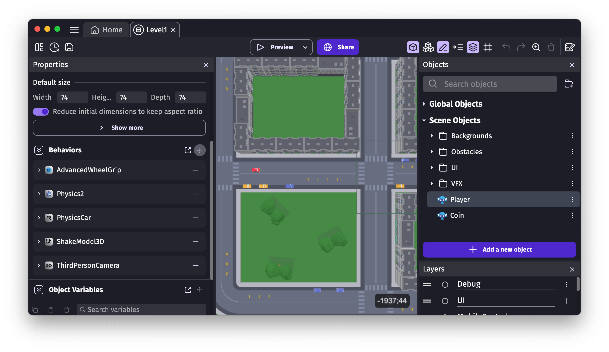
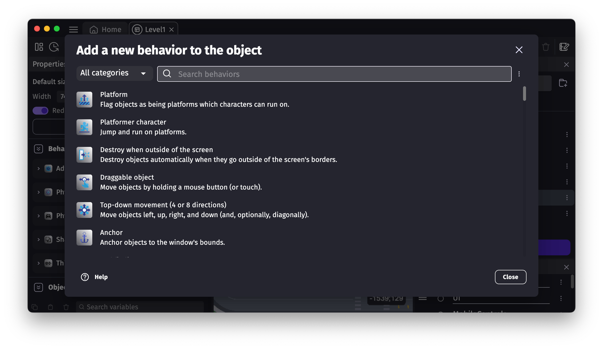
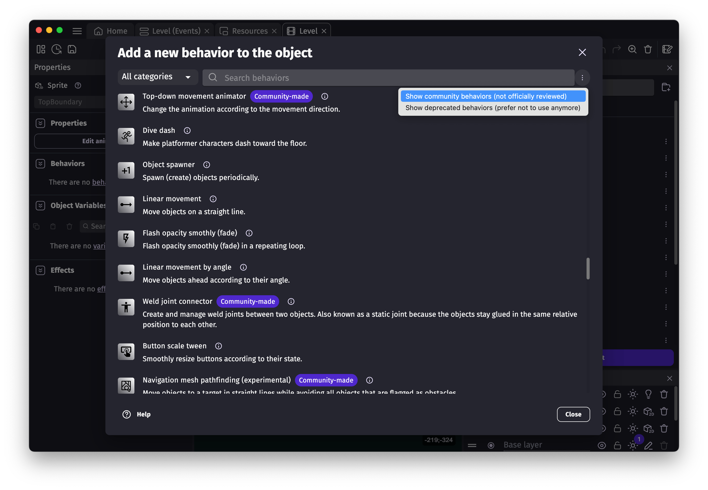

# Behaviors

In GDevelop, _behaviors_ add significant features to [objects](/gdevelop5/objects) with just a few clicks.

For example, behaviors can:

* Move the camera to follow an object.
* Automatically remove objects from a scene when they move outside the edges of the screen.
* Handle health, damage, ammo, and other elements of the player or an enemy.
* Make objects move in a realistic way by following the laws of physics.
* Allow players to move an object with the arrow keys.

Most behaviors can be customized to make your game feel unique. Behaviors attached to an object can be manipulated in [events](/gdevelop5/events).

  <iframe src="https://www.youtube.com/embed/-U8WFcpUmMg" frameborder="0" allowfullscreen></iframe>

## Most commonly used behaviors

Here are some commonly used behaviors:

- [Anchor](/gdevelop5/behaviors/anchor)
- [Destroy outside screen](/gdevelop5/behaviors/destroyoutside)
- [Draggable](/gdevelop5/behaviors/draggable)
- [Pathfinding](/gdevelop5/behaviors/pathfinding)
- [Physics](/gdevelop5/behaviors/physics2)
- [Platformer objects and platforms](/gdevelop5/behaviors/platformer)
- [Top-down movement](/gdevelop5/behaviors/topdown)
- [Tween](/gdevelop5/behaviors/tween)
- [Multiplayer Object](/gdevelop5/all-features/multiplayer)

While these behaviors are often used, the [full list of behaviors available in GDevelop](/gdevelop5/extensions/) keeps growing every day: see the [list of all GDevelop extensions](/gdevelop5/extensions/) to discover them.

Behaviors can be contributed by the community or the GDevelop core development team. You can [create new behaviors](/gdevelop5/behaviors/events-based-behaviors), with or without code, directly inside GDevelop.

!!! tip

    When your game is growing, it's a good idea to make [your own behaviors](/gdevelop5/behaviors/events-based-behaviors) for each object in your game. Making your own behaviors allows you to keep your game modular.

## Adding a behavior to an object

To add a behavior to an object, you can either:

* Select the object in the list of objects and then, in the **Properties** panel, click the + next to the "Behaviors" section:

  

  You can then browse the list of behaviors. The most commonly used are displayed at the top of the list:

  

* Or you can double-click on an object and choose "Add a behavior" in the "Behaviors" tab.

## Enable searching for community-made behaviors

Anyone can [create custom behaviors](/gdevelop5/behaviors/events-based-behaviors) and share them with the GDevelop community.

To search for and install community-created behaviors, enable them in the list of behaviors:

Note that these behaviors are not fully reviewed and might not have the same quality, flexibility, and polish as the behaviors that are considered "reviewed" and shown by default in the interface.

!!! note

    You can contribute by submitting your own behaviors—or improvements to existing ones—on the [GDevelop GitHub repository](https://github.com/GDevelopApp/GDevelop-extensions).
