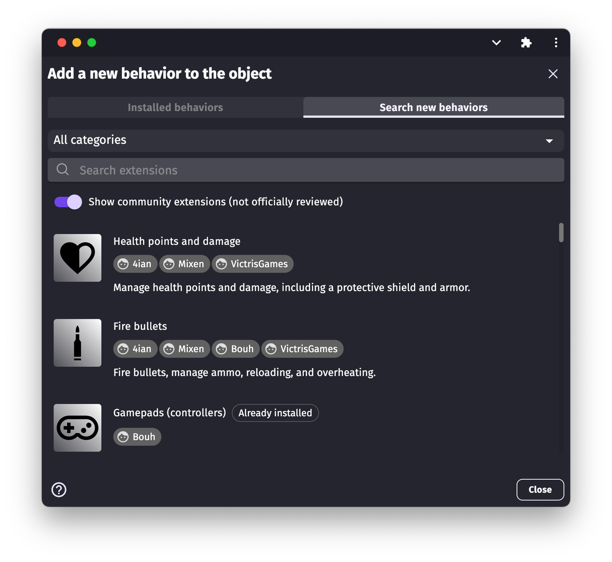
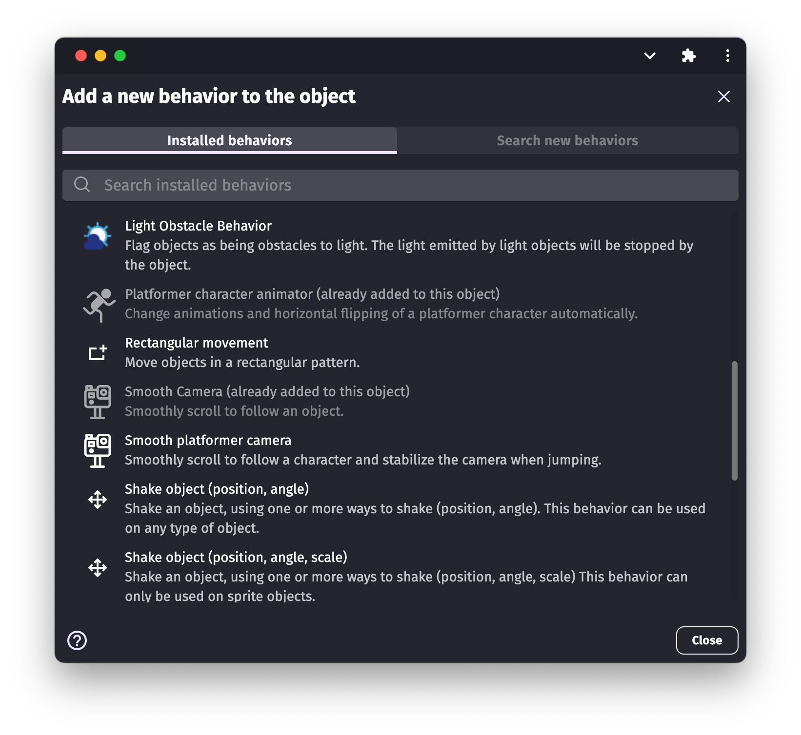

# Behaviors

In GDevelop, _behaviors_ add significant features to [objects](/gdevelop5/objects) in a matter of clicks.

For example, behaviors can:

* Automatically remove objects from a scene when they move outside the edges of the screen.
* Make objects move in a realistic way by following the laws of physics.
* Allow players to move an object with the arrow keys.

You can also customize behaviors to make your game feel unique and use [events](/gdevelop5/events) to manipulate behaviors.

## List of behaviors

This section lists the different types of behaviors, each of which is useful for adding different types of features to objects.

- [Anchor](/gdevelop5/behaviors/anchor)
- [Bounce](/gdevelop5/behaviors/bounce)
- [Destroy outside screen](/gdevelop5/behaviors/destroyoutside)
- [Draggable](/gdevelop5/behaviors/draggable)
- [Pathfinding](/gdevelop5/behaviors/pathfinding)
- [Physics 2](/gdevelop5/behaviors/physics2)
- [Platformer objects and platforms](/gdevelop5/behaviors/platformer)
- [Top-down movement](/gdevelop5/behaviors/topdown)
- [Tween](/gdevelop5/behaviors/tween)

Refer to the linked pages to learn more about each type of behavior.

### Deprecated behaviors

- [Old Physics](/gdevelop5/behaviors/physics)

## Adding a behavior to an object

1. Right-click an object in the **Objects** panel.
2. Select **Edit behaviors**.
3. Click the **Add a behavior to the object** button.
4. Select a behavior from the list.
5. Customize the behavior. The available settings depend on the behavior.
6. Click **Apply**.

## Installing new behaviors

Anyone can [create custom behaviors](/gdevelop5/behaviors/events-based-behaviors) and share them with the GDevelop community.

To search for and install community-created behaviors:

1. Right click an object in the **Objects** panel.
2. Select **Edit behaviors**.
3. Click the **Add a behavior to the object** icon.
4. Switch to the **Search new behaviors** tab.
5. Search for a behavior.
6. Select a behavior.
7. Click **Install in project**.

Installed behaviors appear in the **Installed behaviors** tab:

