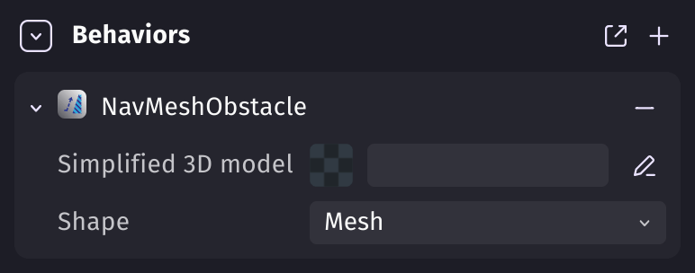
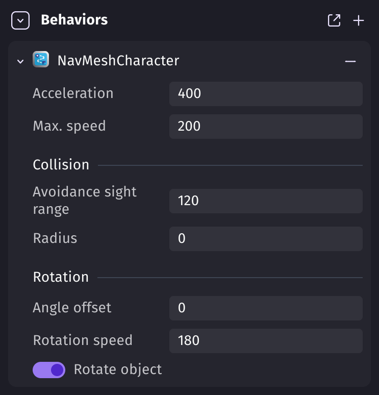
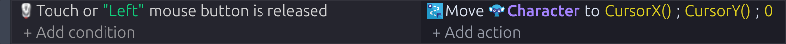
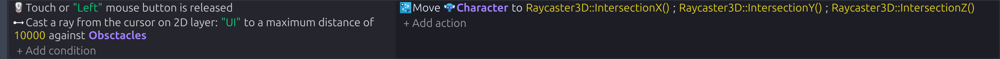
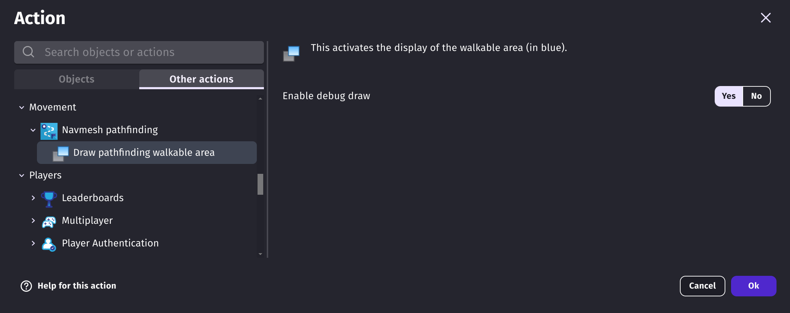
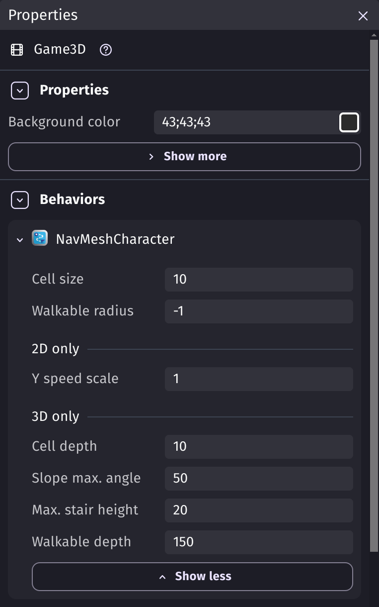
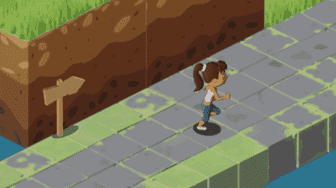

# Navigation mesh pathfinding

The **navmesh pathfinding** behaviors move objects to a destination by following walkable floors and going around obstacles. They work in 2D and in 3D, and a whole crowd of characters can move at the same time while avoiding each other.

## Choose the floors and the obstacles

By using the **Floor/obstacle for pathfinding (navmesh based)** [behavior](/gdevelop5/behaviors), you can flag any [object](/gdevelop5/objects) as a walkable floor, as an obstacle, or as both.

In 3D, characters walk on the flat surfaces of these objects and go around the steep ones. Add the behavior to the floors and platforms where characters must walk, and to the walls and props they must avoid.

In 2D, objects with this behavior are always obstacles. Characters can move around them within a walkable area that extends beyond the obstacles, so characters can go around obstacles even when they are not enclosed. If there is no obstacle at all, characters can move freely within an area the size of the game screen.

When the behavior is added to an object, some properties can be modified:

{ width="386" }

These properties are only relevant for [3D model](/gdevelop5/objects/3d-model) objects. The 2D collision mask is always used for 2D objects.

  * **Shape** – You can choose between using the model shape (**Mesh**) or a bounding box (**Box**).
  * **Simplified 3D model** – Models with a lot of polygons can require heavy computations. You can make a simplified version of your model with an external tool and set it in this property to make the obstacle faster to compute.

!!! tip

    If you need objects to move in only 4 or 8 directions, you can use the [grid-based pathfinding](/gdevelop5/behaviors/pathfinding) instead.

!!! note

    [Tile maps](/gdevelop5/objects/tilemap) can also be used as obstacles: add the **Floor/obstacle for pathfinding (navmesh based)** behavior to a tile map that has collisions, and the moving objects will avoid its tiles.

## Move objects while avoiding obstacles

The **Pathfinding character (navmesh based)** behavior computes the shortest path from the object to a destination and, optionally, moves the object along this path, while avoiding all the objects that have the **Floor/obstacle for pathfinding (navmesh based)** behavior.

After adding the behavior to the object, you can customize some properties:

{ width="387" }

  * **Acceleration** – How fast the object accelerates while moving on a path.
  * **Max. speed** – The maximum speed the object can reach on the path.
  * **Avoidance sight range** – How far ahead the character looks to avoid other characters.
  * **Radius** – The radius of the character. This setting determines how close the object can move to obstacles.
  * **Angle offset** – In case the sprite is facing the wrong direction, you can fix it with the angle offset.
  * **Rotation speed** – The speed of the object's rotation.
  * **Rotate object** – Disable it if you don't want the object to rotate while moving on the path.

!!! note

    If you want to change how the object moves during the game, these properties can be changed using actions.

To make the character move, you need to add the **Move to a position** action and specify the destination.

For instance, to move a character to the cursor, you can do the following in 2D:

or in 3D (using the [3d raycast](/gdevelop5/extensions/raycaster3d) extension):

!!! warning

    The **Move to a position** action only needs to be run once. If you run this action without any condition, it will compute the path at every frame, which is very demanding for the device. You can add the **Destination reached** condition or use a [timer](/gdevelop5/all-features/timers-and-time) to solve this.

!!! tip

    In an isometric 2D game, set the **Y speed scale** scene property to `0.5` so that characters move slower vertically than horizontally.

## Avoid frame skipping when obstacles change

When obstacles are moved, created or deleted, or when their behavior is deactivated or activated again, the navigation mesh is rebuilt on the next frame. This can take more than 1/60 of a second, which leads to frame skipping.

You can reduce this side effect by:

- Making **Cell size** and **Cell depth** bigger in the scene properties.
- Setting a **Simplified 3D model** for obstacles that use a **Mesh** shape. The simplified model should have as few polygons as possible. For instance, a ramp often only needs 5 faces.
- Making a chunk system that destroys far away obstacles in batches.

## Troubleshoot navigation mesh generation

You can display the generated navigation mesh with the **Draw pathfinding walkable area** action. The walkable area is drawn in blue.

Try to modify the following scene properties and check the effects on the navigation mesh by running a preview:

  * **Max. stair height** – If characters won't climb stairs, try a greater value.
  * **Slope max. angle** – If characters won't walk on steep slopes, try a greater value.
  * **Walkable depth** – If characters won't go under a roof, try a smaller value.
  * **Walkable radius** – If characters won't go through a narrow passage, try a smaller value. It's usually better to keep it automatic (`-1`) and change the **Radius** on characters.

{ width="382" }

## Examples

!!! tip

        **See it in action!** 🎮
    Open these examples online.

**Isometric example**

[Open example in GDevelop](https://editor.gdevelop.io/?create-from-example=isometric-game){ .md-button .md-button--primary }

[{ width="320" }](https://editor.gdevelop.io/?create-from-example=isometric-game)

## Reference

All actions, conditions and expressions are listed in [the navmesh pathfinding reference page](/gdevelop5/all-features/nav-mesh-pathfinding/reference/).
