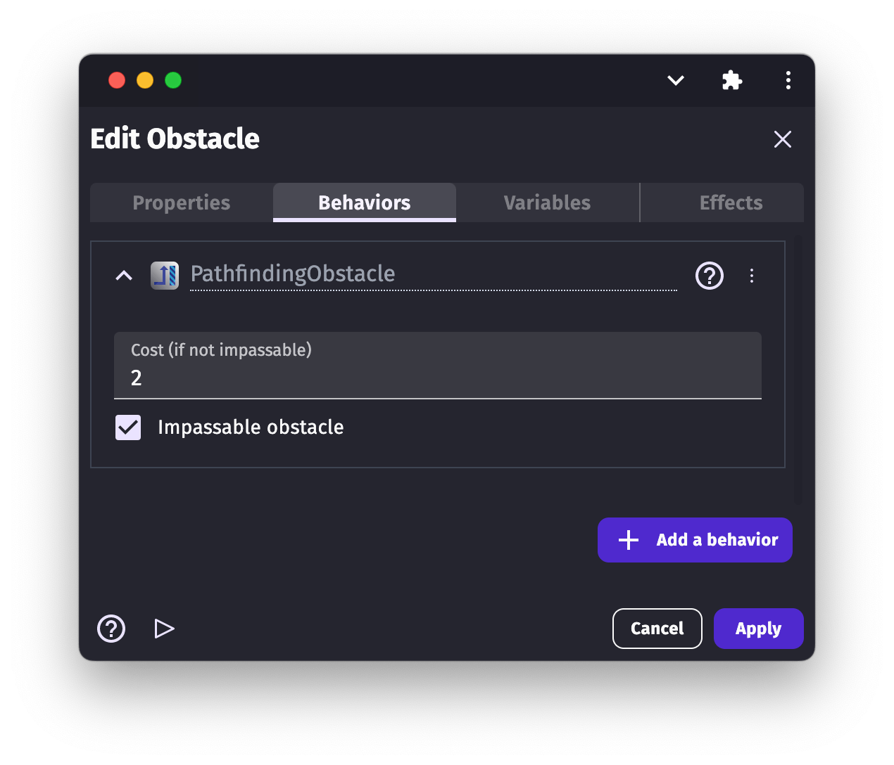
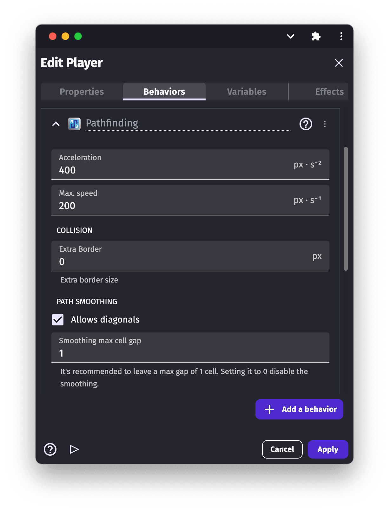
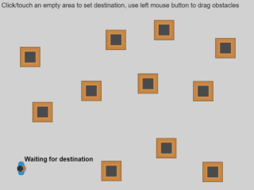
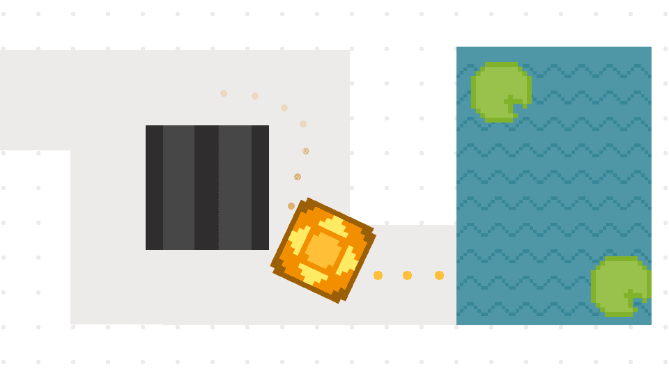

# Grid-based pathfinding

The **grid-based pathfinding** behaviors move objects to a selected destination and flag items as obstacles. Objects that are flagged as obstacles will be avoided by the moving objects.

## Choose which objects to avoid

By using the **Obstacle for pathfinding (grid-based)** [behavior](/gdevelop5/behaviors), you can flag any [object](/gdevelop5/objects) to be an obstacle.

When the behavior is added to an object, some properties can be modified:

  * **impassable:** if enabled, the obstacle is going to be impassable. The moving object will be avoiding them and never go through them.
  * **cost:** if the obstacle is not impassable, a cost can be set for the obstacle. The moving object, when looking for the best possible path to a destination, will prefer to avoid obstacles with high-cost values. For example, a river might have some cost. The moving object, if possible, will avoid it. However, if there is no other way around the river, or if the river has a lower cost compared to another area, the moving object will go through it (instead of climbing a mountain with a higher cost for example). And if we put crocodiles into the river and increase its cost, the moving object might decide to climb the mountains instead. The cost value is a multiplier applied to the path length through that obstacle.

!!! tip

    Obstacles may take more space than expected because a box around obstacles is used instead of the [collision mask](/gdevelop5/objects/sprite/collision-mask). You can use the [navigation mesh pathfinding](/gdevelop5/behaviors/nav-mesh-pathfinding) instead to solve this.

!!! note

    [Tile maps](/gdevelop5/objects/tilemap) can also be used as obstacles: add the **Obstacle for pathfinding (grid-based)** behavior to a tile map that has collisions, and the moving objects will avoid its tiles.

## Move objects while avoiding obstacles

The **Pathfinding character (grid-based)** behavior computes the shortest path from the object to a destination and, optionally, moves the object along this path, while avoiding all the objects that have the **Obstacle for pathfinding (grid-based)** behavior.

After adding the behavior to the object, you can customize some properties:

  * **acceleration:** this is how fast the object is going to accelerate while moving on a path.
  * **allow diagonals:** set if the object can move in diagonals.
  * **angle offset:** in case the sprite is facing the wrong direction we can set the angle offset
  * **extra border size:** sets the border size around the object. This setting determines how close the object can move to obstacles.
  * **grid offset X/Y:** offsets the virtual grid position by the specified number of pixels. This can be useful to align the grid with your level layout. Default is 0 for both X and Y.
  * **max speed:** maximum speed the object can move on the path.
  * **rotate object:** if you don't want the object to rotate while moving on the path, disable the object's rotation.
  * **rotate speed:** sets the speed of the object's rotation.
  * **smoothing max cell gap:** controls path smoothing when diagonal movement is enabled. When set to 1 (default), the path is smoothed by removing unnecessary waypoints. Set to 0 to disable smoothing and follow the grid exactly. This is an advanced setting.
  * **virtual cell height and width:** the path is generated using a virtual grid. The size of the cells if this virtual grid can be changed. When the grid is smaller, the movement is more precise and can find path between objects - but is also more intensive for the device to compute.

!!! note

    A smaller cell size implies more computations, so try to keep the size as large as possible.

To initiate a pathfinding move, add the action **Move to a position** and specify the location you want the object to move to.
It will move using the characteristics defined in the behavior properties.
If you want to change how the object moves during the game, these properties can be changed using actions.

!!! warning

    The **Move to a position** action only needs to be run once. If you run this action without any condition, it will compute the path at every frame, which is very demanding for the device. You can add the **Destination reached** condition or use a [timer](/gdevelop5/all-features/timers-and-time) to solve this.

## Examples

!!! tip

        **See it in action!** 🎮
    Open these examples online.

**Path Finding Basics**

[Open example in GDevelop](https://editor.gdevelop.io/?create-from-example=pathfinding-basics){ .md-button .md-button--primary }

[{ width="320" }](https://editor.gdevelop.io/?create-from-example=pathfinding-basics)

**4-directions pathfinding**

[Open example in GDevelop](https://editor.gdevelop.io/?create-from-example=starting-point-and-click-pixel){ .md-button .md-button--primary }

[{ width="320" }](https://editor.gdevelop.io/?create-from-example=starting-point-and-click-pixel)

## Reference

All actions, conditions and expressions are listed in [the pathfinding reference page](/gdevelop5/all-features/pathfinding-behavior/reference/).