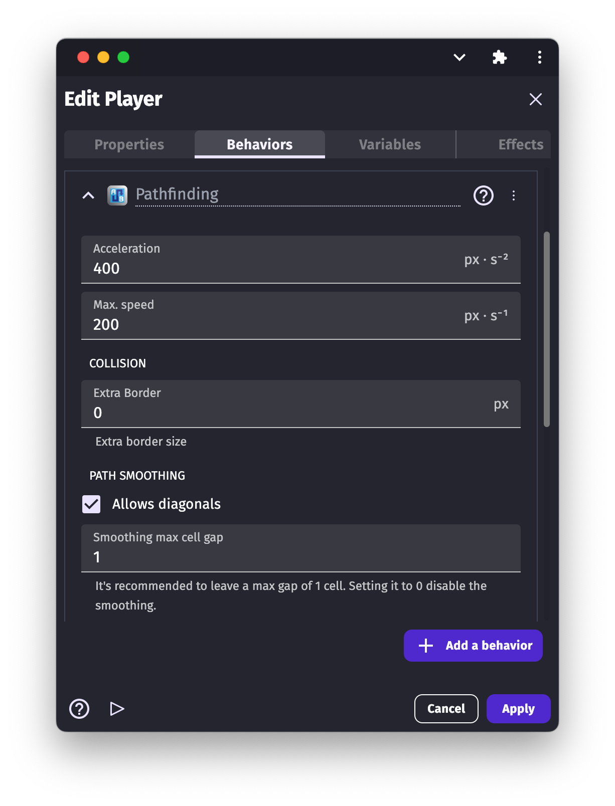
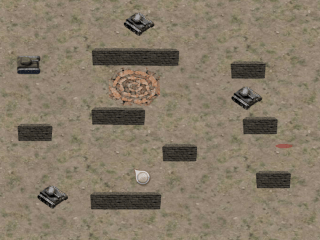

# Pathfinding

The **Pathfinding** behavior allows to move objects to a selected destination as well as to flag items as obstacles. Objects that are flagged as obstacles will be avoided by the moving objects.

## Choose which objects to avoid: the "Obstacle for Pathfinding" behavior

By using the "Pathfinding obstacle" [behavior](/gdevelop5/behaviors), you can flag any [object](/gdevelop5/objects) to be an obstacle.

When the behavior is added to an object, some properties can be modified:

  * **impassable:** if enabled, the obstacle is going to be impassable. The moving object will be avoiding them and never go through them.
  * **cost:** if the obstacle is not impassable, a cost can be set the obstacle. The moving object, when looking for the best possible path to a destination, will prefer to avoid the obstacle with high-cost values. For example, a river might have some cost. The moving object, if possible, will avoid it. However, if there is no other way around the river, or if the river has a lower cost compared to another area, the moving object will go through it (instead of climbing a mountain with a higher cost for example). And if we put crocodiles into the river and increase its cost, the moving object might decide to climb the mountains instead.

!!! tip

    Obstacles may take more space than expected because a box around obstacles is used instead of the [collision mask](/gdevelop5/objects/sprite/collision-mask). The [navigation mesh pathfinding](/gdevelop5/extensions/nav-mesh-pathfinding/reference) extension can be used to solve this.

## Move objects while avoiding obstacles: the "Pathfinding" behavior

The "Pathfinding behavior" allows to compute the shortest path from the object to a destination, and optionally move the object to this destination, while avoiding all objects that have the "Obstacle for Pathfinding".

After we add the behavior to the object, we can customize a number of options:

  * **acceleration:** this is how fast the object is going to accelerate while moving on a path.
  * **allow diagonals:** set if the object can move in diagonals.
  * **angle offset:** in case the sprite is facing the wrong direction we can set the angle offset
  * **extra border size:** sets the border size around the object. This setting determines how close the object can move to the obstacles.
  * **max speed:** maximum speed the object can move on the path.
  * **rotate object:** if you don't want the object to rotate while moving on the path, disable the object's rotation.
  * **rotate speed:** sets the speed of the object's rotation.
  * **virtual cell height and width:** the path is generated using a virtual grid. The size of the cells if this virtual grid can be changed. When the grid is smaller, the movement is more precise and can find path between objects - but is also more intensive for the device to compute.

!!! note

    A smaller cell size implies more calculations so try to still keep the size as large as possible.

### Add an action to move the Pathfinding object

To initiate a pathfinding move, add the action "Move to a position" and specify the location you want the object to move to.
It will move using the characteristics defined in the behavior properties.
If you want to change how the object moves during the game, these properties can be changed using actions.

!!! warning

    The "Move to a position" action only needs to be run once.  If you run this action with no conditions, it will try to recalculate the path at every frame. You object will *not* move and this will generate a lot of intensive computation for your device. Instead, add a condition that makes sure the object pathfinder speed is 0 or that a path was not found already.

## Examples

!!! tip

        **See it in action!** 🎮
    Open these examples online.

**General Path Finding Behavior**

[Open example in GDevelop](https://editor.gdevelop.io/?project=example://pathfinding){ .md-button .md-button--primary }

**Path Finding Basics**

[Open example in GDevelop](https://editor.gdevelop.io/?project=example://pathfinding-basics){ .md-button .md-button--primary }

## Reference

All actions, conditions and expressions are listed in [the pathfinding reference page](/gdevelop5/all-features/pathfinding-behavior/reference/).