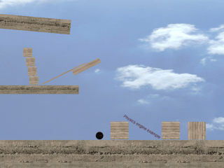

# Physics behavior

!!! danger

    This is the documentation of the old Physics behavior. [Read the new documentation here](/gdevelop5/behaviors/physics2)!

**[I would rather see the Physics behavior examples! Please take me there now.](/#Examples)**

The "Physics" behavior allows objects to behave according to the laws of physics. Physics behavior applies real world physics to your game objects. Game objects can move, fall, roll, bounce and collide.

## Add behavior to object

To add physics behavior to an object, open the object properties by right clicking on the created object in the Objects Editor. Then, select "Edit object" from the popup list that appears. Finally, select the Behaviors tab and click the "add behavior" button.
Choose the "Physics engine":

## Properties

Once the behavior is added to the object, there is a number of options to customize:

**Consider as Bullet**

Check this box if you want the physics engine to try to do perfect collision handling on this object.  This is best used for fast moving objects, i.e. Bullets, hence the name!  "Consider as Bullet" is quite resource intensive. _Use it on as few objects as possible._

**Dynamic Object**

A "Dynamic Object" will be effected by the simulation of the physics engine.  Gravity, forces, and all of the properties listed are a part of the physics engine.  Think of a rolling ball in a pinball game, you would set this to dynamic due to its rolling movement.

If you do not choose "Dynamic Object",  then you will create a Static or Kinematic object.  These objects are not effected by the physics engine. They will **not** move on their own.  They can be moved by your events and actions (Kinematic). Otherwise, they will just stay where they are (Static). In a pinball game, you might use this for the flippers (Kinematic) and the walls and bumpers (Static).

**Fixed Rotation**

This setting prevents the object from rotating. It ignores the angular damping value. Angular damping controls object rotation speed.

**Damping**

Damping is used to reduce the velocity of objects. Damping is different from friction.
Friction only occurs with contact. Damping is not a replacement for friction. //The two effects should
be used together.// Damping parameters should be between 0 and infinity, with 0 meaning no damping, and infinity meaning full damping. Normally you will use a damping value between 0 and 0.1

**Friction**

Friction is used to make objects slide along each other realistically. The friction parameter is
usually set between 0 and 1 but can be any non-negative value.  A friction value of 0 turns off friction
and a value of 1 makes the friction strong.

**Mass**

The Mass (weight) you assign to an object will greatly effect the physics of your game.  Begin with all objects set to 1 and then adjust the value as you see fit.

**Restitution**

Restitution is used to make objects bounce. The restitution value is usually set to be between 0 and 1.
Consider dropping a ball on a table. A value of zero means the ball won't bounce. This is called an
_inelastic collision._ A value of one means the ball's velocity will be exactly reflected. This is called a
_perfectly elastic collision_.

# Examples

!!! tip

        **See it in action!** 🎮
    Open these examples online.

**Physics:**

[Open example in GDevelop](https://editor.gdevelop.io/?project=example://physics){ .md-button .md-button--primary }

**Car Physics**

[Open example in GDevelop](https://editor.gdevelop.io/?project=example://car-physics){ .md-button .md-button--primary }

**Object Gravity**

[Open example in GDevelop](https://editor.gdevelop.io/?project=example://object-gravity){ .md-button .md-button--primary }

## Reference

All actions, conditions and expressions are listed in [the physics Engine (deprecated) reference page](/gdevelop5/all-features/physics-behavior/reference/).