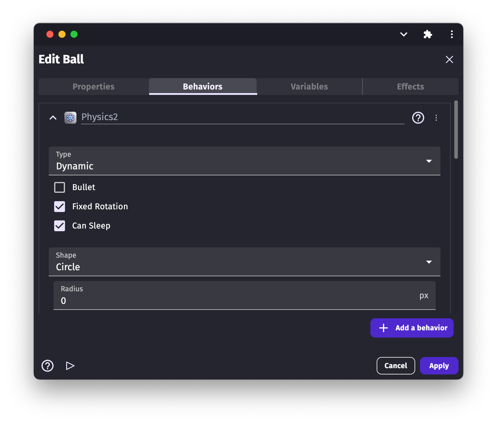

# Physics Engine

You can add the **Physics [behavior](/gdevelop5/behaviors)** to [objects](/gdevelop5/objects) to make them move realistically, following the laws of physics. This is adapted to a large range of games: "Angry Bird" like games, "Cut the Ropes",  bike simulation, Pool Games and many other games uses a physics engine for animating the objects.

!!! tip

    This behavior is based on *Box2D*, a fast and complete rigid bodies physics simulation library in the background.

The behavior is composed of three big concepts: the world that hold the bodies (this is the scene), the bodies themselves (these are the objects), and optionally the joints that link bodies. All of them are explained in this reading.

!!! warning

    Limitation: As stated above, the extension simulates rigid bodies physics, which means that bodies can't be deformed. Things like soft shapes, clothes, and fluids are not supported.

## World

The world is the place where simulations run, bodies and joints are attached to a world to interact with other entities. This corresponds to the scene in GDevelop.
Like GDevelop scenes size, the world size is infinite, so you don't have to care where your objects are. They will always follow the laws of physics once they have the physics behavior added and enabled.

The world has three properties:

  * **Gravity**. It consists of two components (X and Y) and works like our gravity adding a force to every object, pushing them in the given direction. Objects support a gravity scale factor too, more on this in the bodies section.
  * **Timescale**. It defines the scale of time the simulation will use. With a timescale of `0.5`, the simulation will run at half the speed; with a timescale of `2`, the simulation will be twice as fast. If timescale is `0`, the simulation will pause. Super useful for bullet time effects!
  * **Scale**. GDevelop distances and sizes are defined in pixels, but the physics engine uses meters internally. A scale factor must is set (with two components, scale on X axis and on Y axis) to make the conversion. The scale numbers mean how many pixels a meter is; for example, a scale of 50 means that a distance of 50 pixels in GDevelop is converted to 1 meter in the physics world.

!!! note

    The rule number one to decide the world scale is to choose it so that the size of your movable/dynamics objects falls in the range 0.1 - 10 meters; out of this range, the simulations will lose precision. For example, if you work with object sizes around 100x100 pixels, a world scale of 100 would be perfect, as it will make your bodies size to be approximately 1x1 meter. Static objects can be much longer, scaling up to 50 meters.

## Bodies

Bodies are the life of the Physics extension; they define how your object will move, what its shape will be, how much it will bounce, and whether it will be able to rotate or move.

When you add the Physics behavior to an object, you can set the body configuration right from the IDE.
There are many options to play with. They have been categorized below.

### Body Type

GDevelop supports three basic body types:

  * **Dynamic**: The most common type, dynamic bodies, are affected by gravity, can collide with other active, static, and kinematic bodies. You can apply forces and impulses on them and modify their velocity as well. Almost anything that must move should be a dynamic body.
  * **Static**: Static objects are not affected by gravity, and you can't move them using forces, impulses or modifying their velocity. They can collide with dynamic objects only, ignoring kinematics and other static bodies. They are meant to be used for static world geometry, as the ground, non-movable walls, and platforms.
  * **Kinematic**: Kinematics are very specialized; they are a type of static body, so they won't be affected by gravity or forces or impulses, but you can move them by modifying their velocity. Kinematics collide with dynamic bodies only, but will not move as a result of this collision. Kinematic bodies are useful for simulating movable walls and platforms.

And some dynamic-related settings:

  * **Bullet**: If set to true, the object will use a continuous-collision-detection algorithm, slightly reducing the performance but improving the response when moving very fast. Useful to correctly simulate bullets or any high-speed object and reduce the chances for the bullets to go through thin objects.
  * **Fixed Rotation**: If set to true, the object won't be able to rotate. Useful to avoid an object like your player spinning each time it collides with a wall or while walking down a slope.
  * **Can Sleep**: If set to true, the engine can improve the performance on objects that haven't moved in a while, putting them to sleep. This is a performance setting and should not impact the simulation itself.

!!! note

    You can check if a body is sleeping using events conditions. If an object is sleeping, it means it has been in an equilibrium state for a while.

### Body Shape

Body shape options determine the body form and size. Depending on the shape type, you have different options to set the dimensions:

  * **Box**: *An axis-aligned rectangle centered on the object*. If a custom width and height are not set, the object size is used.
  * **Circle**: *A circle centered on the object*. If a custom radius is not set, it will be calculated as an average from the object width and height. If the object is in the form of a square, the result will be an inscribed circle inside the object bounding box.
  * **Edge**: *A thin line centered in the object*; since this shape has no volume, it doesn't work well as a dynamic body. It's meant to be used for static geometry, as ground and platforms. If a custom length and angle are not set, the edge will be a horizontal line with length equal to the object width.
  * **Polygon**: *A custom shape configured using vertices*. This polygon must be convex (if this condition is not fulfilled, the shape falls back to a box). The number of vertices must be greater than or equal to 3 (otherwise, it can't be convex) and less than or equal to 8 (the maximum number of vertices supported per polygon).

In addition to custom shape type and dimension, the body shape supports two extra options:

  * **Offset**: The offset has two components (X and Y) and can be used to move the shape from the object center.
  * **Scale**: This will scale the shape  custom dimensions and offset. If you don't use custom dimensions, you can use the box shape and let the width and height be equal to the object's original size; there's no need to change the shape scale as the scaling will be done automatically. If the shape type is a polygon, the scale will modify the vertices position too, and the scaling origin will be the **Polygon Origin**. If you set the polygon origin to `Center` and scale the shape down, the vertices will be scaled down to/in-direction-of the object center.

### Body Settings

Besides the type and shape, physics bodies have some extra settings that determine how the body will behave on collision, how the gravity will affect them and the energy they lose by air friction. Each setting is explained below:

  * **Density**: Density determines the body mass. The general formula is `density = mass/volume`. In 2D games, this is equivalent to `density = mass/area`. Two bodies with the same density but different areas/sizes will have different mass, so you have to take the density into account when resizing objects.

  * **Friction**: Friction adds a force to the bodies in contact, in the opposite direction to their direction of movement. The higher the friction, the faster the objects will slow down on contact. To understand it better, a platform made of sand will have friction close to 1 (very high), while a platform made of ice, will have a friction factor close to zero. When two objects are in contact, the total friction is calculated using the frictions of the colliding objects through the formula: `friction = sqrt(frictionA * frictionB)`

  * **Restitution**:  Restitution determines how much energy the object will keep or lose in each collision. A value of zero means the collisions will be perfectly inelastic, and the object won't bounce at all. While a restitution = 1 means the collisions will be perfectly elastic, and the object will jump with the same energy each time. Imagine a ball bouncing off the ground, and always reaching the same height. Values of restitution greater than 1 are valid but will make the object gain energy on each collision, and the simulation will probably run out of control. When two objects make contact, the total restitution is calculated using the restitutions of the colliding objects through the formula: `restitution = max(restitutionA, restitutionB)`

  * **Linear Damping**: Linear damping reduces the object velocity all the time. The higher the value, the faster it slows down the objects. You can imagine it as the air viscosity, very high values would even simulate the object to move in liquid. Although you can use any value, a negative damping will make the object to gain velocity on each step, generating a non-physical behavior.

  * **Angular Damping**: Angular damping is analogous to the linear damping, but instead of slowing down the object's linear velocity, it slows down the angular velocity, making the object to rotate slower each step. Although you can use any value, a negative damping will make the object to gain angular velocity on each step, generating a non-physical behavior.

  * **Gravity Scale**: This is multiplied by the world gravity to determine the gravity applied to the object. Note that this is a number and not a vector; you can't change the orientation of the gravity, just the magnitude and sense. Any number is valid. For example, if the gravity scale is 1, the gravity applied will be the world gravity; if it's 2, the gravity will be twice as strong for this object; if it's 0.5, the gravity will be twice as weak; if it's 0 the object won't be affected by gravity, and if it's -1, the gravity will be inverted.

### Collision Layers & Masks

Layers and masks are the way to filter collisions between objects.

  * **Layer**:  Logical group that an object can belong to.  Objects can be a member of multiple layers.
  * **Mask**:  List of the layers that an object will collide with.

!!! note

        Physics collision layers are not related to layers that are used to place objects in a scene.

This system allows you to build up complex interactions between a variety of objects. For example: imagine you're building a zombie game, and you want your player to collide with the ground, and want the zombies to collide with the player and with the ground as well, but you don't want zombies to collide with other zombies. In this case, you use collision filters layers and mask.

There is just a single rule to remember: *two objects A and B can collide if any layer of A matches any mask of B, **and** any layer of B matches any mask of A*.

Here is a possible solution to the above zombie problem:

  * Ground: Enable the first layer and the first and second masks.
  * Player: Enable the first layer and the first and second masks.
  * Zombie: Enable the second layer and the first mask only.

| Object      | Layer       | Mask          |
|---|---|---|
| Ground | 1 | 1, 2  |
| Player | 1 | 1, 2 |
| Zombie | 2 | 1 |

We can verify this works:

  * Ground & Player: A ground layer matches a player mask (first), **and** a player layer matches a ground mask (first)
  * Ground & Zombie: A ground layer matches a zombie mask (first), **and** a zombie layer matches a ground mask (second)
  * Player & Zombie: A player layer matches a zombie mask (first), **and** a zombie layer matches a player mask (second)
  * Zombie & Zombie: The zombie has only the second layer enabled, and only the first mask enabled, so zombies can't collide with each other.

Note that you have 16 layers and 16 masks available. Here, in this example, only two layers and masks were needed. By default, all physics objects will use layer 1 and mask 1.

### Movement

After setting up your objects, it's time to start the simulation: gravity will begin to push things, objects will move and collide, but you can't interact with your game at all. It's time to move the objects and you can use events to do so. Here are some useful actions to interact with the objects and move them in the way you want:

!!! danger

    Remember that GDevelop force related actions are not suited for the Physics behavior. To move an object using the Physics behavior, use the actions specific to the Physics behavior.

  * **Forces**: Forces change an object's movement and are meant to be used for some time to generate an appreciable effect. The velocity the object gains, when you apply on it a force depends on the force's magnitude and the object mass. A heavy object will move slower than a lighter one if the same force is applied on both the masses.
  * **Torques**: Analogous of forces but for rotation. A torque will generate an angular acceleration on the object, making it rotate faster or slower along the time.
  * **Impulses**: Like forces, but not depending on the time step, instead, adding an "amount" of velocity instantly. They're meant to be used a single time. An usage can be to simulate jumps: each time the jump button is pressed, add an impulse upwards.
  * **Angular Impulses**: Analogous of impulses but for rotation. Change the rotation speed of an object instantly.
  * **Velocity**: You can modify the velocity of an object directly. For example, you can make your character walk with constant speed and then change the velocity while a movement button is pressed.
  * **Angular Velocity**: You can set the angular velocity (rotation speed) directly too.

!!! warning

    You can change the position of the objects directly, but it will generate non-physical behaviors, at least until the new position is corrected. Objects don't teleport in real life, after all.

Note that forces and impulses need an **application point**; it's essential because it isn't the same to push a glass from the base (move the glass) than pushing it from the top edges (the glass will probably fall), or pushing a door from the knob than from the hinges.

If the application point is different than the object mass center, it will generate some kind of torque/rotation.

!!! note

    You can get an object mass center using the physics behavior expressions `MassCenterX()` and `MassCenterY().`

## Controlling object movement with joints

Joints are restrictions given to the objects to make them follow extra rules of movement. Some joints make the objects rotate around a fixed point, others keep two objects together, complex ones simulate vehicle wheels limiting the distance between the bodies but allowing them to rotate freely.

The notion of **Joint ID** is important. when you create a joint, you can pass a variable name; if you do it, GDevelop will store the joint unique identification number (ID) in the given variable. Using the joint ID, you can modify it after the creation, check its values and remove it. Imagine you create a joint to stick a key to a rope attached to the roof; if you save the joint ID in a variable, then you can check if an object collides with the rope and remove the joint using the saved ID to make the key fall down.

!!! note

    A joint ID will be always a number greater than zero.

Usually, you will need two objects to define a joint (in the previous example, the rope and the key), but there are exceptions.

Here is a list of  properties, conditions, and actions common for all types of joints:

  * **Joint first/second object**: Conditions that let you pick objects if they are the first or second object the joint is attached to.
  * **Joint first/second anchor X/Y**: Expressions to get the position of the first or second object anchor point the joint is attached at.
  * **Joint reaction force/torque**: Conditions and expressions to check the joint reaction force or torque; this value is a measure of how far away is the joint from its equilibrium state. If the joint reaction force is too high, it means the joint has been separated from the equilibrium position through a considerable force. Useful to make breakable joints.
  * **Remove joint**: Action to remove the specified joint. If the joint is one of the gear joint children, the gear will be also removed. If any of the objects the joint is attached to is deleted, the joint will be deleted.

There are many kinds of joints, each one with unique behaviors and properties; they are listed below.

!!! warning

    Make sure to create joints in events that run only once (for example, at the beginning of the scene). Creating joints every frame will create hundreds of joints in seconds, resulting in poor performance, non-physical behaviors, and possible crashes due to memory consumption.

### Distance Joint

Distance joint tries to keep two objects separated by a given distance; the distance is calculated from the joint anchor points.
The objects won't be at the given distance all the time but will tend to reach it, following an oscillator formula.

Settings:

  * **Length**: The target distance, if a negative value is given, the distance between the objects when creating the joint is used.
  * **Damping ratio**: The "friction" the objects will suffer, low values make the objects oscillate more, higher values reduce oscillations but objects will move slower.
  * **Frequency**: How fast the objects will oscillate, lower values generate soft joints moving more gradually to reach the target distance, higher values simulate harder joints with objects moving very fast to reach the target.
!!! note

    Low damping ratio and frequency values will generate soft joints, with lots of oscillations before getting close to the target distance. In contrast, high values for both settings generate very rigid joints.

### Revolute Joint

Revolute joints work like "pins" and are also known as "hinges," they make the objects to rotate around a point.
There are two types of revolute joints; in the end, they are almost the same, with a small difference:

  * **A revolute joint between two objects**: It "pins" two objects, the objects will move together in a way so their anchor points overlap, and each object will rotate around their anchor point. Imagine that you pin two cards together and throw them, so they move and rotate freely around the pin.
  * **A revolute joint in a single object**: Joints usually work between two objects; this is one of the exceptions. This joint needs a single object and its anchor point and pinpoints the object at the given fixed position. Think of it like pinning a note in a wall; the note can rotate around the pin but can't move.
!!! note

    In the single object version of the joint, the object is added as the second object in the joint. The first object is a hidden static body; this allows to use this type of joint in gears, which is explained in the gear joint section.

Here is the list of the settings specific for revolute joints:

  * **Angle limits**: If enabled, the rotation will be restricted between the minimum and maximum angles. Note that both angles are relative to the first object.
  * **Reference angle**: The angle between the objects that will be considered as zero. It offsets all the angle properties. If the reference angle is 15 degrees, asking for the current joint angle when the angle between the objects is 15 degrees in world coordinates will return 0, and set the maximum angle to 30 will set it to 45 (relative to the first object).
  * **Minimum angle**: The minimum angle between the objects, relative to the first object. Must be lower than or equal to the maximum angle.
  * **Maximum angle**: The maximum angle between the objects, relative to the first object. Must be greater than or equal to the minimum angle.
!!! tip

    You can use revolute joints with angle limits to simulate articulations, in other words, ragdolls!

  * **Motor**: If enabled, the joint will add torque to the second object to make it rotate without the need of an external force, like a motor. If you enable it, remember to set a motor speed and a maximum motor torque!
  * **Motor speed**: The target motor speed, in degrees per second. This is the speed the second object will try to reach while rotating around the first object. Motor speed can be positive to rotate the object in a clockwise direction or negative to rotate it in the anticlockwise direction.
  * **Maximum motor torque**: The maximum torque the motor can spend to reach the target motor speed must be positive.

Also, you can access the following values during simulation:

  * **Joint angle**: The current angle between the objects, relative to the first object and affected by the reference angle.
  * **Joint speed**: The current joint angular speed, i.e., the speed the second object is rotating around, relative to the first object rotation.
  * **Joint motor torque**: The current motor torque, it can be lower than the maximum motor torque, as it's the required torque to reach the target motor speed.

!!! note

    Other uses for revolute joints can be: pinball levers, top-down doors, automated rotating machines as bridges.

### Prismatic Joint

Prismatic joints work like "pistons" and are also known as "sliders." They make objects to slide one over the other in a given axis. A good example is an elevator; the elevator moves in a vertical axis along a rail. The rail would be the first joint body and the elevator the second one. The axis would be an angle pointing up or down (-90 or 90 degrees).

Settings specific for prismatic joints:

  * **Axis angle**: The angle that determines the movement direction, an axis angle of 0 means a horizontal movement. The value is given in world coordinates, but the axis will rotate following the first object direction (if you rotate your elevator rails, the elevator movement angle rotates too).
  * **Reference angle**: As in revolute joints, this angle adds an offset to the axis, establishing a new "angle zero." If the reference angle is 15, an axis angle of 15 in world coordinates (relative to the first object direction) will be treated as 0.
  * **Translation limits**: If enabled, the second object movement will be limited between the given minimum and maximum translations.
  * **Minimum translation**: The minimum position the second object can move from the first one. In our elevator example, the minimum translation would be the floor.
  * **Maximum translation**: The maximum position the second object can move from the first one. In our elevator example, the roof.
!!! warning

    The translation limits range must include the zero, a minimum translation of 5, and maximum translation of 10 (range [5, 10]) will be converted to the range [0, 10] to include the zero.

  * **Motor**: If enabled, the joint will apply a force to the second object to reach a given motor speed. If you enable it, remember to set a motor speed and a maximum motor force!
  * **Motor speed**: The target speed the motor will try to reach; if positive, the second object will move in the axis direction, and in the opposite direction if negative.
  * **Maximum motor force**: The maximum amount of force the motor can spend to reach the target speed. It must be positive.

Also, you can access the below values during simulation:

  * **Joint translation**: In the current translation, the second object has moved relative to the first.
  * **Joint speed**: The current speed the second object is moving at, along the axis and relative to the first object speed.
  * **Joint motor force**: The current force the motor is applying to the second object; this value can be lower than the maximum motor force as it's the force needed to reach the target motor speed.

### Pulley joint

A pulley joint simple joint with a simple name. This joint makes the summation of the distances from each object to its ground position to be constant; it's a lot easier to understand using other words: it simulates a pulley :)

Imagine you have a box hanging 3 meters under a fixed point A and a circle hanging 2 meters under a fixed point B, both objects attached to the ends of the same rope. The rope has a constant length, so if you move the box up, now hanging just 1 meter under A, the circle has to move down the same distance, now 4 meters under B, this way the distance between the box and A plus the distance between the circle and B is always 5 meters:
`distance(box, A) + distance(circle, B) = constant`

**Ratio**:
Easy, no? Now the crazy part, this joint supports an extra setting: ratio. The ratio makes the rope to be more extensible on one of the sides than the other. It can make, for example, 1 meter of rope on the box side to be equivalent to 2 meters of rope on the circle side (ratio = 1/2 = 0.5).

Going back to our initial example: The box 3 meters under A, the circle 2 meters under B, but with a ratio = 0.5. Now, moving the box 2 meters upward will make the circle move 4 meters downward. The rope length is not constant, but:
`distance(box, A) + ratio*distance(circle, B) = constant`
(Note that the first equation is a particular case of this one, with ratio = 1).

Also, please note that there is not a "rope" at all. The joint works with the distance between the objects and the anchor points only!

Here are the joint settings:

  * **First ground point**: The fixed point the first object is attached (in the examples, point A).
  * **Second ground point**: The fixed point the second object is attached (in the examples, point B).
  * **First length**: The initial rope length between the first object and its ground point; if the value is negative or zero, the distance at the moment of creating the joint is used.
  * **Second length**: The initial rope length between the second object and its ground point; if the value is negative or zero, the distance at the moment of creating the joint is used.
  * **Ratio**: Explained above, the equivalence between the distance in each side. If the ratio is = 0.33, 1 meter on the first side is equivalent to 3 meters on the second side.

### Gear Joint

This joint is very special; instead of joining two bodies directly, gears join two other joints, those child joints must be revolute or prismatic.
When two joints are linked through a gear joint, one of the joints movement makes the other joint move. For example, moving an object along the axis on a prismatic joint will cause the linked revolute joint to rotate and vice versa.

This joint is also very tricky!  To get a gear to work, each child's joint's first body must be static, and the second body dynamic.
You can gear together two revolute joints, two prismatic joints, or a revolute and a prismatic, but always the first body of each of the joints must be static!
!!! note

    The first body of the gear child joints must be static; that's why the single object version of the revolute joint clarifies that the first body is a hidden static object

The gear joint settings:

  * **First joint**: A revolute or prismatic joint will be linked to the second joint.
  * **Second joint**: A revolute or prismatic joint will be linked to the first joint.
  * **Ratio**: Like the pulley joint, gears support a "ratio", and works in a similarly: If you link two revolute joints with a ratio = 0.33, each turn in the first revolute will be equivalent to three turns in the second one. But there is a difference against the pulley joint ratio: gears ratios can be negative, allowing a positive movement in one of the joints to generate a negative movement in the other. For example, when linking two revolute joints with a ratio = -1, clockwise rotation in a revolute joint will generate an anti-clockwise rotation in the other, much like a gear.

!!! warning

    The necessary condition for the existence of a gear is the existence of the two child joints. If any of the two joints are deleted the gear will be automatically deleted too.

### Mouse Joint

This joint is not necessarily related to the mouse, but it's very common. This joint moves an object towards a target position; if you update the target position continuously to target the mouse or a touch position, you can drag objects around.

Note that it's another exception from the other joints because it's a joint that requires a single body to work: the object that will be moved towards the target.

Settings for the mouse joint:

  * **Object**: The object to move around, towards the target position.
  * **Target**:  The target point the object will try to reach. You can update it as many times as you want after creating the joint.
!!! warning

    The initial target position (at the moment of creating the joint) is also used as the object anchor point, so make sure to set it!

  * **Maximum force**: The maximum force the joint can apply on the object to reach the target position; the greater the force, the faster the object will move. It must be positive.
  * **Frequency**: Works like the distance joint frequency, determining how fast the object will oscillate around the target.
  * **Damping ratio**: Works like the distance joint damping ratio, slowing down the object along the time.

!!! note

    The mouse joint is not restricted to be used with the mouse only but accepts any world point as the target. This means you can use it to move an object towards another or toward a touch on a touchscreen.

### Wheel Joint

A very specified joint, when you need wheels, you'll want this joint, and it's hard to think of a case different than a vehicle wheel where the best joint is the wheel joint.

You can think of the wheel joint as a revolute plus a prismatic joint:

  * The revolute joint is used to make the second object (the wheel) rotate, and, as the classic revolute joint, it supports a motor to simulate the vehicle motor, causing the wheel to rotate.
  * The prismatic joint function is to simulate the vehicle wheel suspension, and, as the classic prismatic joint, you can set the axis angle to define the wheel translation direction. Generally, the axis direction is vertical, but, for example, motorbikes have a front-wheel suspension direction different (and in some cases very far) from vertical.

!!! warning

    The body that will work as the wheel has to be the second object in the joint.

Here are the wheel joint settings:

  * **Axis angle**: Equivalent to the prismatic joint axis angle, it determines the direction of movement (or sliding) between the wheel and the first object.
  * **Frequency**: The suspension frequency, equivalent to the distance joint frequency. Higher values will make the wheel oscillate faster.
  * **Damping ratio**: Damping ration is the suspension damping, equivalent to the distance joint damping ratio. Higher value slows down the wheel movement at a higher rate.
  * **Motor**: If enabled, the joint will add torque to the wheel (second object) to reach a given motor target speed. If you enable it, remember to set the motor speed and the maximum motor torque!
  * **Motor speed**: The target angular speed the wheel will try to reach. It can be positive for clockwise rotation or negative for anti-clockwise rotation.
  * **Maximum motor torque**: The maximum amount of torque the joint can apply to the wheel to reach the motor target speed. It must be positive.

And some extra values you can access during simulation:

  * **Joint translation**: The current wheel translation along the suspension axis.
  * **Joint speed**: The current wheel rotation speed.
  * **Joint motor torque**: The current torque the joint is applying to the wheel, it can be lower than the maximum motor torque as it's the torque needed to reach the target speed.

### Weld Joint

This joint is super basic: it just tries to stick/glue two objects together and move them as if they were a single object.

!!! warning

    You can use it to make breakable objects, but don't over use it. The objects will be attached by soft joints and so sticking lots of objects with very different densities can lead to physically inaccurate results.

The weld joint-specific settings:

  * **Reference angle**: The angle the second object will have, relative to the first object angle.
!!! note

    To stick the objects in the angle they are at the moment of creating the joint, use the relative angle between the objects as the reference angle: `SecondObject.Angle() - FirstObject.Angle()`

  * **Frequency**: Works like the distance joint frequency, determining how fast the objects will oscillate to reach the rest position.
  * **Damping ratio**: Works like the distance joint damping ratio, slowing down the objects along the time.

### Rope Joint

Another simple joint. The rope joint makes two objects to be virtually linked with a rope; this way, they can't be separated by a distance greater than the rope length but can be in any distance below it.

As in the pulley joint, there is not a real rope; the joint just checks the distance between the objects and reacts if the distance is greater than the given length.

The only setting specific for the rope joint:

  * **Maximum length**: It is the maximum distance between the objects. If the initial value is negative, the distance between the objects at the moment of creating the joint is used.

### Friction Joint

Friction joint simulates friction in a Z-axis; it slows down the relative speed and/or the angular speed between two objects to simulate linear and angular friction.

!!! tip

    If one of the objects is static, the friction joint can be used to correctly simulate friction in a top-down game, like a pool table or top-down racing games.

Friction joint settings:

  * **Maximum force**: The maximum force the joint can apply to the objects; higher values generate higher linear friction.
  * **Maximum torque**: The maximum torque the joint can apply to the objects; higher values generate higher angular friction.

### Motor Joint

The motor joint has not much to do with real motors, at least not directly. When you link two objects with a motor joint, the objects will try to reach a target position and/or angle relative to the other object plus an offset.

Two things to take into account:

  * The joint is not rigid; the objects can be far away from their target position or angle, a correction factor will tell how fast they will move and rotate to reach the rest pose. For example, imagine one of these punching bag toys that always gets up again. You could simulate it using a motor joint, linking the ground and the bag; this way no matter how much you push the bag object, the joint will try to put it back in the original angle, but not automatically.
  * Motor joints will stop if there are obstacles. Going back to the punching bag example, if you push it with a big object to keep it on the ground, the motor joint won't be able to push it back, like in real life.

!!! note

    This joint doesn't use anchor points; the offset position must be set using the linear and angular offsets only. Accessing the anchor points of this joint will return the object's position.

The motor joint specific settings:

  * **Offset X/Y**: The offset position for the second object, relative to the first one. To use the current object's position at the moment of creating the joints use `SecondObject.X() - FirstObject.X()` and `SecondObject.Y() - FirstObject.Y()`
  * **Offset angle**: The angular offset for the second object relative to the first one. To use the current objects relative angle at the moment of creating the joints, use `SecondObject.Angle() - FirstObject.Angle()`
  * **Maximum force**: The maximum force the joint can apply to the objects to move them to the target position. Higher values will move the objects faster, in case of being necessary. If this value is zero, there won't be a linear correction, and objects won't move to reach the target position.
  * **Maximum torque**: The maximum torque the joint can apply to the objects to rotate them to the target angle. Higher values will rotate the objects faster, in case of being necessary. If this value is zero, there won't be an angular correction, and objects won't rotate to reach the target angle.
  * **Correction factor**: How fast the objects have to move and rotate to reach the target position and angle. The higher the correction, the faster the objects will move and/or rotate. The correction is limited by the maximum amount of force and torque the joint can use.

## Reference

All actions, conditions and expressions are listed in [the physics Engine 2.0 reference page](/gdevelop5/all-features/physics2/reference/).