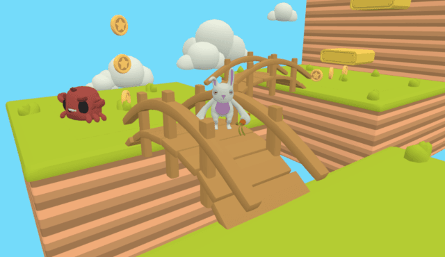
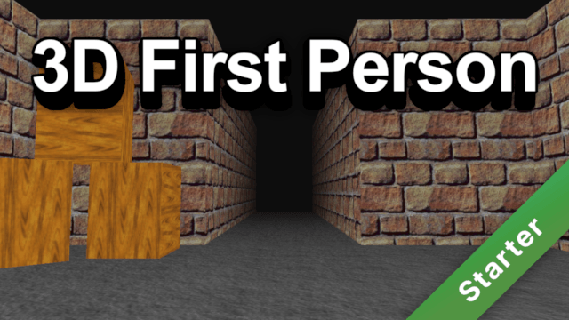
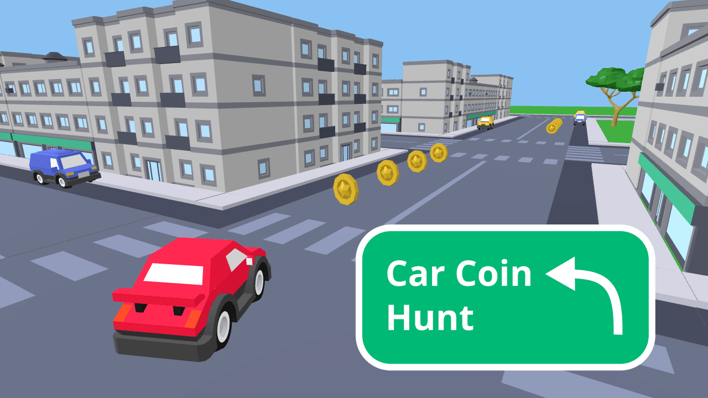
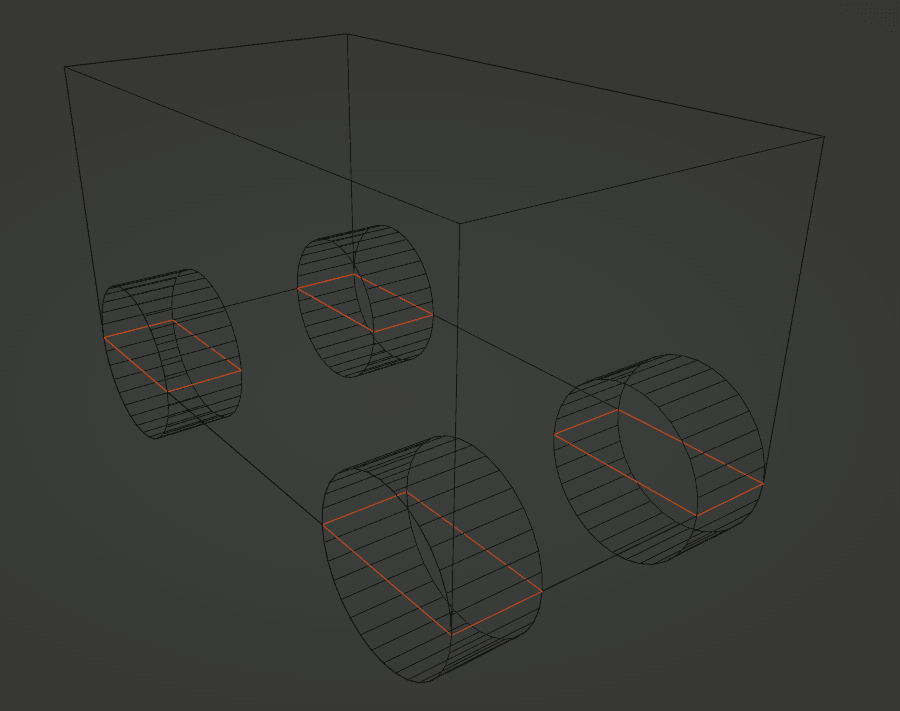

# 3D Physics Engine

GDevelop provides a powerful 3D Physics Engine, allowing to create any kind of 3D games.

!!! tip 

    The 3D physics engine is powered by Jolt Physics a **modern, performant, battle-tested, fully featured** 3D physics engine used in AAA games, like Horizon: Forbidden West. It's perfect for making FPS, TPS, 3D platformers and in the future 3D racing games or any 3D game.

The 3D Physics Engine is available through:

* A behavior **3D physics** to apply to any 3D object of the physics world.
* A dedicated behavior for 3D characters: **3D physics character**.
* A few behaviors add out of the box support for touch screens, gamepads and keyboard/mouse (see [Move a 3D character with controls](#move-a-3d-character-with-controls) section).

## Make ground, walls and platforms

Add the behavior **3D physics** to the object and choose **Static** for the **Type** in the behavior properties. Static objects can't be moved though collisions nor forces.

!!! tip 
    For complicated structures like a bridge, you can use hidden objects to build the shape and add the **3D physics** behavior to these objects instead of the bridge model.

## Make pushable objects

When you want objects to be kicked out and fall, you should set the **Type** to **Dynamic**.

## Move platforms or enemies

Platforms and enemies usually loop on the same path. They must not fall be pushed by other objects.
Objects with the **Kinematic** type won't be moved according to physics rules. They can only be moved by changing their **linear velocity** and **angular velocity**. They can interact with other objects but only these other objects will move.
The [3D ellipse movement](/gdevelop5/extensions/physics-ellipse-movement3d/) behavior allow to easily move objects on ellipses or smoothly back and forth in one direction.

!!! tip 
    The **3D physics character** can also be used for enemies that need to follow slopes or jump.

## Move a 3D character with controls

The **3D physics character** behavior allows characters to walk, jump, follow slopes and stick to moving platforms.

!!! tip 
    The **Capsule** shape is recommended for characters to avoid them floating over slopes.

### Move a 3D platformer character

These behaviors make the character move according to player inputs automatically:

* [3D platformer keyboard mapper](/gdevelop5/extensions/physics-character3dkey-mapper)
* [3D platformer multitouch controller mapper](/gdevelop5/objects/multitouch-joystick)
* [3D shooter gamepad mapper](/gdevelop5/all-features/gamepad/)

[Open example in GDevelop](https://editor.gdevelop.io/?project=example://3d-platformer){ .md-button .md-button--primary }

[{ width="320" }](https://editor.gdevelop.io/?project=example://3d-platformer)

### Move a 3D shooter ("FPS") character

These behaviors make the character move according to player inputs automatically:

* [3D shooter keyboard mapper](/gdevelop5/extensions/physics-character3dkey-mapper) and [First person camera mouse mapper](/gdevelop5/extensions/mouse-pointer-lock/#first-person-camera-mouse-mapper)
* [3D shooter multitouch controller mapper](/gdevelop5/objects/multitouch-joystick)
* [3D platformer gamepad mapper](/gdevelop5/all-features/gamepad/)

[Open example in GDevelop](https://editor.gdevelop.io/?project=example://3d-first-person){ .md-button .md-button--primary }

[{ width="320" }](https://editor.gdevelop.io/?project=example://3d-first-person)

## Move a 3D car with controls

The **3D physics car** behavior simulates a realistic car using the 3D physics engine.

Physics properties often have an impact on several parts of the car movement. Following these steps can help to save time:

- Avoid the car to roll when it turns
- Setup how quick the car falls back on the road
- Avoid the car to slip when it turns
- Setup how fast the car moves

You may need to do the last 2 steps many times to finely tweak your game feel.

!!! tip 
    It can be a good idea to start from an example and change some properties to see how they affect the game feel.

[Open example in GDevelop](https://editor.gdevelop.io/?project=example://3d-car-coin-hunt){ .md-button .md-button--primary }

[{ width="320" }](https://editor.gdevelop.io/?project=example://3d-car-coin-hunt)

### Choose a realistic world scale

The first thing to setup for any realistic game that uses the physics behavior is the world scale. Objects are placed in a scene using pixels but the physics behavior works with meters. The world scale allows to do the conversion. For instance, let's say the car is 40 pixels wide in the scene. Considering a car is about 2 meters wide, you would set a world scale of `40 / 2` which is `20`.

### Avoid cars to levitate

By default, the physics shape encompasses the whole 3D model. If your 3d model includes the wheels, you need to set a custom shape size to exclude them. For instance, let's say:

- the whole car **depth** is `30` pixels
- the wheel radius is `6` pixels
You would set:

- a custom depth of `30 - 6` which is `24`
- a **shape offset Z** of `6 / 2` which is `3` to move the shape up on the car chassis

The default positions of the wheels are in the bottom corners of the car. The wheels are centered in Z axis on the bottom of the physics shape, but don't stick out on X and Y axis.

You may want to adjust the **back wheels offset X** and the  **front wheels offset X** by setting a negative value to move them a bit inside the car.

### Avoid cars to roll when it turns

Cars center of mass is as low as possible to avoid cars to roll. By default, the physics behavior set the center of mass is at the exact center of the object. For instance, to move center of mass at the bottom of the car, let's say your car **depth** is `30` pixels, you could set `-15` pixels for the **center of mass offset Z**.

!!! tip

	In case your car is still rolling when it turns, you can try reducing the **friction**.

### Setup how quick cars fall back on the road

**Mass override**

A car usually weight about 1,500 kg. It can be a good value to start

**Gravity scale**

When a car jumps off from a slope, you may want to give back control to the player by making quickly it go back on the road. It's better to use the gravity scale instead of the mass for this because it won't affect the car acceleration and collision.

### Avoid cars to slip when it turns

**Friction**

Cars with greater friction can turn at higher speed without slipping. The friction of the ground also matters. For instance, a smaller value can be set for a grass object to make cars slip when they are off the road.

!!! tip

	**Gravity scale** and **mass override** also change how cars slip. Make sure you have followed the steps described in the above sections first.

### Setup how fast cars move

You set the **engine inertia** to adjust how fast the car accelerate:

- a smaller value gives faster acceleration
- a greater value gives slower acceleration

The **max engine speed** allows to adjust how fast a car can go.

The **max engine torque** allows to climb slopes faster.

!!! tip

	**Friction**, **gravity scale** and **mass override** also change how fast cars move. Make sure you have followed the steps described in the above sections first.

## Concepts used in Physics

### World

The world holds all physics bodies and defines the rules of the simulation. Every object with the **3D physics** behavior lives in this shared world.

- **Gravity** has three components (X, Y, Z). In a typical 3D game, gravity pulls objects downward along the Z axis with a negative value. You can change the world gravity at runtime to create zero-gravity or anti-gravity effects.
- **World scale** converts between pixels (used by GDevelop) and meters (used by the physics engine). A good starting point is to choose a scale so that dynamic objects are between 0.1 and 10 meters in size. For example, if your character is 100 pixels tall and represents a 1.8 m person, set the world scale to about `55`. Objects simulated far outside this range can lose precision.

### Body Types

- **Static**: Does not move from collisions or forces. Perfect for terrain, walls, and platforms.
- **Dynamic**: Fully simulated — affected by gravity, forces, and collisions. Use this for any object that should move according to physics.
- **Kinematic**: Moves only when its linear or angular velocity is set directly, not by external forces. Ideal for moving platforms, enemies following a path, or player-controlled characters that must interact with physics objects without being knocked away.

### Collision Shapes

The collision shape determines the geometry the physics engine uses for an object. It does not have to match the visible 3D model exactly — a simpler shape is often faster and more predictable.

- **Box**: An axis-aligned rectangular box. Suitable for most objects. Automatically uses the object's size if no custom dimensions are set.
- **Capsule**: A cylinder with rounded ends. Recommended for characters because it slides smoothly over slopes and steps without catching on edges.
- **Sphere**: A perfectly round shape. Good for balls and small rolling objects.
- **Cylinder**: A tube shape. Suitable for wheels, barrels, or pillars.
- **Mesh** *(Static only)*: Uses the actual 3D model geometry as the collision shape. This is the most accurate option for irregular static terrain, but it only works with **Static** bodies.

The **Shape orientation** property (X, Y, or Z) controls which axis the Capsule or Cylinder is aligned along. For example, a standing character typically uses Z orientation.

!!! tip

    For complex objects, use a hidden, simpler-shaped object with the physics behavior as a proxy, and attach the visible 3D model to it without physics.

### Body Settings

These properties control how a body behaves during the simulation:

- **Density / Mass override**: Density determines mass relative to the object's volume. Use the **mass override** to set an exact mass in kilograms regardless of size, which is practical for cars or special objects.
- **Friction**: How much objects resist sliding against each other when in contact. A higher value means more grip (like rubber on asphalt). When two objects touch, the combined friction is computed from both their values.
- **Restitution**: The "bounciness." A value near 0 means objects won't bounce; near 1 means nearly elastic collisions.
- **Linear Damping**: Slows down movement over time, simulating air resistance. Increase it to make objects come to rest more quickly.
- **Angular Damping**: Slows down rotation over time. Increase it to prevent objects from spinning indefinitely.
- **Gravity Scale**: Multiplies the world gravity for this specific object. Set it to `0` to make an object immune to gravity, `2` to make it fall twice as fast, or `-1` to make it float upward.
- **Fixed Rotation**: When enabled, the object cannot rotate from collisions or forces. Useful for characters that should always stay upright.
- **Bullet mode**: Enables continuous collision detection for fast-moving objects, reducing the chance of them passing through thin walls or floors.

### Collision Layers & Masks

Collision layers and masks let you control which objects can collide with each other, using the same system as the [2D Physics Engine](/gdevelop5/behaviors/physics2/).

There are 16 layers and 16 masks. Two objects can collide only when **any layer of object A matches any mask of object B, *and* any layer of object B matches any mask of object A**.

A common use is to prevent certain object types from interacting — for example, making enemies collide with the ground and the player, but not with each other.

!!! note

    Physics collision layers are entirely separate from the scene layers used to display objects.

### Moving Objects

Use physics-specific actions instead of the standard GDevelop movement actions:

- **Forces**: Applied every frame to gradually accelerate an object in a direction. Forces are expressed in Newtons (N). You can apply them at a specific point on the object or at its center of mass to control whether rotation is also produced.
- **Impulses**: Applied once to instantly change an object's speed. Useful for jumps, explosions, or projectile launches.
- **Torques and angular impulses**: The rotational equivalents of forces and impulses. They spin an object around an axis.
- **Setting velocity directly**: You can set the linear or angular velocity of an object directly. This is useful for Kinematic bodies or for precise movement control.

!!! tip

    To apply a force or impulse without causing any rotation, use the **at center** variants or apply the force at the object's `MassCenterX`, `MassCenterY`, `MassCenterZ` position.

## Reference

All actions, conditions and expressions are listed in the [3D Physics reference page](/gdevelop5/all-features/physics3d/reference/).
