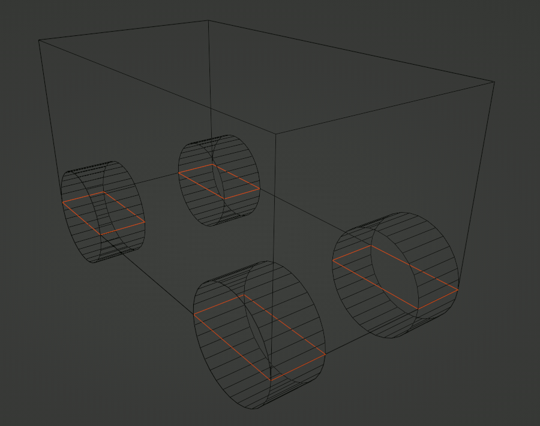

# 3D Physics Engine

GDevelop provides a powerful 3D Physics Engine, allowing to create any kind of 3D games.

!!! tip 

    The 3D physics engine is powered by Jolt Physics a **modern, performant, battle-tested, fully featured** 3D physics engine used in AAA games, like Horizon: Forbidden West. It's perfect for making FPS, TPS, 3D platformers and in the future 3D racing games or any 3D game.

The 3D Physics Engine is available through:

* A behavior **3D physics** to apply to any 3D object of the physics world.
* A dedicated behavior for 3D characters: **3D physics character**.
* A few behaviors add out of the box support for touch screens, gamepads and keyboard/mouse (see [Move a 3D character with controls](#move-a-3d-character-with-controls) section).

## Make ground, walls and platforms

Add the behavior **3D physics** to the object and choose **Static** for the **Type** in the behavior properties. Static objects can't be moved though collisions nor forces.

!!! tip 
    For complicated structures like a bridge, you can use hidden objects to build the shape and add the **3D physics** behavior to these objects instead of the bridge model.

## Make pushable objects

When you want objects to be kicked out and fall, you should set the **Type** to **Dynamic**.

## Move platforms or enemies

Platforms and enemies usually loop on the same path. They must not fall be pushed by other objects.
Objects with the **Kinematic** type won't be moved according to physics rules. They can only be moved by changing their **linear velocity** and **angular velocity**. They can interact with other objects but only these other objects will move.
The [3D ellipse movement](/gdevelop5/extensions/physics-ellipse-movement3d/) behavior allow to easily move objects on ellipses or smoothly back and forth in one direction.

!!! tip 
    The **3D physics character** can also be used for enemies that need to follow slopes or jump.

## Move a 3D character with controls

The **3D physics character** behavior allows characters to walk, jump, follow slopes and stick to moving platforms.

!!! tip 
    The **Capsule** shape is recommended for characters to avoid them floating over slopes.

### Move a 3D platformer character

These behaviors make the character move according to player inputs automatically:

* [3D platformer keyboard mapper](/gdevelop5/extensions/physics-character3dkey-mapper)
* [3D platformer multitouch controller mapper](/gdevelop5/objects/multitouch-joystick)
* [3D shooter gamepad mapper](/gdevelop5/all-features/gamepad/)

[Open example in GDevelop](https://editor.gdevelop.io/?project=example://3d-platformer){ .md-button .md-button--primary }

[{ width="320" }](https://editor.gdevelop.io/?project=example://3d-platformer)

### Move a 3D shooter ("FPS") character

These behaviors make the character move according to player inputs automatically:

* [3D shooter keyboard mapper](/gdevelop5/extensions/physics-character3dkey-mapper) and [First person camera mouse mapper](/gdevelop5/extensions/mouse-pointer-lock/#first-person-camera-mouse-mapper)
* [3D shooter multitouch controller mapper](/gdevelop5/objects/multitouch-joystick)
* [3D platformer gamepad mapper](/gdevelop5/all-features/gamepad/)

[Open example in GDevelop](https://editor.gdevelop.io/?project=example://3d-first-person){ .md-button .md-button--primary }

[{ width="320" }](https://editor.gdevelop.io/?project=example://3d-first-person)

## Move a 3D car with controls

Physics properties often have an impact on several part of the car movement. Following the following steps can help to save time:

- Avoid the car to roll when it turns
- Setup how quick the car fall back on the road
- Avoid the cars to slip when it turns
- Setup how fast the car moves

You may need to do the last 2 steps many times to finely tweak your game feel.

**World scale**

The first thing to setup for any realistic game that uses the physics behavior is the world scale. Objects are placed in a scene using pixels but the physics behavior works with meters. The world scale allows to do the conversion. For instance, let's say the car is 40 pixels wide in the scene. Considering a car is about 2 meters wide, you would set a world scale of `40 / 2` which is `20`.

### Avoid cars to levitate

By default the physics shape encompass the whole 3D model. If your 3d model include the wheels, you need to set a custom shape size to exclude them. For instance, let's say:

- the whole car **depth** is `30` pixels
- the wheel radius is `6` pixels
You would set:

- a custom depth of `30 - 6` which is `24`
- a **shape offset Z** of `6 / 2` which is `3` to move the shape up on the car chassis

The default position of the wheels are in the bottom corners of the car. The wheels are centered in Z axis on the bottom of the physics shape, but don't stick out on X and Y axis.

You may want to adjust the **back wheels offset X** and the  **front wheels offset X** by setting a negative value to move them a bit inside the car.

### Avoid cars to roll when it turns

Cars center of mass is as low as possible to avoid cars to roll. By default, the physics behavior set the center of mass is at the exact center of the object. For instance, to move center of mass at the bottom of the car, let's say your car **depth** is `30` pixels, you could set `-15` pixels for the **center of mass offset Z**.

!!! tip

	In case your car is still rolling when it turns, you can try reducing the **friction**.

### Setup how quick cars fall back on the road

**Mass override**

A car usually weight about 1,500 kg. It can be a good value to start

**Gravity scale**

When a car jump off from a slope, you may want to give back control to the player by making quickly it go back on the road. It's better to use the gravity scale instead of the mass for this because it won't affect the car acceleration and collision.

### Avoid cars to slip when it turns

**Friction**

Cars with greater friction can turn at higher speed without slipping. The friction of the ground also matters. For instance, a smaller value can be set for a grass object to make cars slip when they are off the road.

!!! tip

	**Gravity scale** and **mass override** also change how cars slip. Make sure you have followed the steps described in the above sections first.

### Setup how fast cars move

You set the **engine inertia** to adjust how fast the car accelerate:

- a smaller value gives faster acceleration
- a greater value gives slower acceleration

The **max engine speed** allows to adjust how fast a car can go.

The **max engine torque** allows to climb slopes faster.

!!! tip

	**Friction**, **gravity scale** and **mass override** also change how fast cars move. Make sure you have followed the steps described in the above sections first.

## Concepts used in Physics

This section is being written and will be available soon.
In the meantime, you can refer to the descriptions for the [2D Physics Engine](/gdevelop5/behaviors/physics2/) as most concepts are the same.

## Reference

All actions, conditions and expressions are listed in the [3D Physics reference page](/gdevelop5/all-features/physics3d/reference/).
