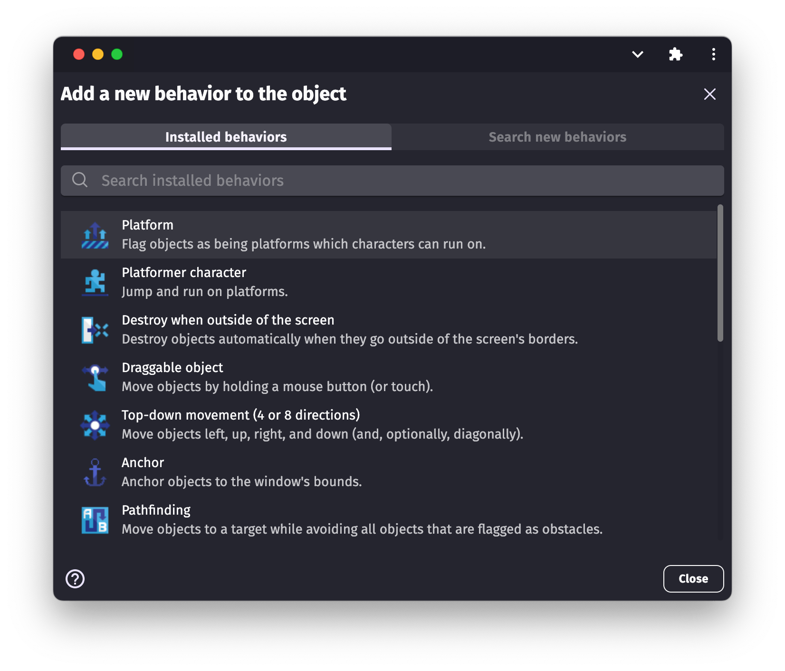
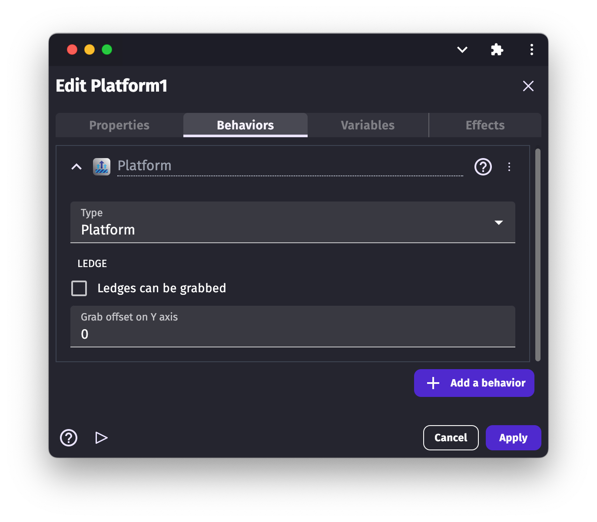

# Platform and platformer character behaviors

GDevelop comes with two [behaviors](/gdevelop5/behaviors) to build platformer games. This first one, "Platform", allows to mark objects as platforms. The second, "Platformer character", allows the object to run and jump on platforms.

## Mark platform and walls with the Platform behavior

Like any behavior, edit an object and choose "Add a behavior" to find the **Platform** behavior:

After selecting the "Platform" option, you will see the Platform behavior options list:

### Platform type

By clicking on the platform behavior, you can choose from 3 different platform types.

  * **Platform:** this is the default option. The default behavior sets the object as a traditional platform. The character can collide with the platform and/or walk on it.
  * **Jumpthru platform:** by choosing this option, the character can collide with the platform and walk on it, but the character can also jump thru the platform from below.
  * **Ladder:** as its name suggests, this option turns our object into a ladder. The character object cannot collide with the ladder object. It can not walk on the ladder object, but, when the character object overlaps the ladder object, the character is able to climb up and get down using the ladder object.

### Grab the ledge

The ledge of our platform can be grabbed by default.  "Grab the ledge" means that when the character object jumps close enough to the edge of the platform, the ledge can be grabbed. If you don't need this functionality, make sure this option is unticked/unchecked. If you do need it, make sure the box is ticked/checked.

The offset of the grab can also be changed on the Y-axis.

The offset option allows us to change the position of the grab to fit the animation of our character.

### Create platforms with tilemaps

The platform behavior can be added to tilemap collision mask objects. Learn more about it on the [tilemap](/gdevelop5/objects/tilemap#handle_collisions) page.

## Use the Platformer character behavior for your player, enemies or moving objects

By selecting the "Platformer character" behavior, you can turn an object into a "Platformer character".

There are a lot of options - you may need to scroll to see them all.

!!! note

    If a platformer character uses a custom collision mask, only the rectangular box around the collision mask will be used to keep the platformer away from platforms. This was done to optimize the performance of games that use this behavior.

### Controls

#### Move a character with the keyboard

The Platformer character behavior comes with default keys set to control the character. These keys are the **arrow keys** and the **Shift or Space** keys. If you don't want to use the default controls, you need to turn off the default controls by unticking/unchecking the "Default controls" box under the "Platform character" options and use [keyboard conditions](/gdevelop5/all-features/keyboard) instead.

#### Move characters with a gamepad

The "Platformer gamepad mapper" behavior from the [gamepad extension](/gdevelop5/all-features/gamepad) can be added to character to make them move according to players inputs automatically.

#### Move characters with multi-touch controls

The "Platformer multitouch controller mapper" behavior from the [multi-touch joystick extension](/gdevelop5/objects/multitouch-joystick) can be added to characters to make them move according to players touches automatically.

### Animate a character

The platformer character behavior is usually added to [sprite objects](/gdevelop5/objects/sprite). Sprites have several animations that can be played according to what the character does. Animations can be changed with events but the [platformer character animator](/gdevelop5/extensions/platformer-character-animator/reference) behavior automatize it.

### Grab a ledge

As with the Platform Behavior, we have the "Grab the ledge" option for the "Platformer character". This option allows the character object to grab the ledge of the platforms. The option is disabled by default. To enable it, tick/check the box in the options list.

If you decide to enable this option, the character can grab the ledge of all of the platforms provided that they too have this option enabled.

Again, as with the "Platform Behavior", we can set the grab offset on the Y axis for the character. Unlike the Platform Behavior, we can also set the grab tolerance on the X-axis.

By changing the grab tolerance value, we can set how close the character needs to be to the platform in order to allow the character to grab the platform object.

### Slope max angle

By changing this value, we can set the maximum angle of a slope that the player can climb. The default is 0. 0 default means the character can move only on a flat surface.

### Change the character speed

The walking speed of a character is configured with:

  - an acceleration
  - a deceleration
  - a maximum speed

Choosing a low acceleration and deceleration will make the character slide.

### Change characters jump height

How high a character jumps depends on:

  - **Jump speed** is the speed at the beginning of the jump.
  - **Jump sustain time** is how long the jump speed can be kept to the initial value while players hold the jump key.
  - **Gravity** is how fast the speed change to go down.
  - **Max. falling speed** to avoid characters going faster and faster because of gravity.

All theses values can also be changed at any time during the game using [events](/gdevelop5/events).

It's not easy to know how these values change the jump trajectory. The best is to try. The platformer jump evaluator example allows to find the right jump speed to reach a given height.

!!! tip

    The [hot reload](/gdevelop5/interface/preview) is a great help to speed up the process of finding the right jump.

### Tip: Use the Platformer jump evaluator example

[Open example in GDevelop](https://editor.gdevelop.io/?project=example://platformer-jump-evaluator){ .md-button .md-button--primary }

#### Make characters wall jump

The [advanced platformer movements](/gdevelop5/extensions/advanced-jump/reference) extension contains behaviors for:

  * Wall jump
  * Double jump
  * Coyote time (also known as ledge tolerance)
  * Dashes

## Examples

!!! tip

        **See it in action!** 🎮
    Open these examples online.

**Platformer Behavior**

[Open example in GDevelop](https://editor.gdevelop.io/?project=example://platformer){ .md-button .md-button--primary }

**Parallax Scrolling Behavior**

[Open example in GDevelop](https://editor.gdevelop.io/?project=example://parallax-scrolling){ .md-button .md-button--primary }

## Reference

All actions, conditions and expressions are listed in [the platformer behavior reference page](/gdevelop5/all-features/platform-behavior/reference/).