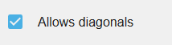

## Top-Down Movement behavior

!!! tip

        **See it in action!** 🎮
    [I would rather see the Top Down Movement behavior examples! Please take me there now.](/#Examples)

  <iframe src="https://www.youtube.com/embed/zUV-lUtXpO4" frameborder="0" allowfullscreen></iframe>

####  Add "Top-Down Movement" behavior

The "Top-Down Movement" [behavior](/gdevelop5/behaviors) allows the additional functionality of moving an [object](/gdevelop5/objects) in either 4 or 8 directions.

After selecting the behavior, we should immediately see the available options:

####  Change the speed of movement and rotation

By changing the value of Acceleration, Deceleration and Max speed, we can change how fast our object is going to move.

By changing the value of Rotation speed, we can change how fast our object is going to rotate or if it going to rotate at all. I'll explain more about rotation, below.

####  Change angle offset

By default, the facing angle of our sprite is 0 which is the right side of our sprite, but we can change the way that our object is facing by changing the value of Angle offset. Here is an image to help you understand the coordinates in GDevelop:

!!! note

    Note that some expressions like `AngleBetweenPositions` can gives you a result between -180 and 180. This is equivalent to this schema. An angle of -45 degrees is equivalent to an angle of 270 degrees.

####  Viewpoint (for isometric games)

The **Viewpoint** property controls how movement directions are projected onto the screen. This is essential for isometric games where the visual perspective differs from the movement plane.

* **Top-Down** (default): Movement directions map directly to screen axes. Moving right moves the object right on screen.
* **Isometry 2:1**: Uses a classic pixel isometry projection (approximately 26.6°), the style common in many retro strategy games. The movement directions are transformed so that "forward" on screen matches the isometric visual perspective.
* **True Isometry (30°)**: Uses a mathematically perfect 30-degree isometric projection.
* **Custom Isometry**: Allows specifying any isometry angle, useful for non-standard perspectives.

When using an isometric viewpoint, it is also recommended to set the **Movement angle offset** to **-45 degrees**. This rotates the input directions so that pressing "up" moves the character toward the top of the isometric view rather than straight up on screen.

!!! tip

    See the **Isometric Game** example below for a working demonstration of how to combine the Isometry viewpoint with the movement angle offset.

####  Allows diagonals

This option is enabled by default. We allow our object to move diagonally in 8 directions. By disabling this option, we don't allow diagonal movement. When disabled, we can move only in 4 directions: left, right, up and down. Diagonal movement is no longer allowed.

####  Controls

####  Move characters with keyboards

The "top-down movement" behavior comes with default keys set to control the character. The default controls are the four keyboard arrow keys. If you don't want to use the default controls, you need to turn off the default controls by unticking/unchecking the "Default controls" box and use [keyboard conditions](/gdevelop5/all-features/keyboard) instead.

####  Move characters with gamepads

The "top-down gamepad mapper" behavior from the [gamepad extension](/gdevelop5/all-features/gamepad) can be added to character to make them move according to players inputs automatically.

####  Move characters with multi-touch controls

The "top-down multitouch controller mapper" behavior from the [multi-touch joystick extension](/gdevelop5/objects/multitouch-joystick) can be added to characters to make them move according to players touches automatically.

####  Rotate object

By default, our object will rotate toward the direction of movement. The object will rotate at the speed we specify in the Rotation speed option. If we don't want the object to rotate, we need to disable this by unchecking the box.

For characters that face different directions using separate animations rather than rotation (for example, a top-down RPG character with separate walk-left and walk-right animations), disable rotation and use the movement angle expression to determine which animation to play with events.

All theses values can also be changed at any time during the game using [events](/gdevelop5/events).

# Examples

!!! tip

        **See it in action!** 🎮
    Open these examples online.

**Space Shooter**

[Open example in GDevelop](https://editor.gdevelop.io/?project=example://space-shooter){ .md-button .md-button--primary }

[{ width="320" }](https://editor.gdevelop.io/?project=example://space-shooter)

**Isometric Game** (creates an illusion of 3D graphics within a 2D graphics game)

[Open example in GDevelop](https://editor.gdevelop.io/?project=example://isometric-game){ .md-button .md-button--primary }

[{ width="320" }](https://editor.gdevelop.io/?project=example://isometric-game)

## Reference

All actions, conditions and expressions are listed in [the top-down movement reference page](/gdevelop5/all-features/top-down-movement-behavior/reference/).