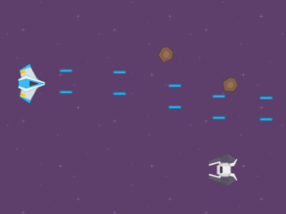

## Top-Down Movement behavior

!!! tip

        **See it in action!** 🎮
    [I would rather see the Top Down Movement behavior examples! Please take me there now.](/#Examples)

  <iframe src="https://www.youtube.com/embed/zUV-lUtXpO4" frameborder="0" allowfullscreen></iframe>

####  Add "Top-Down Movement" behavior

The "Top-Down Movement" [behavior](/gdevelop5/behaviors) allows the additional functionality of moving an [object](/gdevelop5/objects) in either 4 or 8 directions.

After selecting the behavior, we should immediately see the available options:

####  Change the speed of movement and rotation

By changing the value of Acceleration, Deceleration and Max speed, we can change how fast our object is going to move.

By changing the value of Rotation speed, we can change how fast our object is going to rotate or if it going to rotate at all. I'll explain more about rotation, below.

####  Change angle offset

By default, the facing angle of our sprite is 0 which is the right side of our sprite, but we can change the way that our object is facing by changing the value of Angle offset. Here is an image to help you understand the coordinates in GDevelop:

!!! note

    Note that some expressions like `AngleBetweenPositions` can gives you a result between -180 and 180. This is equivalent to this schema. An angle of -45 degrees is equivalent to an angle of 270 degrees.
####  Allows diagonals

This option is enabled by default. We allow our object to move diagonally in 8 directions. By disabling this option, we don't allow diagonal movement. When disabled, we can move only in 4 directions: left, right, up and down. Diagonal movement is no longer allowed.

####  Controls

####  Move characters with keyboards

The "top-down movement" behavior comes with default keys set to control the character. The default controls are the four keyboard arrow keys. If you don't want to use the default controls, you need to turn off the default controls by unticking/unchecking the "Default controls" box and use [keyboard conditions](/gdevelop5/all-features/keyboard) instead.

####  Move characters with gamepads

The "top-down gamepad mapper" behavior from the [gamepad extension](/gdevelop5/all-features/gamepad) can be added to character to make them move according to players inputs automatically.

####  Move characters with multi-touch controls

The "top-down multitouch controller mapper" behavior from the [multi-touch joystick extension](/gdevelop5/objects/multitouch-joystick) can be added to characters to make them move according to players touches automatically.

####  Rotate object

By default, our object will rotate toward the direction of movement. The object will rotate at the speed we specify in the Rotation speed option. If we don't want the object to rotate, we need to disable this by unchecking the box.

All theses values can also be changed at any time during the game using [events](/gdevelop5/events).

## Viewpoint and isometric movement

The **Viewpoint** property controls how movement directions are calculated, which is important for games with an isometric perspective.

- **Top-Down** (default) — standard top-down view. Up/down/left/right keys map directly to screen directions.
- **Isometry 2:1** — pixel-art isometry at 26.565°. Movement directions are skewed to match a classic 2:1 isometric grid.
- **True Isometry (30°)** — movement directions skewed at 30° for a true isometric projection.
- **Custom Isometry** — lets you set any isometry angle from 1° to 44°.

When using any of the isometry viewpoints, setting **Angle offset** to **-45** is recommended so that the object faces the correct direction relative to its movement.

## Use conditions to check the character state

The top-down movement behavior provides conditions and expressions to check what the character is currently doing:

- **Is moving** — the object has a non-zero speed.
- **Speed** — compare or read the current speed of the object (pixels per second).
- **Is movement angle around** — compare the current movement direction (angle ± tolerance in degrees). Useful for choosing the correct animation frame.
- **X velocity / Y velocity** — compare or read the individual axis speeds. Helpful for animating or adjusting physics interactions.

## Simulate controls with events

When default controls are disabled, use the **Simulate** actions to drive movement from events or custom input handling:

| Action | Effect |
|---|---|
| Simulate left key press | Move the object left |
| Simulate right key press | Move the object right |
| Simulate up key press | Move the object up |
| Simulate down key press | Move the object down |
| Simulate stick control | Provide an analog direction (angle in degrees) and force (0 to 1) |

These actions only apply for the current frame, so they must be called every frame as long as the input is active. The stick simulation is especially useful for gamepad analog input or virtual joysticks.

# Examples

!!! tip

        **See it in action!** 🎮
    Open these examples online.

**Space Shooter**

[Open example in GDevelop](https://editor.gdevelop.io/?project=example://space-shooter){ .md-button .md-button--primary }

[{ width="320" }](https://editor.gdevelop.io/?project=example://space-shooter)

**Isometric Game** (creates an illusion of 3D graphics within a 2D graphics game)

[Open example in GDevelop](https://editor.gdevelop.io/?project=example://isometric-game){ .md-button .md-button--primary }

[{ width="320" }](https://editor.gdevelop.io/?project=example://isometric-game)

## Reference

All actions, conditions and expressions are listed in [the top-down movement reference page](/gdevelop5/all-features/top-down-movement-behavior/reference/).